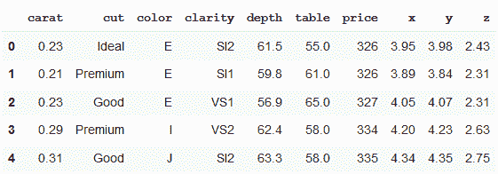
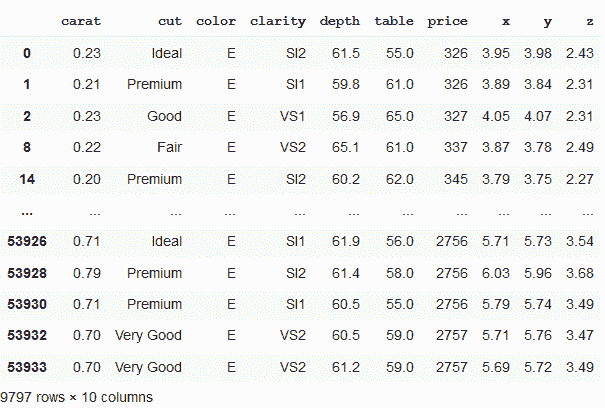

# 按行分割熊猫数据框

> 原文:[https://www . geesforgeks . org/split-pandas-data frame 逐行/](https://www.geeksforgeeks.org/split-pandas-dataframe-by-rows/)

我们可以尝试不同的方法来分割数据帧，以获得期望的结果。让我们举一个钻石数据集的例子。

```py
# importing libraries
import seaborn as sns
import pandas as pd
import numpy as np

# data needs not to be downloaded separately
df  = sns.load_dataset('diamonds')
df.head()
```

**输出:**


**方法 1:按行索引拆分熊猫数据帧**

在下面的代码中，dataframe 分为两部分，第一部分为 1000 行，其余为行。我们可以看到新形成的数据帧的形状作为给定代码的输出。

```py
# splitting dataframe by row index
df_1 = df.iloc[:1000,:]
df_2 = df.iloc[1001:,:]
print("Shape of new dataframes - {} , {}".format(df_1.shape, df_2.shape))
```

**输出:**


**方法 2:通过由唯一列值形成的组分割熊猫数据帧**

在这里，我们将首先按列值“颜色”对数据进行分组。新形成的数据帧由颜色为“E”的分组数据组成。

```py
# splitting dataframe by groups
# grouping by particular dataframe column
grouped = df.groupby(df.color)
df_new = grouped.get_group("E")
df_new
```

**输出:**


**方法 3:将熊猫数据帧分割成预定大小的块**

在上面的代码中，我们可以看到我们已经形成了一个大小为 0.6 的新数据集，即总行数(或数据集长度)的 60%，现在它由 32364 行组成。这些行是随机选择的。

```py
# splitting dataframe in a particular size
df_split = df.sample(frac=0.6,random_state=200)
df_split.reset_index()
```

**输出:**
