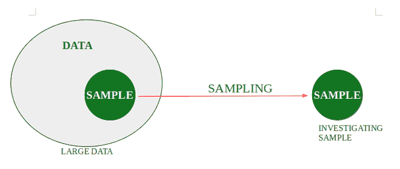
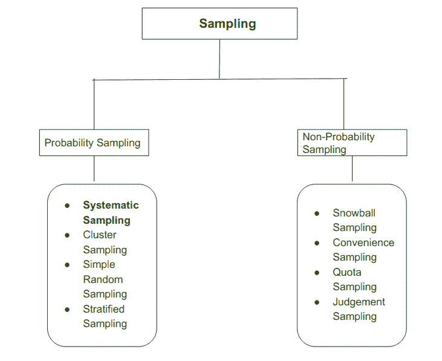
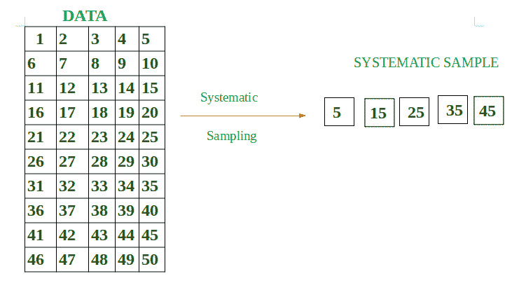
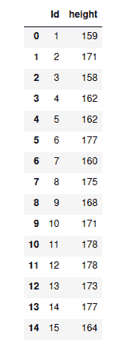
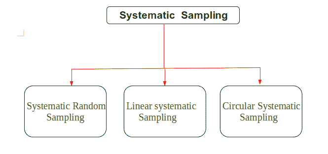
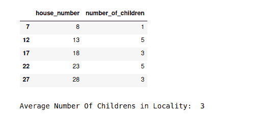
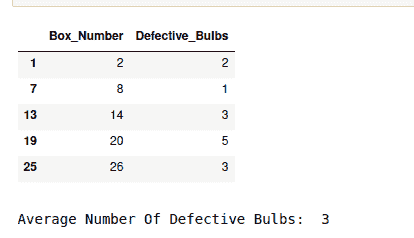
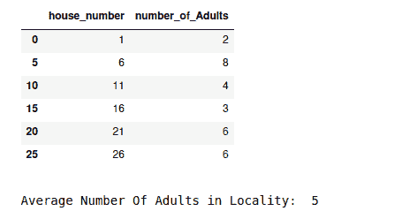

# 大熊猫系统采样

> 原文:[https://www . geesforgeks . org/system-熊猫采样/](https://www.geeksforgeeks.org/systematic-sampling-in-pandas/)

抽样是一种方法，在这种方法中，人们可以从给定的数据中提取子集(样本)，并对样本进行调查，而不调查每一个单独的数据。例如，假设在一所大学里，有人想要检查在该大学学习的学生的平均身高。一种方法是收集所有学生的数据并进行计算，但这一任务非常耗时。因此，使用采样。因此，解决方案是在课间休息期间，从食堂随机选择学生，测量他们的身高，并从学生的子集计算平均身高。



**采样类型:**



抽样

## **系统采样**

系统抽样被定义为概率抽样的类型，在这种类型中，研究人员可以从大量数据中对目标数据进行研究。目标数据是通过选择随机的起始点来选择的，并且在一定的时间间隔之后，下一个元素被选择用于采样。在这种情况下，从大数据中提取一个小子集(样本)。

假设数据的大小是 **D** ， **N** 将是我们想要选择的样本大小。所以根据系统抽样:

> 间隔=(日/月)
> 
> 假设(D/N) = J
> 
> 因此，当我们从数据中选择第一个随机元素 E 时，样本的下一个元素将是(E+J)
> 
> 示例:数据总大小= 50 (1 到 50)
> 
> 我们需要样本= 5 中的元素
> 
> 间隔= 50/5 = 10。
> 
> 这意味着在一个样本中，我们需要系统地间隔 10 个元素。
> 
> 假设我随机选择第一个元素样本元素= 5
> 
> 接下来是 5+10 = 15
> 
>                  15+10= 25
> 
>                  25+ 10 =35
> 
>                  35+10  = 45
> 
> 所以，
> 
> 样本= { 5，15，25，35，45 }

从图表上看，



**进场:**

*   以数据为例。
*   从大数据中提取系统样本。
*   打印样本数据的平均值。

**程序:**

## 蟒蛇 3

```py
# Import in order to use inbuilt functions
import numpy as np
import pandas as pd

# Define total number of students
number_of_students = 15

# Create data dictionary
data = {'Id': np.arange(1, number_of_students+1).tolist(),
        'height': [159, 171, 158, 162, 162, 177, 160, 175,
                   168, 171, 178, 178, 173, 177, 164]}

# Transform dictionary into a data frame
df = pd.DataFrame(data)

display(df)

# Define systematic sampling function
def systematic_sampling(df, step):

    indexes = np.arange(0, len(df), step=step)
    systematic_sample = df.iloc[indexes]
    return systematic_sample

# Obtain a systematic sample and save it in a new variable
systematic_sample = systematic_sampling(df, 3)

# View sampled data frame
display(systematic_sample)
```

**输出:**

 

**示例:**打印样本数据的平均值

## 蟒蛇 3

```py
# Import in order to use inbuilt functions
import numpy as np
import pandas as pd

# Define total number of students
number_of_students = 15

# Create data dictionary
data = {'Id': np.arange(1, number_of_students+1).tolist(),
        'height': [159, 171, 158, 162, 162, 177, 160, 175,
                   168, 171, 178, 178, 173, 177, 164]}

# Transform dictionary into a data frame
df = pd.DataFrame(data)

# Define systematic sampling function
def systematic_sampling(df, step):

    indexes = np.arange(0, len(df), step=step)
    systematic_sample = df.iloc[indexes]
    return systematic_sample

# Obtain a systematic sample and save it in a new variable
systematic_sample = systematic_sampling(df, 3)

# View sampled data frame
display(systematic_sample)

# Empty Print Statement for new line
print()

# Save the sample data in a separate variable
systematic_data = round(systematic_sample['height'].mean())
print("Average Height in cm: ", systematic_data)
```

**输出:**


## **系统采样类型**

系统采样有三种类型，如下所示:



系统抽样的类型

### **系统随机抽样:**

在系统随机抽样中，选择随机起点，然后从该随机起点开始应用系统抽样。

**进场:**

*   检索数据
*   选择一个随机起点
*   对数据应用系统方法
*   按照预期执行操作

**示例:**

## 蟒蛇 3

```py
# Import in order to use inbuilt functions
import numpy as np
import pandas as pd
import random

# Define total number of house
number_of_house = 30

# Create data dictionary
data = {'house_number': [1, 2, 3, 4, 5, 6, 7, 8, 9, 10, 11, 12, 13,
                         14, 15, 16, 17, 18, 19, 20, 21, 22, 23,
                         24, 25, 26, 27, 28, 29, 30],
        'number_of_children': [2, 2, 1, 3, 2, 1, 4, 1, 3, 5, 4, 3, 5,
                               3, 2, 1, 2, 3, 4, 5, 3, 4, 5, 2, 2, 2,
                               2, 3, 2, 1]}

# Transform dictionary into a data frame
df = pd.DataFrame(data)

# Defining Size of Systematic Sample
size_of_systematic_sample = 6

# Defining Interval(gap) in order to get required data.
interval = (number_of_house // size_of_systematic_sample)

# Choosing Random Number
random_number = random.randint(1, 30)

# Define systematic sampling function
def systematic_sampling(df, step):

    indexes = np.arange(random_number, len(df), step=step)
    systematic_sample = df.iloc[indexes]
    return systematic_sample

# Obtain a systematic sample and save it in a new variable
systematic_sample = systematic_sampling(df, interval)

# View sampled data frame
display(systematic_sample)

# Empty Print Statement for new line
print()

# Save the sample data in a separate variable
systematic_data = round(systematic_sample['number_of_children'].mean())

# Printing Average Number of Children
print("Average Number Of Childrens in Locality: ", systematic_data)
```

**输出:**



### **线性系统采样:**

线性系统采样是一种系统采样，其中样本是使用线性方法选择的。线性方法，即在特定时间间隔后，从大数据中选择样本，然后对所选样本执行操作。

这些元素是在从 starting _ random _ number 到 last_element -1 范围内选择的。

**进场:**

*   检索数据
*   在特定时间间隔后从数据集中选择数据
*   按照预期执行操作

**示例:**

## 蟒蛇 3

```py
# Import in order to use inbuilt functions
import numpy as np
import pandas as pd
import random

# Define total number of boxes
number_of_boxes = 30

# Create data dictionary
data = {'Box_Number': [1, 2, 3, 4, 5, 6, 7, 8, 9, 10, 11, 12, 13, 14,
                       15, 16, 17, 18, 19, 20, 21, 22, 23, 24, 25, 26,
                       27, 28, 29, 30],

        'Defective_Bulbs': [2, 2, 1, 0, 2, 1, 0, 1, 3, 5, 4, 3, 5, 3,
                            0, 1, 2, 0, 4, 5, 3, 4, 5, 2, 0, 3, 2, 0,
                            5, 4]}

# Transform dictionary into a data frame
df = pd.DataFrame(data)

# Size of Systematic Sample
size_systematic_sample = 5

# Interval (Gap) taken
interval = (number_of_boxes // size_systematic_sample)

# Choosing Random Starting Point
random_number = random.randint(1, 30)

# Define systematic sampling function
def systematic_sampling(df, step):

    indexes = np.arange(random_number, len(df)-1, step=step)
    systematic_sample = df.iloc[indexes]
    return systematic_sample

# Obtain a systematic sample and save it in a new variable
systematic_sample = systematic_sampling(df, interval)

# View sampled data frame
display(systematic_sample)

# Empty Print Statement for new line
print()

# Save the sample data in a separate variable
systematic_data = round(systematic_sample['Defective_Bulbs'].mean())

# Printing Average Number of Defective Bulbs
print("Average Number Of Defective Bulbs: ", systematic_data)
```

**输出:**



### **循环系统采样**

在循环系统抽样中，一个样本在结束后再次从同一点开始。基本上，当系统地选择样本时，当到达结束元素时，样本的选择将再次从头开始，直到样本的所有元素都被选择。这意味着对使用循环系统采样选择的所有数据执行操作。

**进场:**

*   检索数据
*   系统地选择样本
*   一旦到达终点，重新启动
*   按照预期执行操作

**程序:**

## 蟒蛇 3

```py
# Import in order to use inbuilt functions
import numpy as np
import pandas as pd
import random

# Define total number of house
number_of_house = 30

# Create data dictionary
data = {'house_number': [1, 2, 3, 4, 5, 6, 7, 8, 9, 10, 11, 12, 13,
                         14, 15, 16, 17, 18, 19, 20, 21, 22, 23,
                         24, 25, 26, 27, 28, 29, 30],
        'number_of_Adults': [2, 2, 5, 3, 2, 8, 4, 7, 8, 5, 4, 9, 5,
                             4, 2, 3, 2, 3, 4, 5, 6, 4, 5, 4, 2, 6,
                             2, 3, 2, 2]}

# Transform dictionary into a data frame
df = pd.DataFrame(data)

# Defining Size of Systematic Sample
size_of_systematic_sample = 6

# Defining Interval(gap) in order to get required data.
interval = (number_of_house // size_of_systematic_sample)

# Define systematic sampling function
def systematic_sampling(df, step):
    indexes = np.arange(0, len(df), step=step)
    systematic_sample = df.iloc[indexes]
    return systematic_sample

# Obtain a systematic sample and save it in a new variable
systematic_sample = systematic_sampling(df, interval)

# View sampled data frame
display(systematic_sample)

# Empty Print Statement for new line
print()

# Save the sample data in a separate variable
systematic_data = round(systematic_sample['number_of_Adults'].mean())

# Printing Average Number of Children
print("Average Number Of Adults in Locality: ", systematic_data)
```

**输出:**

