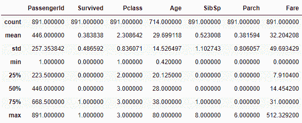

# 用 Python 用熊猫计算统计

> 原文:[https://www . geesforgeks . org/use-pandas-to-compute-statistics-in-python/](https://www.geeksforgeeks.org/use-pandas-to-calculate-statistics-in-python/)

在 python 中执行各种复杂的统计操作可以很容易地简化为使用 pandas 的单行命令。我们将在这篇文章中讨论一些最有用和最常见的统计操作。我们将使用 [**泰坦尼克号生存数据集**](https://drive.google.com/file/d/17XszLX8k8O0hYx9kfYH07NDzKJKsk9WS/view?usp=sharing) 来演示这样的操作。

## 蟒蛇 3

```
# Import Pandas Library
import pandas as pd

# Load Titanic Dataset as Dataframe
dataset = pd.read_csv('train.csv')

# Show dataset
# head() bydefault show
# 5 rows of the dataframe
dataset.head()
```

**输出:**


#### 1.意思是:

使用**数据帧/序列.平均值()**方法计算平均值或平均值。

> **语法:**数据帧/序列.均值(自身，轴=无，skipna =无，级别=无，numeric _ only =无，**kwargs)
> 
> **参数:**
> 
> *   **轴:**{索引(0)，列(1)}
> 
> 指定要应用的函数的轴。
> 
> *   **skipna:** 此参数取布尔值，默认值为真
> 
> 它在计算结果时排除空值。
> 
> *   **级别:**该参数取整数值或级别名称，默认值为无。
> 
> 如果轴是多索引，沿特定级别计数，折叠成系列。
> 
> *   **仅限数值** <u>:</u> 此参数取布尔值，默认值为无
> 
> 只包括浮点、整型和布尔型列。如果为“无”，将尝试使用所有内容，然后仅使用数字数据值。不适用于系列。
> 
> *   ****kwargs:** 要传递给函数的附加参数。
> 
> **返回:**序列或数据帧的平均值(如果指定了级别)

**代码:**

## 蟒蛇 3

```
# Calculate the Mean
# of 'Age' column
mean = dataset['Age'].mean()

# Print mean
print(mean)
```

**输出:**

```
29.69911764705882
```

#### **2。中位数:**

使用**数据框/系列.中值()**方法计算中值。

> **语法:**数据帧/序列。中位数(自身，轴=无，skipna =无，级别=无，numeric _ only =无，**kwargs)
> 
> **参数:**
> 
> *   **轴:**{索引(0)，列(1)}
> 
> 指定要应用的函数的轴。
> 
> *   **skipna:** 此参数取布尔值，默认值为真
> 
> 它在计算结果时排除空值。
> 
> *   **级别:**该参数取 int 或级别名，默认无
> 
> 如果轴是多索引，沿特定级别计数，折叠成系列。
> 
> *   **仅限数值:**此参数取布尔值，默认值为无
> 
> 只包括浮点、整型和布尔型列。如果值为“无”，将尝试使用所有内容，然后仅使用数字数据。
> 
> *   ****kwargs:** 要传递给函数的附加参数。
> 
> **返回:**系列或数据帧的中间值(如果指定了级别)

**代码:**

## 蟒蛇 3

```
# Calculate Median of 'Fare' column
median = dataset['Fare'].median()

# Print median
print(median)
```

**输出:**

```
14.4542
```

#### 3.模式:

使用 **DataFrame.mode()** 方法计算模式或最频繁值。

> **语法:**数据帧/序列模式(自身，轴=0，仅数值=假，dropna =真)
> 
> **参数:**
> 
> *   **轴**T2:{索引(0)，列(1)}
> 
> 搜索模式值时要迭代的轴:
> 
> 0 值或“索引”:获取每列的模式
> 
> 1 个值或“列”:获取每行的模式。
> 
> *   **仅限数值:**此参数取布尔值，默认值为假。
> 
> 如果为真，则仅适用于数值列。
> 
> *   **dropna:** 此参数取布尔值，默认值为真。
> 
> 不要考虑 NaN/None 值的计数。
> 
> **返回 <u>:</u>** 最高频率值。

**代码**:

## 蟒蛇 3

```
# Calculate Mode of 'Sex' column
mode = dataset['Sex'].mode()

# Print mode
print(mode)
```

**输出:**

```
0    male
dtype: object
```

#### 4.计数:

使用 **DataFrame/Series.count()** 方法计算非空值的计数或频率。

> **语法:**数据帧/序列计数(自身，轴=0，级别=无，仅数值=假)
> 
> **参数:**
> 
> *   **轴:** {0 或‘索引’，1 或‘列’}，默认值为 0
> 
> 如果值为 0 或“索引”，将为每列生成计数。如果值为 1 或，则为每行生成“列”计数。
> 
> *   **级别:**(可选)该参数取 int 或 str 值。
> 
> 如果轴是多索引类型，则沿特定级别计数，折叠成一个数据框。使用字符串指定级别名称。
> 
> *   **仅限数值:**此参数取布尔值，默认为假
> 
> 只包括浮点、整型或布尔型数据。返回:返回最高频率值
> 
> **返回 <u>:</u>** 每一列/行的非空条目数。如果指定了级别，则返回一个数据帧结构。

**代码:**

## 蟒蛇 3

```
# Calculate Count of 'Ticket' column
count = dataset['Ticket'].count()

# Print count
print(count)
```

**输出:**

```
891
```

#### 5.标准偏差:

使用 **DataFrame/Series.std()** 方法计算值的标准偏差。

> **语法 <u>:</u>** 数据帧/系列. std(自身，轴=无，skipna =无，级别=无，ddof=1，numeric _ only =无，**kwargs)
> 
> **参数:**
> 
> *   **轴**:{索引(0)，列(1)}
> *   **skipna:** 该参数取布尔值，默认值为真。
> 
> 排除无/空值。如果整行/整列有数值，结果将是数值。
> 
> *   **级别:**该参数取 int 或级别名，默认值为 None。
> 
> 如果轴是多索引，沿特定级别计数，折叠成系列。
> 
> *   **ddof <u>:</u>** 此参数取 int 值，默认值为 1。
> 
> δ自由度。计算中使用的除数是 N–ddof，其中 N 值代表元素的数量。
> 
> *   **仅限数值 <u>:</u>** 此参数取布尔值，默认无
> 
> 只包括浮点、整型和布尔型列。如果没有，将尝试使用所有内容，然后只使用数字数据。不适用于系列。
> 
> **返回 <u>:</u>** 标准差

**代码:**

## 蟒蛇 3

```
# Calculate Standard Deviation
# of 'Fare' column
std = dataset['Fare'].std()

# Print standard deviation
print(std)
```

**输出**:

```
49.693428597180905
```

#### 6.最大:

使用**数据框/数列. max()** 方法计算最大值。

> **语法:** DataFrame/Series.max(self，axis=None，skipna=None，level=None，numeric_only=None，**kwargs)
> 
> **参数:**
> 
> *   **轴:**{索引(0)，列(1)}
> 
> 指定要应用的函数的轴。
> 
> *   **skipna：** bool，默认为 True
> 
> 它在计算结果时排除空值。
> 
> *   **级别:**整数或级别名称，默认无
> 
> 如果轴是多索引类型，则沿特定级别计数，折叠成系列。
> 
> *   **仅限数值:** bool，默认无
> 
> 只包括浮点、整型和布尔型列。如果无值，将尝试使用所有内容，然后仅使用数字数据。
> 
> *   ****kwargs:** 要传递给函数的附加关键字。
> 
> **返回 <u>:</u>** 系列或数据帧中的最大值(如果指定了级别)

**代码**:

## 蟒蛇 3

```
# Calculate Maximum value in 'Age' column
maxValue = dataset['Age'].max()

# Print maxValue
print(maxValue)
```

**输出**:

```
80.0
```

#### 7.最小值:

使用**数据帧/序列.分钟()**方法计算最小值。

> **语法:**数据帧/序列. min(自身，轴=无，skipna =无，级别=无，numeric _ only =无，**kwargs)
> 
> **参数:**
> 
> *   **轴:**{索引(0)，列(1)}
> 
> 指定要应用的函数的轴。
> 
> *   **skipna：** bool，默认为 True
> 
> 它在计算结果时排除空值。
> 
> *   **级别:**整数或级别名称，默认无
> 
> 如果轴是多索引类型，则沿特定级别计数，折叠成系列。
> 
> *   **仅限数值:** bool，默认无
> 
> 只包括浮点、整型和布尔型列。如果无值，将尝试使用所有内容，然后仅使用数字数据。
> 
> *   ****kwargs:** 要传递给函数的附加关键字。
> 
> **返回:**序列或数据帧中的最小值(如果指定了级别)

**代码**:

## 蟒蛇 3

```
# Calculate Minimum value in 'Fare' column
minValue = dataset['Fare'].min()

# Print minValue
print(minValue)
```

**输出:**

```
0.0000
```

#### 8.描述:

使用**数据框/系列. description()**方法总结一般描述性统计。

> **语法:**数据帧/序列。描述(自身:~帧或序列，百分位数=无，包含=无，排除=无)
> 
> **参数:**
> 
> *   **百分位数:**类似数字的列表，可选
> *   i **包括 <u>:</u>** “全部”，类似列表的数据类型或无值(默认)，可选
> *   **排除** <u>:</u> 类似列表的数据类型或无值(默认)，可选，
> 
> **返回:**提供的系列或数据框的汇总统计。

## 蟒蛇 3

```
# Statistical summary
dataset.describe()
```

**输出:**

