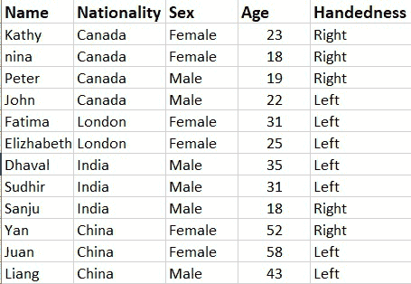
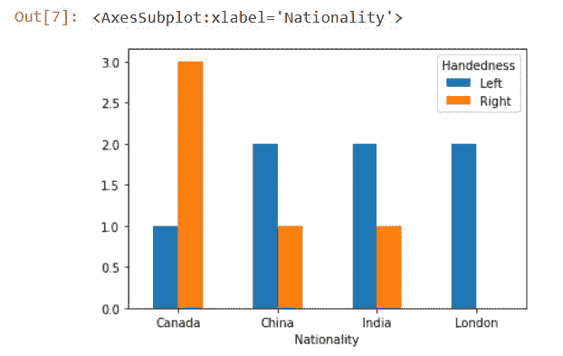
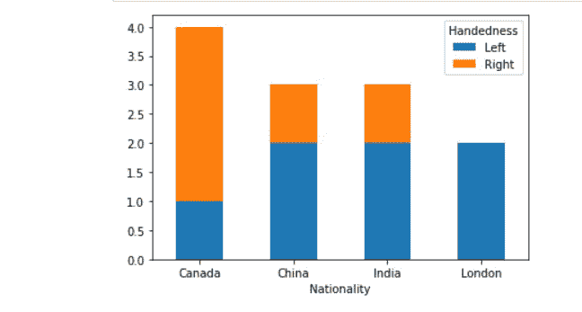

# 使用熊猫交叉表创建条形图

> 原文:[https://www . geesforgeks . org/using-pandas-cross table-to-create-a-bar-plot/](https://www.geeksforgeeks.org/using-pandas-crosstab-to-create-a-bar-plot/)

在本文中，我们将讨论如何在 Python 中使用熊猫交叉表创建条形图。首先让我们更多地了解交叉表，它是两个或多个变量的简单交叉列表。

## 什么是交叉制表？

这是一个简单的交叉列表，帮助我们理解两个或多个变量之间的关系。它将使人们对数据有一个清晰的了解，并使分析更加容易。

让我们举一个例子，如果我们取一个人的惯用手的数据集，其中包括民族，性别，年龄和姓名。假设如果我们想分析民族和惯用手之间的关系。交叉表提供了它们之间的关系。



## 使用熊猫的交叉表

在创建条形图之前，我们应该使用熊猫创建交叉列表。

> **语法:**pandas . crosstable(索引，列，值=无，行名=无，列名=无，aggfunc =无，边距=假，边距 _name= '全部'，dropna =真，normalize =假

**代码:**

## 计算机编程语言

```py
# importing the pandas library
import pandas as pd

# Reading the csv file and storing it
# in a variable
df = pd.read_csv('Data.csv')

# Crosstab function is called
# 2 parameters are passed
# The table is stored in a variable
crosstb = pd.crosstab(df.Nationality, df.Handedness)
```

**输出:**


## 创建条形图

条形图最常用于不同组之间的比较或跟踪随时间的变化。对交叉表使用条形图是总结交叉表并更好地分析它们的有效方法之一。

> 语法:data frame . plot . bar(x =无，y =无，**kwargs)

**代码:**

## 蟒蛇 3

```py
# importing the pandas library
import pandas as pd

# Reading the csv file and storing it in a variable
df = pd.read_csv('Data.csv')

# Creating crosstab
crosstb = pd.crosstab(df.Nationality, df.Handedness)

# Creating barplot
barplt = crosstb.plot.bar(rot=0)
```

**输出:**



## 堆叠条形图

在这里，我们将通过将堆叠参数作为 True 传递来创建数据框的堆叠条形图。

> data frame . plot(kind =“bar”，stacked = True，rot=0)

**代码:**

## 计算机编程语言

```py
# importing the pandas library
import pandas as pd

# Reading csv file
df = pd.read_csv('Data.csv')

# Creating crosstab
crosstb = pd.crosstab(df.Nationality, df.Handedness)

# Creating barplot
pl = crosstb.plot(kind="bar", stacked=True, rot=0)
```

**输出:**



## 使用交叉表中的两个以上变量创建条形图

在上面的例子中，我们发现了民族和人的惯用手之间的关系。我们还可以创建一个包含两个以上值的交叉表。我们将在下面的示例中实现这一点。

## 蟒蛇 3

```py
# importing the module
import pandas as pd

# reading the csv file
df = pd.read_csv('Data.csv')

# Crosstab with three variables
crosstb = pd.crosstab(df.Sex, [df.Nationality,
                               df.Handedness])

# Bar ploting
a = crosstb.plot(kind='bar', rot=0)
a.legend(title='Handedness', bbox_to_anchor=(1, 1.02),
         loc='upper left')
```

**输出:**

