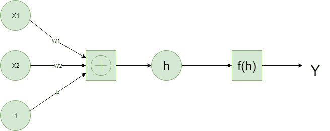

# 【PyTorch 深度学习|简介

> 原文:[https://www . geesforgeks . org/deep-learning-with-py torch-an-introduction/](https://www.geeksforgeeks.org/deep-learning-with-pytorch-an-introduction/)

PyTorch 在很多方面表现得像我们喜欢的 Numpy 的数组。这些 Numpy 数组毕竟只是张量。PyTorch 接受这些张量，并使它们移动到 GPU 变得简单，以便在训练神经网络时进行更快的处理。它还提供了一个自动计算梯度的模块(用于反向传播)和另一个专门用于构建神经网络的模块。总之，与 TensorFlow 和其他框架相比，PyTorch 在 Python 和 Numpy 堆栈方面更加灵活。

**神经网络:**
深度学习是基于自 20 世纪 50 年代末以来以某种形式出现的人工神经网络。这些网络是由接近神经元的单个部分构建而成的，通常被称为单位或简称为“神经元”。每个单元都有一些加权输入。这些加权输入相加(线性组合)，然后通过一个激活函数得到该单元的输出。
下面是一个简单神经网络的例子。



**张量:**
原来神经网络计算只是张量上的一堆线性代数运算，是矩阵的推广。向量是一维张量，矩阵是二维张量，有三个索引的数组是三维张量。神经网络的基本数据结构是张量，PyTorch 是围绕张量构建的。

是时候探索如何使用 PyTorch 构建一个简单的神经网络了。

```py
# First, import PyTorch
import torch
```

定义激活函数(sigmoid)来计算线性输出

```py
def activation(x):
    """ Sigmoid activation function 

        Arguments
        ---------
        x: torch.Tensor
    """
    return 1/(1 + torch.exp(-x))
```

```py
# Generate some data 
# Features are 3 random normal variables
features = torch.randn((1, 5))

# True weights for our data, random normal variables again
weights = torch.randn_like(features)

# and a true bias term
bias = torch.randn((1, 1))
```

> `features = torch.randn((1, 5))`创建一个形状为(1，5)的张量，一行五列，包含根据正态分布随机分布的值，平均值为零，标准差为 1。
> 
> `weights = torch.randn_like(features)`创建另一个形状与特征相同的张量，同样包含正态分布的值。
> 
> 最后，`bias = torch.randn((1, 1))`从正态分布创建单个值。

现在我们使用矩阵乘法计算网络的输出。

```py
y = activation(torch.mm(features, weights.view(5, 1)) + bias)
```

这就是我们计算单个神经元输出的方法。当你开始将这些独立的单元堆叠成一层又一层的堆叠成一个神经元网络时，这个算法的真正威力就显现出来了。一层神经元的输出成为下一层的输入。有了多个输入单元和输出单元，我们现在需要将权重表示为一个矩阵。

我们定义了神经网络的结构，并初始化了权重和偏差。

```py
# Features are 3 random normal variables
features = torch.randn((1, 3))

# Define the size of each layer in our network

# Number of input units, must match number of input features
n_input = features.shape[1]     
n_hidden = 2                # Number of hidden units 
n_output = 1                # Number of output units

# Weights for inputs to hidden layer
W1 = torch.randn(n_input, n_hidden)

# Weights for hidden layer to output layer
W2 = torch.randn(n_hidden, n_output)

# and bias terms for hidden and output layers
B1 = torch.randn((1, n_hidden))
B2 = torch.randn((1, n_output))
```

现在，我们可以使用权重 W1 和 W2 以及偏差 B1 和 B2 来计算这个多层网络的输出。

```py
h = activation(torch.mm(features, W1) + B1)
output = activation(torch.mm(h, W2) + B2)
print(output)
```