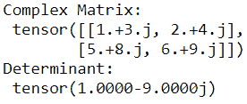
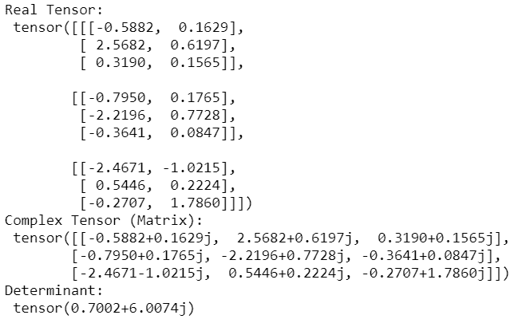
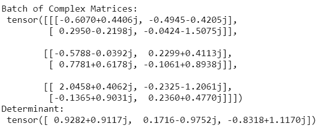

# 在 PyTorch 中求复矩阵的行列式

> 原文:[https://www . geeksforgeeks . org/find-复矩阵行列式在 pytorch/](https://www.geeksforgeeks.org/find-determinant-of-a-complex-matrix-in-pytorch/)

**的线性代数模块 **torch.linalg** 提供函数**torch . linalg . det()***计算正方形(实数或复数)矩阵的行列式。该函数还计算一批中每个方阵的行列式。***

***语法:***

> *torch.linalg.det(输入)–> Tensor*
> 
>  *输入是一个(n，n)矩阵或一批大小为(b，n，n)的矩阵，其中 b 是批维数(一批中的矩阵数)。这个输入必须是张量。这个函数返回行列式值的张量。*

***注意:**此功能支持浮点型、双精度、 **cfloat** 、**T5】和**双精度**数据类型。***

*我们先来看看如何在 PyTorch 中创建一个复杂的矩阵，然后计算矩阵的行列式。为了在 PyTorch 中创建一个复杂矩阵，我们使用 **2D 复张量**。我们还可以创建一批复杂的矩阵。支持的复杂数据类型有 **torch.cfloat** 和**torch . cddouble .***

*下面是一些创建复矩阵(二维复张量)和寻找它们的行列式的例子。*

***例 1:***

*通过生成随机数创建大小为 2×2 的 2D 复张量，并计算行列式。*

## *蟒蛇 3*

```
*# import library
import torch

# create 2x2 complex matrix using
# random numbers
mat = torch.randn(2,2, dtype = torch.cfloat)

# display the matrix
print("Complex Matrix: \n", mat)

# Compute the determinant of Matrix
# using torch.linalg.det()
det = torch.linalg.det(mat)
print("Determinant: \n", det)*
```

***输出:***

**

***例 2:***

*在 PyTorch 中创建复杂矩阵的另一种方法是使用 **torch.complex(real，imag)。**这创建了一个复张量，其实部和虚部分别为**实部**和 **imag。**无论是**实拍**还是 **imag** 都必须是浮动或双面的， **imag** 必须与**实拍同类型。**在下面的程序中，我们创建一个大小为 2×2 的 2D 复张量，并计算其行列式。*

## *蟒蛇 3*

```
*# import library
import torch

# create real parts the complex numbers
real = torch.tensor([[1, 2],[5,6]], dtype=torch.float32)

# create imaginary parts of the complex numbers
imag = torch.tensor([[3, 4],[8,9]], dtype=torch.float32)

# create complex tensor (matrix)
z = torch.complex(real, imag)
print("Complex Matrix: \n", z)

# Compute the determinant of Matrix
# using torch.linalg.det()
det = torch.linalg.det(z)
print("Determinant: \n", det)*
```

***输出:***

**

***例 3:***

*也可以从**已经存在的实张量**创建复张量。使用 **torch.view_as_complex()** 可以很容易地将形状(…，2)的实张量转换成复张量，并且可以使用 **torch.linalg.det()** 方法计算它们的行列式。*

## *蟒蛇 3*

```
*# import library
import torch

# create a real tensor
mat = torch.randn(3,3,2)

# display the real tensor
print("Real Tensor: \n",mat)

# convert the above real tensor
# into complex tensor
mat = torch.view_as_complex(mat)

# display the complex tensor (matrix)
print("Complex Tensor (Matrix): \n", mat)

# Compute the determinant of Matrix
# using torch.linalg.det()
det = torch.linalg.det(mat)
print("Determinant: \n", det)*
```

***输出:***

**

***例 4:***

*这里，我们创建一批大小为 2×2 的 3 个复张量，并计算其行列式。*

## *蟒蛇 3*

```
*# import library
import torch

# create matrix
mat = torch.randn(3,2,2, dtype = torch.cfloat)

# display matrix
print("Batch of Complex Matrices: \n", mat)

# Compute the determinant
det = torch.linalg.det(mat)
print("Determinant: \n", det)*
```

***输出:***

**

***例 5:***

*这是另一个程序，我们创建一批大小为 4×4 的 3 个复张量，并计算行列式。*

## *蟒蛇 3*

```
*# import library
import torch

# create complex matrix
mat = torch.randn(3,4,4, dtype = torch.cfloat)

# display matrix
print("Batch of Complex Matrices: \n", mat)

# Compute the determinant
det = torch.linalg.det(mat)
print("Determinant: \n", det)*
```

***输出:***

**