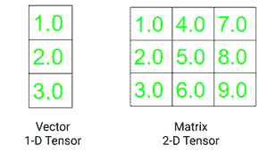

# 【PyTorch 入门

> 原文:[https://www.geeksforgeeks.org/getting-started-with-pytorch/](https://www.geeksforgeeks.org/getting-started-with-pytorch/)

深度学习是机器学习的一个分支，其中编写的算法模仿人脑的功能。深度学习中最常用的库是 Tensorflow 和 PyTorch。由于有各种深度学习框架可用，人们可能会想知道何时使用 PyTorch。以下是为什么人们可能更喜欢在特定任务中使用 Pytorch 的原因。

Pytorch 是一个开源深度学习框架，提供 Python 和 C++接口。Pytorch 位于火炬模块内部。在 PyTorch 中，需要处理的数据以张量的形式输入。

## **安装 PyTorch**

如果您的系统中安装了 Anaconda Python 包管理器，那么通过在终端中运行以下命令来安装 PyTorch:

> 孔代安装 pytorch torch vision CPU only-c pytorch

如果您想使用 PyTorch 而不将其显式安装到本地机器中，可以使用谷歌 Colab。

## **PyTorch 张量**

Pytorch 用于处理张量。[张量](https://www.geeksforgeeks.org/deep-learning-with-pytorch-an-introduction/)是像 n 维 NumPy 数组一样的多维数组。然而，张量也可以用在图形处理器中，这在 NumPy 阵列中是不存在的。PyTorch 加速了张量的科学计算，因为它具有各种内置功能。

向量是一维张量，矩阵是二维张量。C、C++和 Java 中使用的 Tensor 和多维数组之间的一个显著区别是 Tensor 在所有维度上都应该具有相同大小的列。此外，张量只能包含数字数据类型。



张量的两个基本属性是:

*   **形状:**指数组或矩阵的维度
*   **秩:**指张量中存在的维数

**代码:**

## 蟒蛇 3

```
# importing torch
import torch

# creating a tensors
t1=torch.tensor([1, 2, 3, 4])
t2=torch.tensor([[1, 2, 3, 4],
                 [5, 6, 7, 8],
                 [9, 10, 11, 12]])

# printing the tensors:
print("Tensor t1: \n", t1)
print("\nTensor t2: \n", t2)

# rank of tensors
print("\nRank of t1: ", len(t1.shape))
print("Rank of t2: ", len(t2.shape))

# shape of tensors
print("\nRank of t1: ", t1.shape)
print("Rank of t2: ", t2.shape)
```