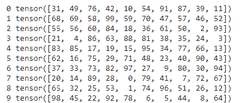

# 如何在 PyTorch 中使用数据加载器？

> 原文:[https://www . geesforgeks . org/如何使用 pytorch 中的数据加载器/](https://www.geeksforgeeks.org/how-to-use-a-dataloader-in-pytorch/)

操作大型数据集需要将它们一次性加载到内存中。在大多数情况下，由于系统中可用的内存数量有限，我们会面临内存中断。此外，由于一次加载大量数据集，程序往往运行缓慢。PyTorch 提供了一种解决方案，通过使用数据加载器，利用自动批处理来并行化数据加载过程。数据加载器已被用于并行化数据加载，因为这提高了速度并节省了内存。

dataloader 构造函数驻留在 torch.utils.data 包中。它有各种参数，其中唯一要传递的强制参数是必须加载的数据集，其余都是可选参数。

**语法:**

> 数据加载器(数据集，随机=真，采样器=无，批处理大小=32)

**自定义数据集上的数据加载器:**

要在自定义数据集上实现数据加载器，我们需要覆盖以下两个子类函数:

*   函数的作用是:返回数据集的大小。
*   [_getitem_()](https://www.geeksforgeeks.org/__getitem__-in-python/#:~:text=The%20__getitem__%20magic,Python's%20most%20underutilized%20magic%20methods.) 函数:从数据集中返回给定索引的样本。

## 蟒蛇 3

```py
# importing the required libraries
import torch
from torch.utils.data import Dataset
from torch.utils.data import DataLoader

# defining the Dataset class
class data_set(Dataset):
    def __init__(self):
        numbers = list(range(0, 100, 1))
        self.data = numbers

    def __len__(self):
        return len(self.data)

    def __getitem__(self, index):
        return self.data[index]

dataset = data_set()

# implementing dataloader on the dataset and printing per batch
dataloader = DataLoader(dataset, batch_size=10, shuffle=True)
for i, batch in enumerate(dataloader):
    print(i, batch)
```

**输出:**



**内置数据集上的数据加载器:**

## 蟒蛇 3

```py
# importing the required libraries
import torch
from torch.utils.data import Dataset
from torch.utils.data import DataLoader
import seaborn as sns
from torch.utils.data import TensorDataset

# defining the dataset consisting of 
# two columns from iris dataset
iris = sns.load_dataset('iris')
petal_length = torch.tensor(iris['petal_length'])
petal_width = torch.tensor(iris['petal_width'])
dataset = TensorDataset(petal_length, petal_width)

# implementing dataloader on the dataset 
# and printing per batch
dataloader = DataLoader(dataset, 
                        batch_size=5, 
                        shuffle=True)

for i in dataloader:
    print(i)
```

**输出:**

