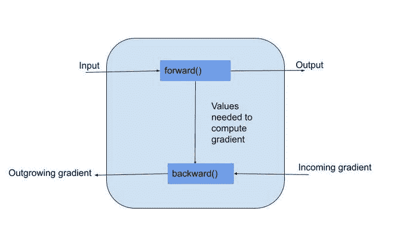

# 变量并在 Pytorch 中签名

> 原文:[https://www . geesforgeks . org/variables-and-autograd-in-py torch/](https://www.geeksforgeeks.org/variables-and-autograd-in-pytorch/)

**PyTorch** 是脸书开发的一个 python 库，用来运行和训练机器和深度学习算法。在神经网络中，我们必须执行反向传播，包括优化参数，以最小化其预测误差。

为此，PyTorch 提供了**torch . autograted**，通过收集所有梯度进行自动区分。**自动签名**通过保存数据记录(张量)&在由函数对象组成的有向无环图中执行所有操作。在这个 DAG 中，叶子是输入张量，根是输出张量。通过从根到叶追踪这个图，我们可以使用链式法则自动计算梯度。



变量是给定正向公式的自动微分工具。它包装了一个变量。变量支持几乎所有由张量定义的 API。定义变量时，我们传递参数 *requires_grad* ，该参数指示变量是否可训练。默认情况下，它设置为 false。下面描述了一个例子来更清楚地理解它。

**例 1:**

## 蟒蛇 3

```py
# importing libraries
import torch
from torch.autograd import Variable

# packing the tensors with Variable
a = Variable(torch.tensor([5., 4.]), requires_grad=True)
b = Variable(torch.tensor([6., 8.]))

# polynomial function with a,b as variable
y = ((a**2)+(5*b))
z = y.mean()
print('Z value is:', z)
```

**输出:**

> z 值为:张量(55.5000，grad_fn= <meanbackward0>)</meanbackward0>

因此，在上面的正向过程中，我们计算出维持梯度函数的张量。之后，当调用 backward 时，它会跟随图中创建的链接向后传播渐变，并将它们累积在相应变量的 *grad* 属性中。

**例 2:**

## 蟒蛇 3

```py
# importing libraries
import torch
from torch.autograd import Variable

# packing the tensors with Variable
a = Variable(torch.tensor([5., 4.]), requires_grad=True)
b = Variable(torch.tensor([6., 8.]))

# polynomial function with a,b as variable
y = ((a**2)+(5*b))
z = y.mean()

# dy/da=2*a=10,8
# dy/db=5

# computing gradient
z.backward()

# printing out
print('Gradient of a', a.grad)
print('Gradient of b', b.grad)
```