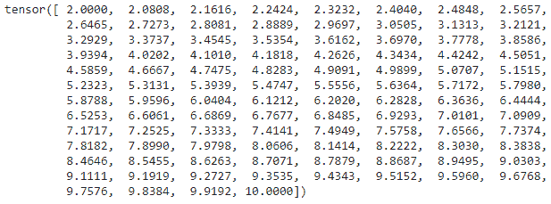
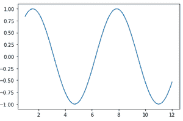
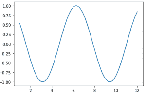
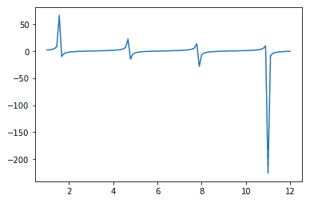

# py torch 中的向量运算

> 原文:[https://www.geeksforgeeks.org/vector-operations-in-pytorch/](https://www.geeksforgeeks.org/vector-operations-in-pytorch/)

在本文中，我们将讨论 PyTorch 中的向量运算。向量是一维张量，用于处理数据。向量运算有不同的类型，如数学运算、点积和 linspace。

PyTorch 是一个优化的张量库，主要用于使用图形处理器和中央处理器的深度学习应用程序。它是广泛使用的机器学习库之一，其他的还有 TensorFlow 和 Keras。

我们可以使用 **torch.tensor()** 函数创建一个向量

**语法:**

> torch.tensor([value1，value2，.值 n])

其中值是将输入作为列表的输入值

**示例:**

## 蟒蛇 3

```
# importing pytorch module
import torch

# create an vector
A = torch.tensor([7058, 7059, 7060, 7061, 7062])

# display
print(A)
```

**输出:**

> 张量([7058，7059，7060，7061，7062])

现在让我们讨论张量支持的每个向量运算。

### 算术运算

这个过程非常简单，只需创建两个向量，并对它们执行操作，就像对两个正则变量执行操作一样。

**示例:**

## 蟒蛇 3

```
# importing pytorch module
import torch

# create an vector A
A = torch.tensor([58, 59, 60, 61, 62])

# create an vector B
B = torch.tensor([100, 120, 140, 160, 180])

# add two vectors
print("Addition of two vectors:", A+B)

# subtract two vectors
print("subtraction of two vectors:", A-B)

# multiply two vectors
print("multiplication of two vectors:", A*B)

# multiply two vectors
print("multiplication of two vectors:", A*B)

# divide two vectors
print("division of two vectors:", A/B)

# floor divide two vectors
print("floor division of two vectors:", A//B)

# modulous of two vectors
print("modulous operation of two vectors:", A % B)

# power of two vectors
print("power operation of two vectors:", A**B)
```

**输出:**

> 两个向量的加法:张量([158，179，200，221，242])
> 
> 两个向量的减法:张量([ -42，-61，-80，-99，-118])
> 
> 两个向量的乘法:张量([ 5800，7080，8400，9760，11160])
> 
> 两个向量的乘法:张量([ 5800，7080，8400，9760，11160])
> 
> 两个向量的除法:张量([0.5800，0.4917，0.4286，0.3812，0.3444])
> 
> 两个向量的楼层划分:张量([0，0，0，0，0])
> 
> 两个向量的模运算:张量([58，59，60，61，62])
> 
> 两个向量的幂运算:张量([ 0，-4166911448072485343，0，8747520307384418433，0])

### 一元运算

它类似于算术运算，只是另一个向量部分被常数代替。

**示例:**

## 蟒蛇 3

```
# importing pytorch module
import torch

# create an vector A
A = torch.tensor([58, 59, 60, 61, 62])

# divide vector by 2
print(A/2)

# multiply vector by 2
print(A*2)

# subtract  vector by 2
print(A-2)
```

**输出:**

> 张量([29.0000，29.5000，30.0000，30.5000，31.0000])
> 
> 张量([116，118，120，122，124])
> 
> 张量([56，57，58，59，60])

### 点积

dot()用于获取点积。考虑中的向量只需要传递给它。

**语法:**

> torch.dot(vector1，vector2)

**示例:**

## 蟒蛇 3

```
# importing pytorch module
import torch

# create an vector A
A = torch.tensor([58, 59, 60, 61, 62])

# create an vector B
B = torch.tensor([8, 9, 6, 1, 2])

# dot product of the two vectors
print(torch.dot(A, B))
```

**输出:**

> 张量(1540)

### **林空间功能**

linspace 用于在给定空间中线性排列数据。它可以在 torch 包中找到，使用 linspace()函数，开始和结束值就足够了。

**语法**:

> torch.linspace(开始，结束)

其中 start 是起始值，end 是结束值。

**例**

## 蟒蛇 3

```
# importing pytorch module
import torch

# arrange the elements from 2 to 10
print(torch.linspace(2, 10))
```

**输出:**



### 在二维坐标系上绘制函数

linspace 函数用于在二维坐标系上绘制函数。对于 x 轴，我们以 2.5 的间隔创建一个从 0 到 10 的陆地空间，Y 将是每个 x 值的函数。

**例 1:** sin 函数

## 蟒蛇 3

```
#import pytorch
import torch

#import numpy
import numpy as np

#import matplotlib
import matplotlib.pyplot as plt

# create lin space from 1 to 12
x = torch.linspace(1, 12)

# sin function
y = torch.sin(x)

# plot
plt.plot(x.numpy(), y.numpy())

# display
plt.show()
```

**输出:**



**例 2:** cos 函数

## 蟒蛇 3

```
#import pytorch
import torch

#import numpy
import numpy as np

#import matplotlib
import matplotlib.pyplot as plt

# create lin space from 1 to 12
x = torch.linspace(1, 12)

# cos function
y = torch.cos(x)

# plot
plt.plot(x.numpy(), y.numpy())

# display
plt.show()
```

**输出:**



**例 3:** tan()函数

## 蟒蛇 3

```
#import pytorch
import torch

#import numpy
import numpy as np

#import matplotlib
import matplotlib.pyplot as plt

# create lin space from 1 to 12
x = torch.linspace(1, 12)

# tan function
y = torch.tan(x)

# plot
plt.plot(x.numpy(), y.numpy())

# display
plt.show()
```

**输出:**

