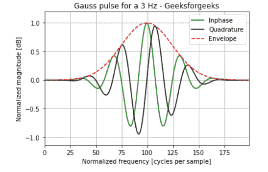

# 使用高斯脉冲

产生高斯脉冲

> 原文:[https://www . geesforgeks . org/create-a-gauss-pulse-using-scipy-signal-gauss pulse/](https://www.geeksforgeeks.org/create-a-gauss-pulse-using-scipy-signal-gausspulse/)

**先决条件** : [Scipy](https://www.geeksforgeeks.org/data-analysis-with-scipy/)

高斯滤波器的脉冲响应写成高斯函数，如下所示:


它的结果也是高斯的。在本文中，我们将使用 scipy 和 [matplotlib](https://www.geeksforgeeks.org/python-introduction-matplotlib/) Python 库绘制 3Hz 的高斯脉冲。高斯脉冲用于运动分析的数字滤波器。为了产生高斯脉冲，使用了 scipy 的 gauss pulse()方法。gausspulse()在数组 t 中指示的时间返回单位幅度高斯调制正弦脉冲，中心频率为赫兹(Hz)。

> **语法:**scipy . signal . gaussulse(t，fc retquad，retenv)
> 
> **参数:**
> 
> *   **t:** 输入数组。
> *   **fc:** 中心频率。
> *   **返回:**如果为真，返回信号的虚部和实部。默认值为假。
> *   **retenv:** 如果为真，返回信号包络。默认值为假。
> 
> **返回**
> 
> *   **yI:** 信号的实部。总是回来。
> *   **yQ:** 信号虚部。仅当 retquad 为真时返回。
> *   **yenv:** 信号的包络。仅当 retenv 为真时才返回。

### **进场:**

*   导入所需模块。
*   使用 np.linespace 创建一个数据数组。
*   创建一个 3 Hz 的高斯脉冲。
*   标记图表。
*   显示结果图。

使用上述方法的实现描述如下:

## 蟒蛇 3

```py
from scipy import signal
import matplotlib.pyplot as plt
import numpy as np

t = np.linspace(-1, 1, 200)

i, q, e = signal.gausspulse(t, fc=3, retquad=True, retenv=True)

plt.plot(i, color='green')
plt.plot(q, color='black')
plt.plot(e, '--', color='red')

plt.title('Gauss pulse for a 3 Hz - Geeksforgeeks')
plt.ylabel("Normalized magnitude [dB]")
plt.xlabel("Normalized frequency [cycles per sample]")
plt.margins(0, 0.1)
plt.grid(which='both', axis='both')
plt.legend(['Inphase', 'Quadrature', 'Envelope'])

plt.show()
```

**输出:**

