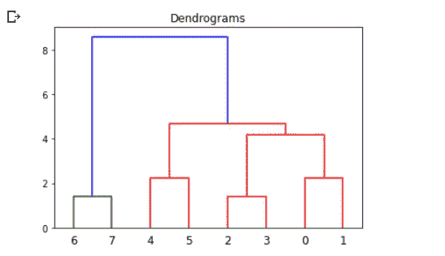
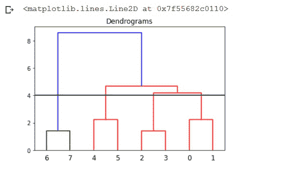

# 使用 Python 中的 SciPy 将层次树图切割成簇

> 原文:[https://www . geesforgeks . org/cutting-hierarchy-trendgram-in-clusters-using-scipy-in-python/](https://www.geeksforgeeks.org/cutting-hierarchical-dendrogram-into-clusters-using-scipy-in-python/)

在本文中，我们将看到如何使用 Python 中的 SciPy 通过一个阈值将一个层次树图切割成簇。

树形图是一种显示层次聚类的树形图，即相似数据集之间的关系。它用于分析不同类之间的层次关系。 ***scipy.cluster*** 包为我们提供了分层聚类和树图绘制所需的工具。因此，必须输入到环境中。

让我们首先创建一些样本数据，然后正常绘制。我们取了一堆随机数据点作为我们的输入，稍后我们将绘制它们的树图。

**示例:**用于创建和可视化数据的示例程序

## 蟒蛇 3

```
# Importing the libraries
from scipy.cluster import hierarchy
from scipy.cluster.hierarchy import dendrogram
import numpy as np
import matplotlib.pyplot as plt

# The data points are given as list of lists
data = np.array([
    [1, 4],
    [2, 2],
    [3, 7],
    [4, 6],
    [5, 1],
    [6, 3],
    [8, 10],
    [9, 11]
])

# Taking transpose
x, y = data.T

# plot our list in X,Y coordinates
plt.scatter(x, y)
plt.show()
```

**输出:**


样本输入数据点

使用连锁矩阵可以很容易地绘制树形图。链接矩阵是通过 link()函数创建的。该矩阵包含分层聚类的编码，以呈现为树形图。

> **语法:**
> 
> *层次结构.链接(y，方法='single '，度量='euclidean '，optimal_ordering=False):*
> 
> **参数:**
> 
> *   **y:** 输入 1D/ 2D 阵列的输入向量
> *   **方法:**计算新形成的簇与其他点之间距离的方法。方法= '单一'，'完整'，'平均'，'形心'
> *   **度量:**在输入是观察向量集合的情况下使用的距离度量
> *   **最优排序:**如果为真，将对连锁矩阵进行重新排序，使连续叶片之间的距离最小

**示例:**为我们的数据创建树形图

## 蟒蛇 3

```
# Creating Dendrogram for our data
# Z = linkage matrix
Z = hierarchy.linkage(data, method='average')

plt.figure()
plt.title("Dendrograms")

# Dendrogram plotting using linkage matrix
dendrogram = hierarchy.dendrogram(Z)
```

**输出:**



无任何截断的原始树木图

现在，让我们把树图减少一个阈值。我们选择了一个截止值或阈值 4。在这个值下，也可以画一条垂直线。

对于所选的截止值/阈值，我们总是可以简单地计算树图垂直线的交点数，以获得形成的聚类数。假设我们选择 max_d = 6 的截止值，我们会得到两个最终的簇。

**示例:**在阈值处切割树形图

## 蟒蛇 3

```
# Creating Dendrogram for our data
# max_d = cut-off/ Threshold value
max_d = 4

Z = hierarchy.linkage(data, method='average')
plt.figure()
plt.title("Dendrograms")
dendrogram = hierarchy.dendrogram(Z)

# Cutting the dendrogram at max_d
plt.axhline(y=max_d, c='k')
```

**输出:**



树状图在阈值为 4 时切割