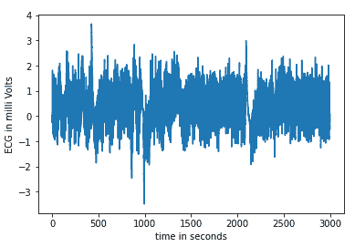

# Scipy–显示心电图

> 原文:[https://www . geesforgeks . org/scipy-display-心电图/](https://www.geeksforgeeks.org/scipy-display-electrocardiogram/)

心电图学是使用安装在皮肤上的电极产生心电图的实践，心电图是心脏电活动的电压对时间的图表。

**应用:**

*   心跳分析
*   癌症治疗

在 python 中使用 scipy 我们可以通过使用 **scipy.misc .心电图()**来生成心电图

它用于加载心电图，将只返回一维信号。

返回的信号是 5 分钟长的心电图，这是心脏电活动的医学记录，它基本上返回一个 n 维数组。

**进场:**

*   导入 numpy 和 scipy 模块。
*   创建心电图模型。
*   用频率计算时间数据。
*   显示图表。

**实现:**

## 计算机编程语言

```py
# import electrocardiogram
import matplotlib.pyplot as plt
from scipy.misc import electrocardiogram

# import numpy
import numpy as np

# define electrocardiogram as ecg model
ecg = electrocardiogram()

# frequency is 0
frequency = 360

# calculating time data with ecg size along with frequency
time_data = np.arange(ecg.size) / frequency

# plotting tine and ecg model
plt.plot(time_data, ecg)
plt.xlabel("time in seconds")
plt.ylabel("ECG in milli Volts")

# display
plt.show()
```

**输出:**



*   更改 x，y 限制，以清晰可视化。

## 蟒蛇 3

```py
# import electrocardiogram
import matplotlib.pyplot as plt
from scipy.misc import electrocardiogram

# import numpy
import numpy as np

# define electrocardiogram as ecg model
ecg = electrocardiogram()

# frequency is 360
frequency = 360

# calculating time data with ecg size along with frequency
time_data = np.arange(ecg.size) / frequency

# plotting tine and ecg model
plt.plot(time_data, ecg)
plt.xlabel("time in seconds")
plt.ylabel("ECG in milli Volts")
plt.xlim(9, 10.2)
plt.ylim(-1, 1.5)
# display
plt.show()
```