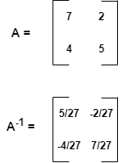

# SciPy 线性代数 – SciPy Linalg

> 原文:[https://www . geeksforgeeks . org/scipy-线性代数-scipy-linalg/](https://www.geeksforgeeks.org/scipy-linear-algebra-scipy-linalg/)

SciPy 包包含 Python 中 NumPy 包的特性。它使用 NumPy 数组作为基本的数据结构。它具有 NumPy 模块的线性代数中包含的所有特性和一些扩展功能。它由一个 **linalg** 子模块组成，SciPy 和 NumPy 子模块提供的功能有重叠。

让我们通过一些例子来讨论模块提供的一些方法及其功能。

## 求解线性方程

**线性求解**函数用于求解给定的线性方程。它用于自动评估方程和寻找未知变量的值。

> **语法:** scipy.linalg.solve(a，b，sym_pos，lower，overwrite_a，overwrite_b，debug，check _ limited，假设 _a，转置)

让我们考虑一个例子，其中两个数组 a 和 b 由 **linalg.solve** 函数获取。数组 a 包含未知变量的系数，而数组 b 包含线性方程的右侧值。线性方程由函数求解，以确定未知变量的值。假设线性方程为:

```
7x + 2y = 8
4x + 5y = 10
```

## 计算机编程语言

```
# Import the required libraries
from scipy import linalg
import numpy as np

# The function takes two arrays
a = np.array([[7, 2], [4, 5]])
b = np.array([8, 10])

# Solving the linear equations
res = linalg.solve(a, b)
print(res)
```

**输出:**

```
[0.74074074 1.40740741]
```

## 计算矩阵的逆

**scipy . linalg . inv**用于求矩阵的逆。

> **语法:** scipy.linalg.inv(a，overwrite_a，check _ limited)
> 
> **参数:**
> 
> *   **a:** 是正方形矩阵。
> *   **覆盖 _a (** ***【可选)*** **:** 丢弃方块矩阵中的数据。
> *   **check _ limited(*****【可选)*** **:** 检查输入矩阵是否只包含有限个数。
> 
> **返回:**
> 
> *   **scipy.linalg.inv** 返回方阵的逆矩阵。

考虑一个例子，其中输入 x 由函数 **scipy.linalg.inv** 获取。这个输入是方阵。它返回 y，y 是矩阵 x 的逆矩阵。让矩阵为–



## 计算机编程语言

```
# Import the required libraries
from scipy import linalg
import numpy as np

# Initializing the matrix
x = np.array([[7, 2], [4, 5]])

# Finding the inverse of
# matrix x
y = linalg.inv(x)
print(y)
```

**输出:**

```
[[ 0.18518519 -0.07407407]
 [-0.14814815  0.25925926]]
```

## 计算矩阵的伪逆

为了计算矩阵的(摩尔-彭罗斯)伪逆，使用了 **scipy.linalg.pinv** 。

> **语法:** scipy.linalg.pinv(a，cond，rcond，return_rank，check _ limited)
> 
> **参数:**
> 
> *   **a:** 是输入矩阵。
> *   **cond，rcond (** ***可选)*** **:** 是小奇异值的截止因子。
> *   **return_rank (** ***【可选)*** **:** 如果值为 True，则返回矩阵的有效秩。
> *   **check _ 有限(** ***【可选)*** **:** 它检查输入矩阵是否只由有限个数字组成。
> 
> **返回:**
> 
> *   **scipy.linalg.pinv** 返回输入矩阵的伪逆。

**示例:****scipy . linalg . pinv**取矩阵 x 进行伪逆。它返回矩阵 x 的伪逆和矩阵的有效秩。

## 计算机编程语言

```
# Import the required libraries
from scipy import linalg
import numpy as np

# Initializing the matrix
x = np.array([[8 , 2] , [3 , 5] , [1 , 3]])

# finding the pseudo inverse of matrix x
y = linalg.pinv(x)
print(y)
```