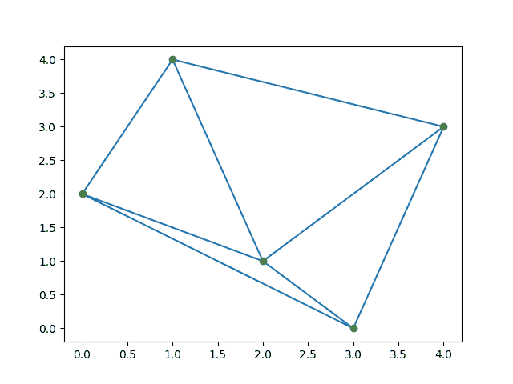
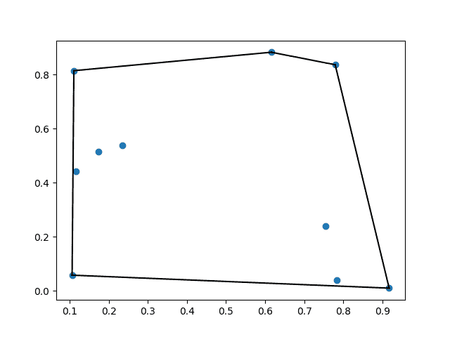

# scipy . Spatial–空间数据结构和算法

> 原文:[https://www . geesforgeks . org/scipy-space-space-data-structures-and-algorithms/](https://www.geeksforgeeks.org/scipy-spatial-spatial-data-structures-and-algorithms/)

在本文中，我们将看到空间数据结构和算法，它用于在几何空间中表示数据。

## 什么是空间数据结构？

空间包通过利用 Qhull 库来计算一组点的三角剖分、Voronoi 图和凸包。此外，它包含最近邻点查询的 KDTree 实现和各种度量中距离计算的实用程序。

### 示例 1:德劳内三角测量

在数学和计算几何中，一个平面中给定的离散点集合 p 的德劳奈三角剖分是一个三角剖分 DT(p)，这样 DT(p)中的任何三角形的外接圆内都没有点 p。

## 计算机编程语言

```
from scipy.spatial import Delaunay
import numpy as np
import matplotlib.pyplot as plt

points = np.array([[1, 4], [2, 1], [3, 0], 
                   [0, 2], [4, 3]])
tri = Delaunay(points)

plt.triplot(points[:, 0], points[:, 1], tri.simplices.copy())
plt.plot(points[:, 0], points[:, 1], 'o')
plt.show()
```

**输出:**



### 示例 2:共面点

共面点是位于同一平面上的三个或更多的点。回想一下，平面是一个平面，它向各个方向延伸，没有尽头。

## 计算机编程语言

```
from scipy.spatial import Delaunay
import numpy as np

points = np.array([[0, 0], [0, 1], [1, 0], 
                   [1, 1], [1, 1]])
tri = Delaunay(points)
print(tri.simplices)
print(tri.coplanar)
```

**输出:**

```
[[3 1 0]
 [2 3 0]]
[[4 0 3]]
```

### 示例 3:凸包

欧氏空间(或者更一般地说，实数上的仿射空间)中的一组点 X 的凸包或凸包络是包含 X 的最小凸集。

## 计算机编程语言

```
from scipy.spatial import ConvexHull
import numpy as np
import matplotlib.pyplot as plt

points = np.random.rand(10, 2)
hull = ConvexHull(points)

plt.plot(points[:, 0], points[:, 1], 'o')
for simplex in hull.simplices:
    plt.plot(points[simplex, 0], points[simplex, 1], 'k-')

plt.show()
```

**输出:**



### 示例 4:关键绩效指标树

kd-tree 是一种快速的最近邻查找。和 Kdtree()方法返回 kd-tree 对象

## 蟒蛇 3

```
from scipy.spatial import KDTree

points = np.random.rand(10, 2)
kdtree = KDTree(points)
result = kdtree.query((1, 1))
print(result)
```

**输出:**

```
(0.5144859720297681, 9)
```