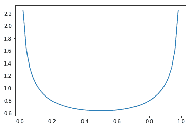
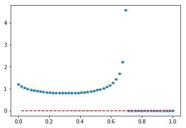

# scipy stats . arcsine()| python

> 哎哎哎:# t0]https://www . geeksforgeeks . org/scipy-stats-arcsine-python/

**scipy.stats.arcsine()** 是一个反正弦连续随机变量，用标准格式和一些形状参数定义，以完成其规格。
T3】

> **参数:**
> **q :** 上下尾概率
> **x :** 分位数
> **loc :** 【可选】位置参数。默认= 0
> **比例:**【可选】比例参数。默认值= 1
> **大小:**【整数元组，可选】形状或随机变量。
> **瞬间:**【可选】由字母['mvsk']组成；m’=均值，‘v’=方差，‘s’= Fisher 偏斜度，‘k’= Fisher 峰度。(默认值= 'mv ')。
> 
> **结果:**反正弦连续随机变量

**代码#1:创建反正弦连续随机变量**

```py
# importing scipy
from scipy.stats import arcsine

numargs = arcsine.numargs
[ ] = [0.6, ] * numargs
rv = arcsine()

print ("RV : \n", rv)
```

**输出:**

```py
RV :  
<scipy.stats._distn_infrastructure.rv_frozen object at 0x0000029484D796D8>
```

**代码#2:反正弦随机变量和概率分布函数。**

```py
quantile = np.arange (0.01, 1, 0.1)

# Random Variates
R = arcsine.rvs(scale = 2,  size = 10)
print ("Random Variates : \n", R)

# PDF
R = arcsine.pdf(x = quantile, scale = 2)
print ("\nProbability Distribution : \n", R)
```

**输出:**

```py
Random Variates : 
 [1.17353658 1.96350916 1.73419819 0.71255312 0.28760466 1.54410451
 1.9644408  0.35014597 0.26798525 0.24599504]

Probability Distribution : 
 [2.25643896 0.69810843 0.51917523 0.43977033 0.39423905 0.3651505
 0.34568283 0.33260295 0.32421577 0.31960693]
```

**代码#3:图形表示。**

```py
# libraries
import numpy as np
import matplotlib.pyplot as plt

distribution = np.linspace(0, np.minimum(rv.dist.b, 3))
print ("Distribution : \n", distribution)

plot = plt.plot(distribution, rv.pdf(distribution))
```

**输出:**

```py
Distribution : 
 [0\.         0.02040816 0.04081633 0.06122449 0.08163265 0.10204082
 0.12244898 0.14285714 0.16326531 0.18367347 0.20408163 0.2244898
 0.24489796 0.26530612 0.28571429 0.30612245 0.32653061 0.34693878
 0.36734694 0.3877551  0.40816327 0.42857143 0.44897959 0.46938776
 0.48979592 0.51020408 0.53061224 0.55102041 0.57142857 0.59183673
 0.6122449  0.63265306 0.65306122 0.67346939 0.69387755 0.71428571
 0.73469388 0.75510204 0.7755102  0.79591837 0.81632653 0.83673469
 0.85714286 0.87755102 0.89795918 0.91836735 0.93877551 0.95918367
 0.97959184 1\.        ]

```



**代码#4:不同的位置和比例**

```py
from scipy.stats import arcsine
import matplotlib.pyplot as plt
import numpy as np
a = 2
b = 2
x = np.linspace(0, np.minimum(rv.dist.b, 3))

# Varying location and scale
y1 = arcsine.pdf(x, -0.1, .8)
y2 = arcsine.pdf(x, -3.25, 3.25)
plt.plot(x, y1, "*", x, y2, "r--")
```

