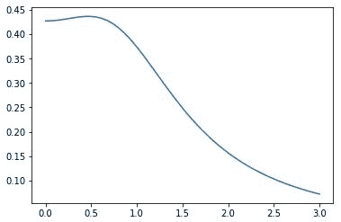

# scipy stats . foldca uchy()| python

> 哎哎哎:# t0]https://www . geeksforgeeks . org/scipy-stats-foldca uchy-python/

**scipy.stats.foldcauchy()** 是一个折叠的 cauchy 连续随机变量，用标准格式和一些形状参数定义以完成其规格。
T3】

> **参数:**
> **- > q :** 上下尾概率
> **- > a :** 形状参数
> **- > x :** 分位数
> **- > loc :** 【可选】位置参数。默认= 0
> **- >刻度:**【可选】刻度参数。默认值= 1
> **- >大小:**【整数元组，可选】形状或随机变量。
> **- >矩:**【可选】由字母['mvsk']组成；m’=均值，‘v’=方差，‘s’= Fisher 偏斜度，‘k’= Fisher 峰度。(默认值= 'mv ')。
> 
> **结果:**折叠柯西连续随机变量

**代码#1:创建折叠柯西连续随机变量**

```
from scipy.stats import foldcauchy

numargs = foldcauchy.numargs
[a] = [0.7, ] * numargs
rv = foldcauchy(a)

print ("RV : \n", rv) 
```

**输出:**

```
RV : 
 <scipy.stats._distn_infrastructure.rv_frozen object at 0x0000018D55D8E160>

```

**代码#2:折叠柯西随机变量和概率分布函数。**

```
import numpy as np
quantile = np.arange (0.01, 1, 0.1)

# Random Variates
R = foldcauchy.rvs(a, scale = 2,  size = 10)
print ("Random Variates : \n", R)

# PDF
R = foldcauchy.pdf(a, quantile, loc = 0, scale = 1)
print ("\nProbability Distribution : \n", R) 
```

**输出:**

```
Random Variates : 
 [1.7445128  2.82630984 0.81871044 5.19668279 7.81537565 1.67855736
 3.35417067 0.13838753 1.29145462 1.90601065]

Probability Distribution : 
 [0.42727064 0.42832192 0.43080143 0.43385803 0.43622229 0.43639823
 0.43294602 0.42480391 0.41154712 0.3934792 ]

```

**代码#3:图形表示。**

```
import numpy as np
import matplotlib.pyplot as plt

distribution = np.linspace(0, np.minimum(rv.dist.b, 3))
print("Distribution : \n", distribution)

plot = plt.plot(distribution, rv.pdf(distribution))
```

**输出:**

```
Distribution : 
 [0\.         0.06122449 0.12244898 0.18367347 0.24489796 0.30612245
 0.36734694 0.42857143 0.48979592 0.55102041 0.6122449  0.67346939
 0.73469388 0.79591837 0.85714286 0.91836735 0.97959184 1.04081633
 1.10204082 1.16326531 1.2244898  1.28571429 1.34693878 1.40816327
 1.46938776 1.53061224 1.59183673 1.65306122 1.71428571 1.7755102
 1.83673469 1.89795918 1.95918367 2.02040816 2.08163265 2.14285714
 2.20408163 2.26530612 2.32653061 2.3877551  2.44897959 2.51020408
 2.57142857 2.63265306 2.69387755 2.75510204 2.81632653 2.87755102
 2.93877551 3\.        ]
```



**代码#4:变化的位置参数**

```
import matplotlib.pyplot as plt
import numpy as np

x = np.linspace(0, 5, 100)

# Varying positional arguments
y1 = foldcauchy.pdf(x, 1, 3)
y2 = foldcauchy.pdf(x, 1, 4)
plt.plot(x, y1, "*", x, y2, "r--")
```

**输出:**
