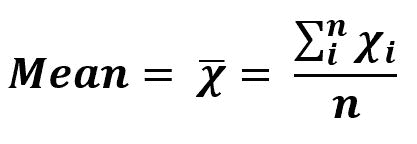

# scipy stats . tmean()| python

> 哎哎哎:# t0]https://www . geeksforgeeks . org/scipy-stats-tmean-python/

`**scipy.stats.tmean(array, limits=None, inclusive=(True, True))**`计算沿数组指定轴的数组元素的修剪平均值。

是公式–


> **参数:**
> **数组:**输入具有计算修剪平均值的元素的数组或对象。
> **轴:**轴，沿该轴计算修剪平均值。默认情况下，轴= 0。
> **限值:**数组的下限和上限要考虑，小于下限或大于上限的值将被忽略。如果限制为无[默认值]，则使用所有值。
> 
> **返回:**基于设置参数的数组元素的修剪平均值。

**代码#1:**

```
# Trimmed Mean 

from scipy import stats
import numpy as np 

# array elements ranging from 0 to 19
x = np.arange(20)

print("Trimmed Mean :", stats.tmean(x)) 

print("\nTrimmed Mean by setting limit : ", 
      stats.tmean(x, (2, 10)))
```

**Output:**

```
Trimmed Mean : 9.5

Trimmed Mean by setting limit :  6.0

```

**代码#2:** 多维数据，轴()工作

```
# Trimmed Mean 

from scipy import stats
import numpy as np 

arr1 = [[1, 3, 27], 
        [5, 3, 18], 
        [17, 16, 333], 
        [3, 6, 82]] 

# using axis = 0
print("\nTrimmed Mean is with default axis = 0 : \n", 
      stats.tmean(arr1, axis = 1))
```

**Output:**

```
Trimmed Mean is with default axis = 0 : 
 42.8333333333

```