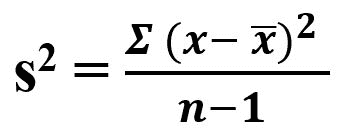

# scipy stats . shape()函数\ python

> 原文:[https://www . geesforgeks . org/scipy-stats-tvar-function-python/](https://www.geeksforgeeks.org/scipy-stats-tvar-function-python/)

****【scipy . stats . tvar(array，limits=None，including =(1，1))**** 函数计算数组元素的修剪方差，同时忽略位于指定限制之外的值。

是公式–


> **参数:**
> **数组:**输入具有计算修剪方差的元素的数组或对象。
> **限值:**数组的下限和上限要考虑，小于下限或大于上限的值会被忽略。如果限制为无[默认值]，则使用所有值。
> **包含:**决定是包含等于下限还是上限的值，还是在计算时将其排除。
> 
> **返回:**根据设置的参数，对数组元素的方差进行修剪。

**代码#1:**

```
# Trimmed Variance 

from scipy import stats
import numpy as np 

# array elements ranging from 0 to 19
x = np.arange(20)

print("Trimmed Variance :", stats.tvar(x)) 

print("\nTrimmed Variance by setting limit : ", 
      stats.tvar(x, (2, 10)))
```

**Output:**

```
Trimmed Variance : 35.0

Trimmed Variance by setting limit :  7.5

```

**代码#2:** 检查“包含”标志

```
# Trimmed Variance 

from scipy import stats
import numpy as np 

# array elements ranging from 0 to 19
x = np.arange(20)

# Setting limits
print("\nTrimmed Variance by setting limit : ", 
      stats.tvar(x, (2, 10))) 

# using flag
print("\nTrimmed Variance by setting limit : ", 
      stats.tvar(x, (2, 10), (False, True))) 

print("\nTrimmed Variance by setting limit : ", 
      stats.tvar(x, (2, 12), (True, False))) 
```

**Output:**

```
Trimmed Variance by setting limit :  7.5

Trimmed Variance by setting limit :  6.0

Trimmed Variance by setting limit :  9.16666666667

```