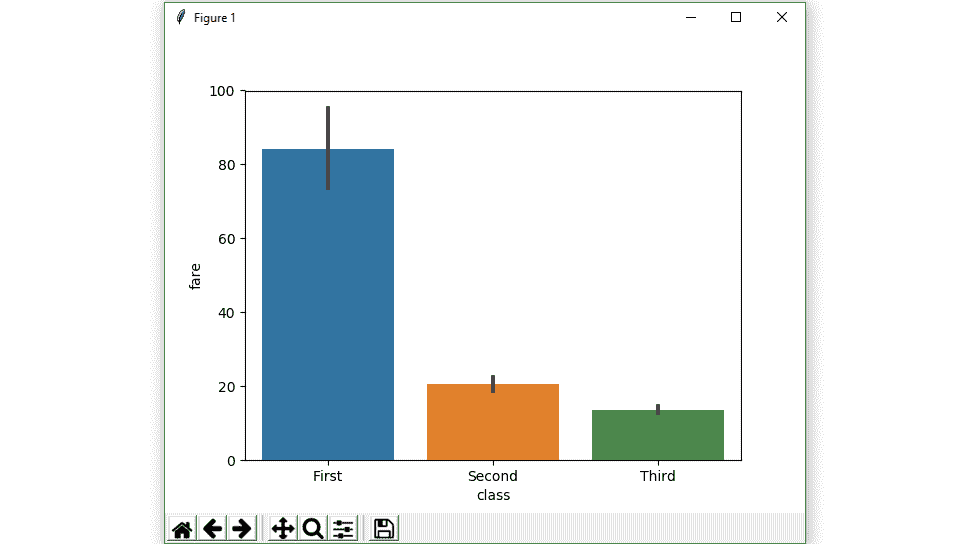
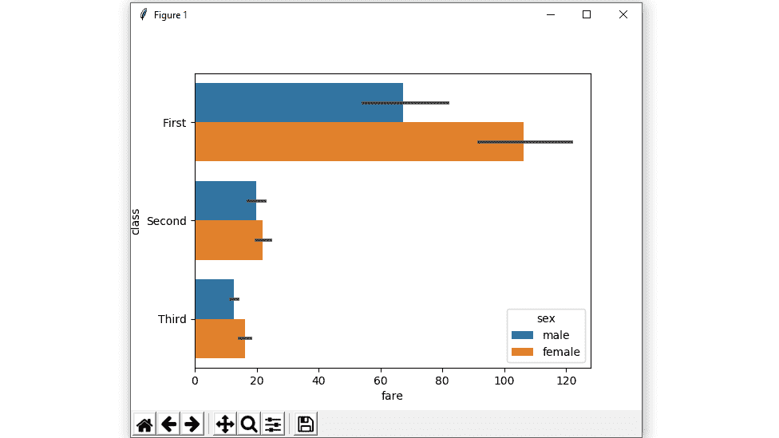
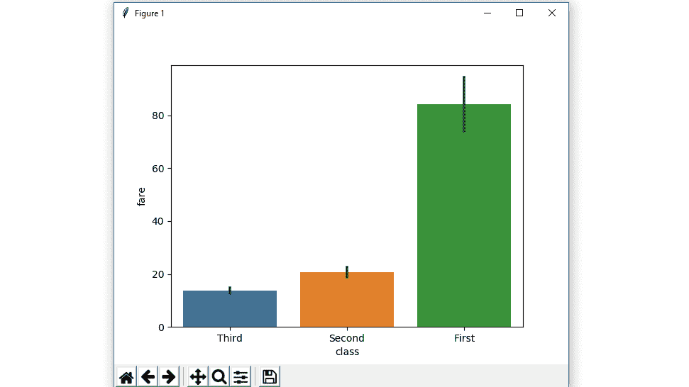
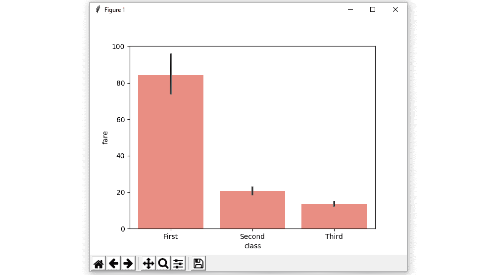

# 在 Python 中使用海鸟绘制条形图

> 原文:[https://www . geesforgeks . org/bar plot-use-seaborn-in-python/](https://www.geeksforgeeks.org/barplot-using-seaborn-in-python/)

Seaborn 是一个用 Python 绘制统计图形的惊人可视化库。它提供了漂亮的默认样式和调色板，使统计图更有吸引力。它建立在 [matplotlib](https://www.geeksforgeeks.org/python-introduction-matplotlib/) 库的基础上，也与[熊猫](https://www.geeksforgeeks.org/introduction-to-pandas-in-python/)的数据结构紧密结合。

### Seaborn.barplot()

**seaborn.barplot()** 方法用于绘制 barplot。条形图表示数值变量中心趋势的估计值以及每个矩形的高度，并使用误差线提供该估计值周围不确定性的一些指示。

> **语法:**seaborn . barplot(x =无，y =无，色相=无，数据=无，顺序=无，色相 _ 顺序=无，估计器= *<函数平均值在 0x7fa4c4f67940 >* ，ci=95，n_boot=1000，单位=无，种子=无，方向=无，颜色=无，调色板=无，饱和度=0.75，errcolor='.26 '，errwidth =无，倾覆=0。
> 
> *   **x，y :** 该参数取数据或矢量数据中变量的名称，用于绘制长格式数据的输入。
> *   **色调:**(可选)该参数取颜色编码的列名。
> *   **数据:**(可选)此参数采用数据框、数组或数组列表、数据集进行绘图。如果 x 和 y 不存在，这被解释为宽形。否则它应该是长格式的。
> *   **颜色:**(可选)此参数采用 matplotlib 颜色、所有元素的颜色或渐变调色板的种子。
> 
> **返回:**返回绘制了绘图的坐标轴对象。

**用不同的属性对 Seaborn barplot 中的变量进行分组**

**示例 1:绘制一组由分类变量分组的竖线图。**
使用海鸟创造一个简单的酒吧情节。

**语法:**

> seaborn.barplot( x，y，日期)

## 蟒蛇 3

```
# importing the required library
import seaborn as sns
import matplotlib.pyplot as plt

# read a titanic.csv file
# from seaborn library
df = sns.load_dataset('titanic')

# class v / s fare barplot
sns.barplot(x = 'class', y = 'fare', data = df)

# Show the plot
plt.show()
```

**输出:**



**例 2:画一组竖条，用两个变量嵌套分组。**

使用带有两个变量的色调参数创建条形图。

**语法:**

> seaborn.barplot( x，y，data，hue)

## 蟒蛇 3

```
# importing the required library
import seaborn as sns
import matplotlib.pyplot as plt

# read a titanic.csv file
# from seaborn library
df = sns.load_dataset('titanic')

# class v / s fare barplot
sns.barplot(x = 'class', y = 'fare', hue = 'sex', data = df)

# Show the plot
plt.show()
```

**输出:**


**示例 3:** **显示了水平条形图。**

交换数据变量，而不是两个数据变量，这意味着轴将这些数据变量中的每一个表示为一个轴。

x 表示 x 轴，y 表示 y 轴。

## 蟒蛇 3

```
# importing the required library
import seaborn as sns
import matplotlib.pyplot as plt

# read a titanic.csv file
# from seaborn library
df = sns.load_dataset('titanic')

# fare v / s class horizontal barplot
sns.barplot(x = 'fare', y = 'class', hue = 'sex', data = df)

# Show the plot
plt.show()
```

**输出:**



**示例 4:按给定顺序绘制所有条形图。**

通过传递显式顺序来控制 barplot 顺序。

## 蟒蛇 3

```
# importing the required library
import seaborn as sns
import matplotlib.pyplot as plt

# read a titanic.csv file
# from seaborn library
df = sns.load_dataset('titanic')

# class v / s fare barplot in given order
sns.barplot(x = 'class', y = 'fare', data = df,
            order = ["Third", "Second", "First"])

# Show the plot
plt.show()
```

**输出:**



**示例 5:使用颜色属性以单一颜色绘制所有条形图。**

所有元素的颜色。

**语法:**

> seaborn.barplot( x，y，日期，颜色)

## 蟒蛇 3

```
# importing the required library
import seaborn as sns
import matplotlib.pyplot as plt

# read a titanic.csv file from seaborn library
df = sns.load_dataset('titanic')

# class v / s fare barplot with same colour
sns.barplot(x = 'class', y = 'fare', data = df, color = "salmon")

# Show the plot
plt.show()
```

**输出:**



**示例 6:使用 ci 属性的不带误差线的条形图。**

我们将使用无这意味着不会执行引导，并且不会绘制误差线

**语法:**

> seaborn.barplot( x，y，日期，ci)

## 蟒蛇 3

```
# importing the required library
import seaborn as sns
import matplotlib.pyplot as plt

# read a titanic.csv file
# from seaborn library
df = sns.load_dataset('titanic')

# class v / s fare barplot
# without error bars
sns.barplot(x = 'class', y = 'fare', data = df, ci = None)

# Show the plot
plt.show()
```