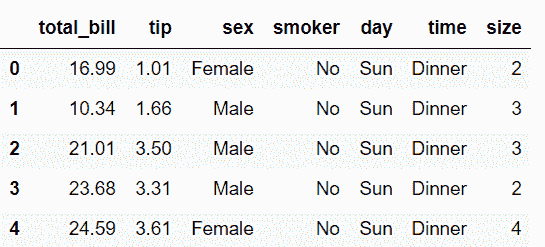
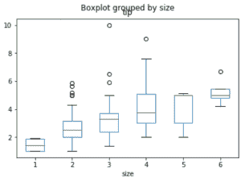
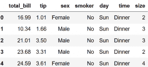

# 熊猫和海鸟的箱线图可视化

> 原文:[https://www . geesforgeks . org/box-plot-visualization-with-pandas-and-seaborn/](https://www.geeksforgeeks.org/box-plot-visualization-with-pandas-and-seaborn/)

***箱线图*****是通过四分位数描绘数字数据组的视觉表示。Boxplot 也用于检测数据集中的异常值。它通过一个简单的方框和触须高效地捕获数据摘要，并允许我们轻松地跨组进行比较。Boxplot 使用第 25 个、第 50 个和第 75 个百分位数汇总样本数据。这些百分位数也被称为下四分位数、中位四分位数和上四分位数。**

**方框图由 5 个部分组成。**

*   **最低限度**
*   **第一个四分位数或 25%**
*   **中位数(第二四分位数)或 50%**
*   **第三个四分位数或 75%**
*   **最高的**

**要下载使用的数据集，点击这里的。**

****用熊猫画方框图:****

**使用熊猫[数据框](https://www.geeksforgeeks.org/python-pandas-dataframe/)绘制箱线图的一种方法是使用熊猫库的`boxplot()`功能。**

```
# import the required library 
import numpy as np 
import pandas as pd 
import matplotlib.pyplot as plt 
% matplotlib inline

# load the dataset
df = pd.read_csv("tips.csv")

# display 5 rows of dataset
df.head()   
```

****

**`days` 相对于`total_bill`的箱线图。**

```
df.boxplot(by ='day', column =['total_bill'], grid = False)
```

**

同敬`size` `tip`的箱型地块。**

```
df.boxplot(by ='size', column =['tip'], grid = False)
```

**

**使用海鸟图书馆绘制箱线图:****

> ****语法:**
> `seaborn.boxplot(x=None, y=None, hue=None, data=None, order=None, hue_order=None, orient=None, color=None, palette=None, saturation=0.75, width=0.8, dodge=True, fliersize=5, linewidth=None, whis=1.5, notch=False, ax=None, **kwargs)`**
> 
> ****参数:**
> **x =** 数据集的特征
> **y =** 数据集的特征
> **色相=** 数据集的特征
> **数据=** 数据框或完整数据集
> **颜色=** 颜色名称**

**让我们看看如何通过 seaborn library 创建方块图。**

**关于“提示”数据集的信息。**

```
# load the dataset
tips = sns.load_dataset('tips')

tips.head()
```

****

**`days` 相对于`total_bill`的箱线图。**

```
# Draw a vertical boxplot grouped 
# by a categorical variable:
sns.set_style("whitegrid")

sns.boxplot(x = 'day', y = 'total_bill', data = tips)
```

****

**Let’s take the first box plot i.e, *blue box plot* of the figure and understand these statistical things:

*   *蓝色方框图底部黑色*水平线为最小值
*   *蓝色方框图矩形的第一条黑色*水平线为第一个四分位数或 25%
*   *第二黑*蓝框图矩形水平线为第二四分位数或 50%或中位数。
*   *蓝色方框图矩形的第三条黑色*水平线为第三个四分位数或 75%
*   *上黑*蓝色方框图矩形的水平线为最大值。
*   *蓝框图的小菱形*为异常数据或错误数据。**