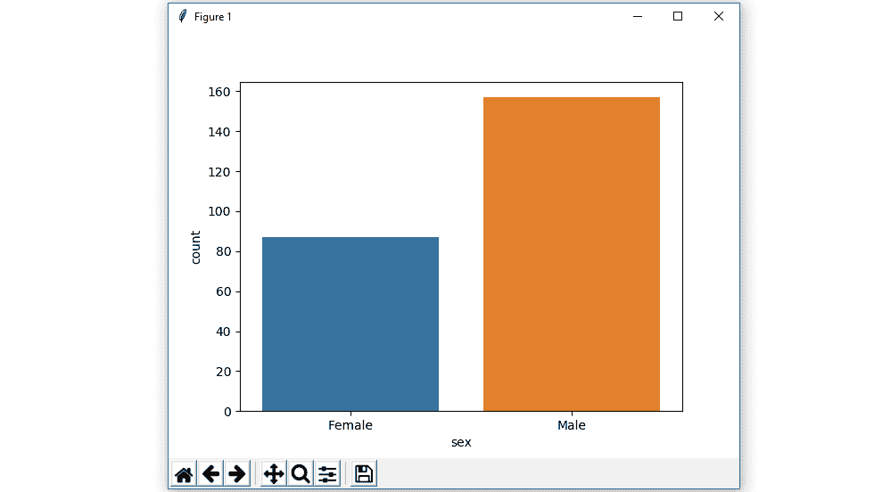
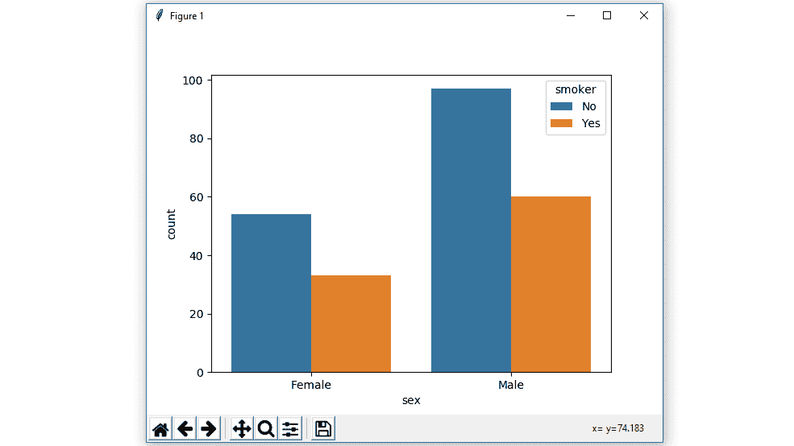
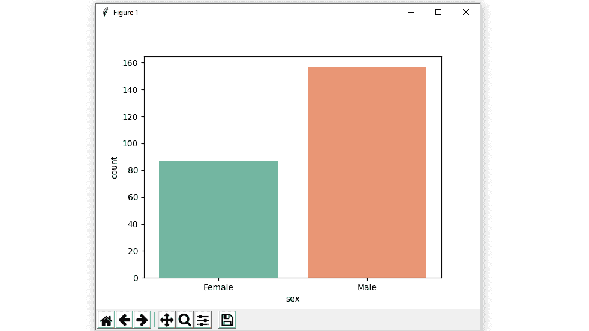
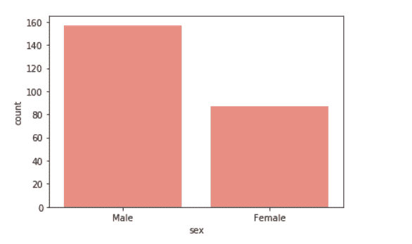

# Python 中使用海鸟的计数图

> 原文:[https://www . geesforgeks . org/count plot-use-seaborn-in-python/](https://www.geeksforgeeks.org/countplot-using-seaborn-in-python/)

[**Seaborn**](https://www.geeksforgeeks.org/introduction-to-seaborn-python/) 是一个用 Python 进行统计图形绘制的惊人可视化库。它提供了漂亮的默认样式和调色板，使统计图更有吸引力。它建立在 [matplotlib](https://www.geeksforgeeks.org/python-introduction-matplotlib/) 库的基础上，也与[熊猫](https://www.geeksforgeeks.org/introduction-to-pandas-in-python/)的数据结构紧密结合。

### Seaborn.countplot()

**seaborn.countplot()** 方法用于使用条形图显示每个分类箱中的观察计数。

> **语法:** seaborn.countplot(x=None，y=None，色相=None，数据=None，顺序=None，色相 _ 顺序=None，方向=None，颜色=None，调色板=None，饱和度=0.75，减淡=True，ax=None，**kwargs)
> **参数:**该方法接受以下描述的参数:
> 
> *   **x，y:** 该参数取数据或向量数据中变量的名称，可选，用于绘制长格式数据的输入。
> *   **色调:**(可选)该参数取颜色编码的列名。
> *   **数据:**(可选)此参数采用数据框、数组或数组列表、数据集进行绘图。如果 x 和 y 不存在，这被解释为宽形。否则它应该是长格式的。
> *   **顺序，hue_order :** (可选)此参数采用字符串列表。在中绘制分类级别的顺序，否则级别是从数据对象中推断出来的。
> *   **方向:**(可选)此参数取“v”|“h”，图的方向(垂直或水平)。这通常是从输入变量的数据类型中推断出来的，但是可以用来指定“分类”变量是数字还是绘制宽格式数据。
> *   **颜色:**(可选)此参数采用 matplotlib 颜色、所有元素的颜色或渐变调色板的种子。
> *   **调色板:**(可选)该参数采用调色板名称、列表或字典颜色，用于色调变量的不同级别。应该是 color_palette()可以解释的东西，或者是将色调级别映射到 matplotlib 颜色的字典。
> *   **饱和度:**(可选)此参数取浮点值，原始饱和度的比例绘制颜色。较大的色标通常使用稍微不饱和的颜色会更好看，但是如果您希望绘图颜色与输入颜色规格完全匹配，请将该值设置为 1。
> *   **闪避:**(可选)此参数取 bool 值，当使用色相嵌套时，元素是否要沿分类轴偏移。
> *   **ax :** (可选)此参数取 matplotlib Axes，Axes 对象来绘制地块，否则使用当前 Axes。
> *   **kwargs :** 此参数接受键、值映射，其他关键字参数传递到 matplotlib.axes.Axes.bar()。
> 
> **返回:**返回绘制了绘图的坐标轴对象。

下面的例子说明了 seaborn 库的 countplot()方法。

## 将 Seaborn countplot 中具有不同属性的变量分组

**示例 1:** **显示单个分类变量的值计数。**

如果我们只使用一个数据变量，而不是两个数据变量，那么这意味着轴将这些数据变量表示为一个轴。

x 表示 x 轴，y 表示 y 轴。

**语法:**

```
seaborn.countplot(x)
```

## 蟒蛇 3

```
# importing the required library

import seaborn as sns
import matplotlib.pyplot as plt

# read a tips.csv file from seaborn library
df = sns.load_dataset('tips')

# count plot on single categorical variable
sns.countplot(x ='sex', data = df)

# Show the plot
plt.show()
```

**输出:**



**示例 2:显示两个分类变量的数值计数，并使用色调参数:**

虽然点是以二维绘制的，但是可以通过根据第三个变量给点着色来将另一个维度添加到图中。

**语法:**

> seaborn.countplot(x，y，色相，数据)；

## 蟒蛇 3

```
# importing the required library

import seaborn as sns
import matplotlib.pyplot as plt

# read a tips.csv file from seaborn library
df = sns.load_dataset('tips')

# count plot on two categorical variable
sns.countplot(x ='sex', hue = "smoker", data = df)

# Show the plot
plt.show()
```

**输出:**



**示例 3:水平绘制条形图。**

在上面的例子中，我们看到了如何绘制单个水平计数图，这里可以通过数据变量与另一个轴的交换来执行多个水平计数图。

## 蟒蛇 3

```
# importing the required library

import seaborn as sns
import matplotlib.pyplot as plt

# read a tips.csv file from seaborn library
df = sns.load_dataset('tips')

# count plot along y axis
sns.countplot(y ='sex', hue = "smoker", data = df)

# Show the plot
plt.show()
```

**输出:**


**例 4:使用不同的调色板属性。**

使用调色板，我们可以生成不同[颜色](https://seaborn.pydata.org/generated/seaborn.color_palette.html#seaborn.color_palette)的点。在下面的例子中，我们可以看到调色板可以负责生成具有不同颜色映射值的 countplot。

**语法:**

> seaborn.countplot(x，y，data，hue，palette)

## 蟒蛇 3

```
# importing the required library

import seaborn as sns
import matplotlib.pyplot as plt

# read a tips.csv file from seaborn library
df = sns.load_dataset('tips')

# use a different colour palette in count plot
sns.countplot(x ='sex', data = df, palette = "Set2")

# Show the plot
plt.show()
```

**输出:**



> **调色板的可能值为:**
> 
> -=伊甸园美剧 http://sfile . ydy . com =-荣誉出品本字幕仅供学习交流，严禁用于商业途径，
> 
> GnBu，GnBu_r，Greens，Greens_r，Greys，Greys_r，OrRd，OrRd_r，Oranges，Oranges_r，PRGn，PRGn_r，painted，Paired _ r，
> 
> 蛋糕 1、蛋糕 1_r、蛋糕 2、蛋糕 2_r、PiYG、PiYG_r、PuBu、pubu _ r、PuOr、PuOr_r、PuRd、PuRd_r、
> 
> purple、purples _ r、RdBu、RdBu_r、RdGy、RdGy_r、RdPu、RdPu_r、RdYlBu、RdYlBu_r、RdYlGn、rdgy _ r、Reds、Reds_r、Set1，
> 
> Set1_r，Set2，Set2_r，Set3，Set3_r，Spectral，Spectral_r，Wistia，Wistia_r，YlGn，YlGnBu，YlGnBu_r，YlGn_r，and RBR，
> 
> y 轴、y 轴、y 轴、y 轴、r 轴、afmhot、afmhot_r、秋季、秋季 _r、binary、binary_r、bone、bone_r、brg、brg_r、BWC、bwr _ r、
> 
> cidis，cividis _ r，cool，cool_r，coolwarm，coolwarm_r，copper，copper_r，cubehelix，cubehelix_r，flag，flag_r，gist_earth，
> 
> gist_earth_r，gist_gray，gist_gray_r，gist_heat，gist_heat_r，gist_ncar，gist_ncar_r，gist_rainbow，gist_rainbow_r，gist_stern，

**示例 5:在图中使用颜色参数。**

使用颜色属性，我们是所有元素的颜色。

**语法:**

> seaborn.countplot(x，y，数据，颜色)

## 蟒蛇 3

```
# importing the required library
import seaborn as sns
import matplotlib.pyplot as plt

# read a titanic.csv file
# from seaborn library
df = sns.load_dataset('titanic')

sns.countplot(x = 'class', y = 'fare',
            hue = 'sex',
            data = df,color="salmon")

# Show the plot
plt.show()
```

**输出:**



**示例 6:在图中使用饱和度参数。**

用于绘制颜色的原始饱和度的比例。较大的色标通常使用稍微不饱和的颜色会更好看，但是如果您希望绘图颜色与输入颜色规格完全匹配，请将该值设置为 1。

**语法:**

> *seaborn.colorplot(x，y，数据，饱和度)*

## 蟒蛇 3

```
# importing the required library
import seaborn as sns
import matplotlib.pyplot as plt

# read a titanic.csv file
# from seaborn library
df = sns.load_dataset('titanic')

# class v / s fare barplot
sns.countplot(x ='sex', data = df,
              color="salmon",
              saturation = 0.1)
# Show the plot
plt.show()
```