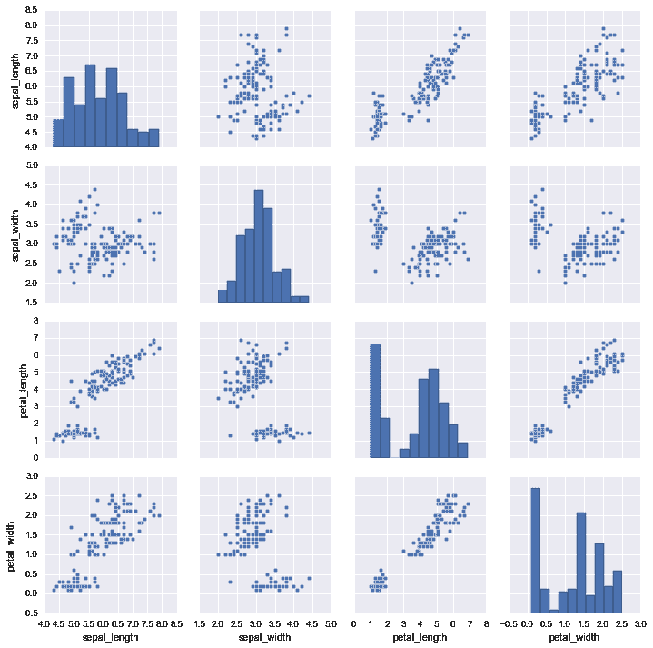
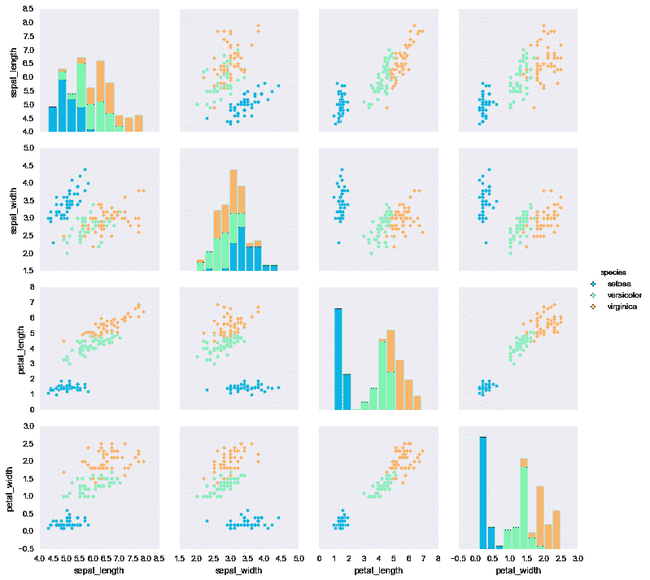
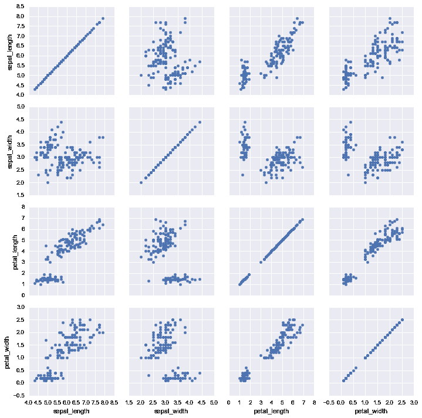
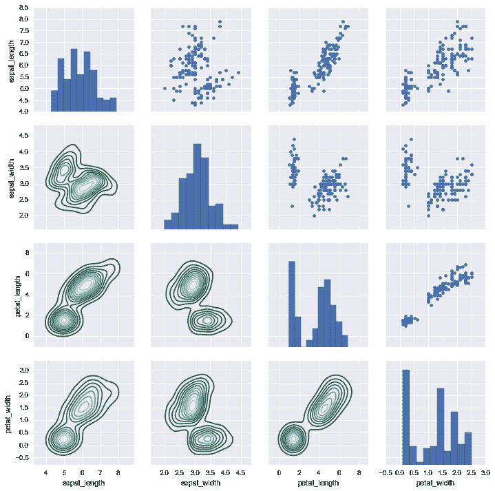
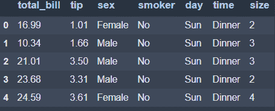
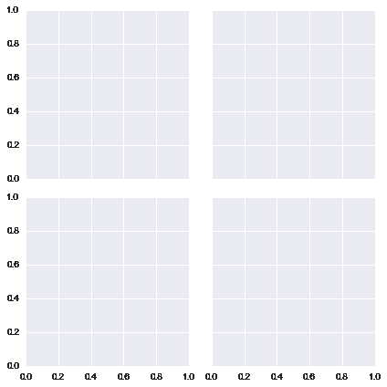
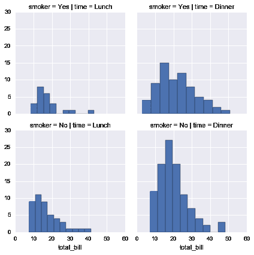
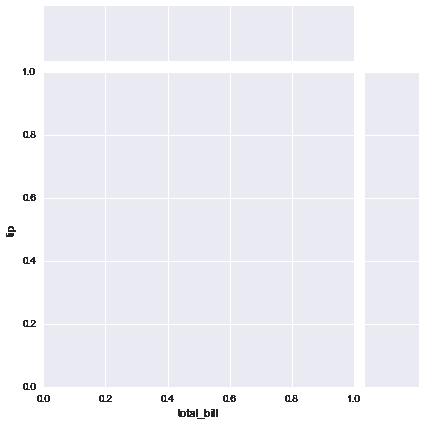

# 使用海博恩的 Python 网格图

> 原文:[https://www . geesforgeks . org/grid-plot-in-python-use-seaborn/](https://www.geeksforgeeks.org/grid-plot-in-python-using-seaborn/)

栅格是常规类型的地块，允许您将地块类型映射到栅格行和列，这有助于您创建类似的字符分隔地块。在本文中，我们将使用两个不同的数据集(Iris 和 Tips)来演示网格图

## 使用虹膜数据集

我们将使用 Iris 数据集，这是一个非常著名的数据集，可以作为内置数据集使用。它包含对一束不同鸢尾花的测量。数据集由四个度量组成:萼片距离、萼片重量、花瓣长度和花瓣宽度。我们将为下面使用的所有示例使用下面的代码片段。

**代码片段:**

## 蟒蛇 3

```
import seaborn as sns
import matplotlib.pyplot as plt

iris = sns.load_dataset("iris")
iris.head()

# YOUR CODE HERE
```

**输出:**


**注意:**将下面的代码片段放在**您的代码所在的位置。**

#### 配对图

配对图类似于整个数据集的自动联合图。在一个示例中，一个配对图映射了一个成对的伙伴关系。`pairplot()`方法生成一个坐标轴图，使得每个数据向量分布在 y 轴的一行和 x 轴的一列上。生成如下图所示的图。

```
sns.pairplot(data = iris)

```



我们使用“色调”来可视化图中每种“物种”的独立颜色。调色板用于自定义图的颜色，如下所示。

```
sns.pairplot(iris, hue="species", palette="rainbow")

```



#### **成对网格**

我们可以使用 seaborn 的 PairGrid 机制来定制配对图。PairGrid 采用所有的数字列，并对它们进行网格划分，组成如下所示的子场景。

```
sns.PairGrid(data = iris)

```


我们可以通过调用'来映射到网格。把它画出来。在这里，我们称散点图为。分散。现在所有的网格都是散点图。我们可以使用“”定义网格中想要的绘图类型。地图。

```
g = sns.PairGrid(iris)
g.map(plt.scatter) #All the grids plot scatter plot

```



映射到我们称之为的上网格、下网格和对角网格。map_upper '，'。map_lower '，'。从 PairGrid 中移除 map_diag。在这里，我们可以看到对角线是' hist '型图，上网格是'散点'型图，下网格是' kde '型图。

```
g = sns.PairGrid(iris)
g.map_diag(plt.hist)
g.map_upper(plt.scatter)
g.map_lower(sns.kdeplot)

```



## 使用提示数据集

我们将使用另一个内置数据集。数据集由七个特征组成:总账单、小费、性别、吸烟者、日期、时间、大小。我们将为下面使用的所有示例使用下面的代码片段。

**代码** **片段:**

## 蟒蛇 3

```
import seaborn as sns
import matplotlib.pyplot as plt

tips = sns.load_dataset("tips")
tips.head()

# YOUR CODE HERE
```

**输出:**



**注意:**将下面的代码片段放在**你的代码在这里**的地方。

#### FacetGrid

FacetGrid 是一种基于函数创建地块网格的通用方法。它的对象使用 dataframe 作为输入，并使用构成网格的行、列或颜色维度的变量的名称。

在这里，我们可以看到，由于在吸烟者列中有两种类型的值，即吸烟者=否和吸烟者=是，因此这在网格中创建了两行，一行代表吸烟者=是，另一行代表吸烟者=否。对于列，由于在时间列中有两种类型的值，即时间=午餐和时间=晚餐，因此这在网格中创建了两列，一列代表时间=午餐，另一列代表时间=晚餐。

```
g = sns.FacetGrid(tips, col="time", row="smoker")

```



账单总额在我们使用“地图”创建的网格中绘制为历史。

```
g = sns.FacetGrid(tips, col="time",  row="smoker")
g = g.map(plt.hist, "total_bill")

```



在这里，我们将色调定义为性别，并绘制了散点图，其中 X 轴为总色调，Y 轴为色调..

```
g = sns.FacetGrid(tips, col="time",  row="smoker", hue='sex')
g = g.map(plt.scatter, "total_bill", "tip").add_legend()

```


**联合电网**

JointGrid 是`jointplot()`网格类型的通用版本。Seaborn 的 Jointplot 显示了两个变量(双变量)和 1D 剖面(单变量)之间的边缘关系。这个图是包装 JointGrid 的产品表单。

```
g = sns.JointGrid(x="total_bill", y="tip", data=tips)

```



```
g = sns.JointGrid(x="total_bill", y="tip", data=tips)
g = g.plot(sns.regplot, sns.distplot)

```

