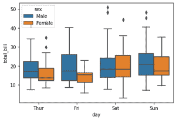
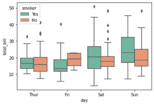
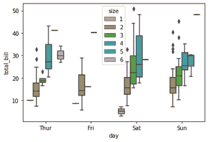

# 用蟒蛇皮将箱型地块分组

> 原文:[https://www . geesforgeks . org/group-box plots-in-python-with-seaborn/](https://www.geeksforgeeks.org/grouped-boxplots-in-python-with-seaborn/)

[箱线图](https://www.geeksforgeeks.org/box-plot-visualization-with-pandas-and-seaborn/)描绘了定量数据的分布，便于不同变量之间的比较，无论是连续变量还是分类变量。这是一种常见的数据分散措施。箱线图包含一个五位数的摘要，有助于检测和移除数据集中的异常值。

1.  最小观察
2.  Q1 (25%或四分之一)
3.  中位数还是 Q2
4.  第三季度(75%或第二四分位数)
5.  最大观察值


分组箱线图用于可视化具有多个子组的数据。此外，我们可以用分组箱线图一次可视化三个变量，其中一个变量是数值变量，另两个是分类变量。

我们将使用 Python 的 Seaborn 库来创建分组方框图。我们将使用来自 Seaborn 图书馆的数据集“提示”。

## 蟒蛇 3

```
# import seaborn library
import seaborn as sns

# load the dataset
data = sns.load_dataset('tips')

# view the dataset
print(data.head(5))
```

**输出:**


**示例 1:** 让我们创建一个箱线图来了解“total_bill”在“tips”数据集的每个“日”上的分布。但我们也要根据‘性’属性来分组。因此，我们将绘制这三个属性的分组箱线图，其中“性”和“日”是分类属性，“总账单”是数字属性。

## 蟒蛇 3

```
# create grouped boxplot 
sns.boxplot(x = data['day'],
            y = data['total_bill'],
            hue = data['sex'])
```

**输出:**



**示例 2:** 下一个示例与上一个示例类似。唯一的区别是作为“吸烟者”属性的“色调”参数的值。这里我们想知道“total_bill”和“day”组在一个人是否吸烟的基础上的分布。

此外，我们还学习了如何使用 boxplot()的“调色板”属性来更改 box plot 的颜色。

## 蟒蛇 3

```
# create another grouped boxplot 
sns.boxplot(x = data['day'],
            y = data['total_bill'],
            hue = data['smoker'],
            palette = 'Set2')
```

**输出:**



**示例 3:** 在本例中，我们将介绍如何绘制 2 个以上的分组箱线图。如果“色调”参数的值超过 2 个类别，那么我们可以绘制 2 个以上的分组方框图，如下所示。

这里，*‘色相’=数据【‘大小’】*有六个类别，所以我们可以用上面同样的方法看到 2 个以上的分组箱线图。

## 蟒蛇 3

```
# create 3rd grouped boxplot 
sns.boxplot(x = data['day'],
            y = data['total_bill'],
            hue = data['size'],
            palette = 'husl')
```

**输出:**

