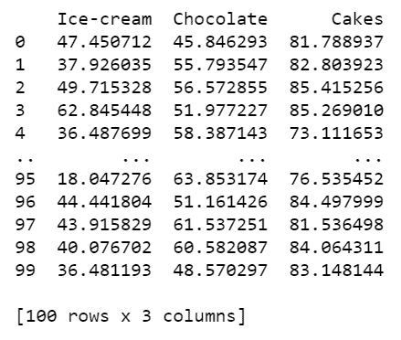
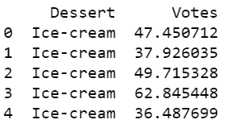

# 使用 Python 中的 Seaborn 绘制带点的水平方框图

> 原文:[https://www . geesforgeks . org/horizontal-box plot-with-points-use-seaborn-in-python/](https://www.geeksforgeeks.org/horizontal-boxplots-with-points-using-seaborn-in-python/)

[Seaborn](https://www.geeksforgeeks.org/introduction-to-seaborn-python/) 是一个神奇的可视化库，用于在 Python 中绘制统计图形。它提供了漂亮的默认样式和调色板，使统计图更有吸引力。它建立在 [matplotlib](https://www.geeksforgeeks.org/python-introduction-matplotlib/) 库的基础上，也与[熊猫](https://www.geeksforgeeks.org/introduction-to-pandas-in-python/)的数据结构紧密结合。
Seaborn 旨在使探索和理解数据的中心部分可视化。它提供了面向数据集的 API，因此我们可以在相同变量的不同视觉表示之间切换，以便更好地理解数据集。

## **为什么用水平箱线图代替箱线图？**

当您有许多具有较大名称的组时，它们非常有用。当我们有有限数量的组和组的简称时，Boxplots 工作得很好。但是如果我们有更长的标题，它们会在方框图中相互重叠，并且很难读取数据和从图表中获得见解。水平箱线图很容易解决这个问题。

### 以下是使用 Seaborn 模块说明水平箱线图的分步方法:

*   **导入库**

## 蟒蛇 3

```
# Import required modules
import sklearn
import numpy as np
import matplotlib.pyplot as plt
import pandas as pd
import seaborn as sns
```

*   **分配数据**

## 蟒蛇 3

```
# To avoid changing values everytime you run the cell
np.random.seed(42)

# Creating Data
df = pd.DataFrame({
    'Ice-cream': np.random.normal(40, 15, 100),
    'Chocolate': np.random.normal(60, 10, 100),
    'Cakes': np.random.normal(80, 5, 100)
})

# Display data
print(df)
```

**输出:**



我们遇到的大多数数据都是宽格式的。比如你刮网站的时候。该数据为宽格式。使用熊猫融化功能将数据转换为长格式。

## 蟒蛇 3

```
# Using melt dataframe for Converting data to long form
data_df = df.melt(var_name='Dessert', value_name='Votes')

# Data is in long form
print(data_df.head())
```

**输出:**



*   **将该数据绘制成箱线图。**

## 蟒蛇 3

```
# Adjust size
plt.figure(figsize=(8.3,6))

# Illustrate boxplot
sns.boxplot(y="Dessert", x="Votes", data=data_df)
```