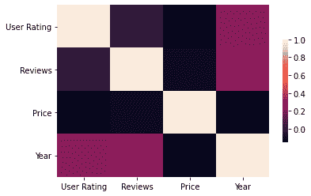
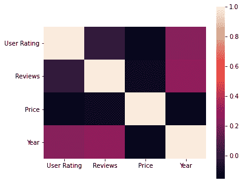

# 如何在 Python 中更改一个海伯恩热图图形的彩条大小？

> 原文:[https://www . geeksforgeeks . org/如何改变海洋生物大小的颜色条-热图-蟒蛇皮图/](https://www.geeksforgeeks.org/how-to-change-the-colorbar-size-of-a-seaborn-heatmap-figure-in-python/)

**先决条件:** [海伯恩](https://www.geeksforgeeks.org/introduction-to-seaborn-python/)

彩条是一种用于解释热图数据的矩形色标。默认情况下，它的大小与热图相同，但可以使用热图()函数的 cbar_kws 参数更改其大小。此参数接受字典类型值，要更改 colorbar 的大小，其收缩参数需要相应。默认情况下，它是 1，这使得颜色条的大小与热图相同。要使 colorbar 变小，应该给收缩一个小于 1 的值，要增加它的大小，应该给它一个大于 1 的值。

**热图()语法:**

> ***语法:** seaborn.heatmap(data，* vmin =无，vmax =无，cmap =无，center =无，annot _ kws =无，线宽=0，linecolor='white '，cbar=True，**kwargs)*
> 
> ***重要参数:***
> 
> *   ***数据:** 2D 数据集，可以强制到数组中。*
> *   ***【vmin】****VMAX:**值锚定颜色映射，否则它们是从数据和其他关键字参数中推断出来的。*
> *   ***cmap:** 从数据值到颜色空间的映射。*
> *   ***中心:**绘制发散数据时颜色图的中心值。*
> *   ***注释:**如果为真，则在每个单元格中写入数据值。*
> *   ***fmt:** 添加注释时使用的字符串格式代码。*
> *   ***线宽:**将划分每个单元格的线条宽度。*
> *   ***线条颜色:**将分割每个细胞的线条的颜色。*
> *   ***cbar:** 是否绘制彩条。*
> 
> *除数据外的所有参数都是可选的。*
> 
> ***返回:【matplotlib.axes. _ 子场景类型的对象。AxesSubplot***

### 方法

*   导入模块
*   加载或创建数据
*   使用适当的值创建热图，在此函数中，使用收缩设置 cbar_kws 及其所需值。
*   显示图

下面给出了使用这种方法的实现:

**正在使用的数据库:** [畅销书](https://drive.google.com/file/d/1KhtJuBtO73gItNku98y5ekCRWobzBify/view?usp=sharing)

**示例 1:** 减小颜色条的大小

## 蟒蛇 3

```py
# import modules
import matplotlib.pyplot as mp
import pandas as pd
import seaborn as sb

# load data
data = pd.read_csv("bestsellers.csv")

# plotting heatmap
sb.heatmap(data.corr(), annot=None, cbar_kws={'shrink': 0.6})

# displaying heatmap
mp.show()
```

**输出:**



**示例 2:** 增加颜色条的大小

## 蟒蛇 3

```py
# import modules
import matplotlib.pyplot as mp
import pandas as pd
import seaborn as sb

# load data
data = pd.read_csv("bestsellers.csv")

# plotting heatmap
sb.heatmap(data.corr(), annot=None, cbar_kws={'shrink': 1.3})

# displaying heatmap
mp.show()
```

**输出:**

