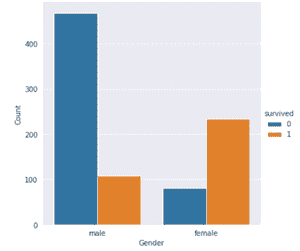
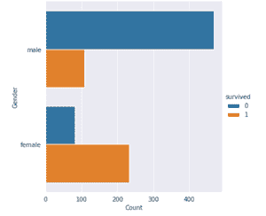

# 如何用海底猫图制作 Countplot 或 barplot？

> 原文:[https://www . geeksforgeeks . org/how-make-count plot-or-bar plot-with-seaborn-catplot/](https://www.geeksforgeeks.org/how-to-make-countplot-or-barplot-with-seaborn-catplot/)

在 Python 中，我们通常可以绘制数值变量的条形图。但是当涉及到分类变量的情况时，我们通常不能绘制每个类别的计数。图中的海底猫情节来了。它允许您为非数值/分类变量绘制每个类别的计数。

## 创建计数图

Countplot 使用条形图直观地显示每个类别中的观察计数。这不能用于定量变量。它可以通过将计数值传递给 kind 参数来创建。

**示例:**我们举一个泰坦尼克号数据集的例子。

## 蟒蛇 3

```
# import libraries
import matplotlib.pyplot as plt
import seaborn as sns

# setting background style
sns.set_style('darkgrid')

# import dataset
data = sns.load_dataset('titanic')
data.head()
```

**输出:**


**示例 1:** 创建计数图

## 蟒蛇 3

```
# plot for count of passengers belonging
# to each gender
sns.catplot(x='sex', kind='count', data=data)
plt.xlabel("Gender")
plt.ylabel("Count")
```

**输出:**


**示例 2:** 创建分组计数图

## 蟒蛇 3

```
# Grouped Countplot/Barplot
# Count of passengers who survived
# or didn't of each gender
sns.catplot(x='sex', hue='survived',
            kind='count', data=data)

plt.xlabel("Gender")
plt.ylabel("Count")
```

**输出:**



**示例 3:** 创建水平计数图

## 蟒蛇 3

```
# Plotting horizontally
sns.catplot(y='sex', hue='survived', 
            kind='count', data=data)

plt.xlabel("Count")
plt.ylabel("Gender")
```

**输出:**

