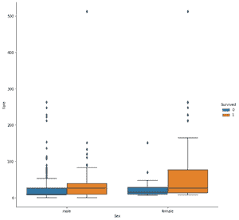
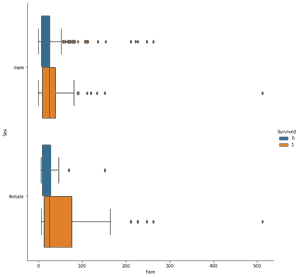

# 如何用海底猫图制作分组箱型图？

> 原文:[https://www . geeksforgeeks . org/如何制作分组-box plot-with-seaborn-catplot/](https://www.geeksforgeeks.org/how-to-make-grouped-boxplot-with-seaborn-catplot/)

**先决条件:** [海鸟](https://www.geeksforgeeks.org/introduction-to-seaborn-python/)

分组箱线图是将类别组织成组和子组的箱线图。每当我们想要可视化组和子组格式的数据时，Seaborn [Catplot](https://seaborn.pydata.org/generated/seaborn.catplot.html) ()起着主要作用。以下示例以分组箱线图格式可视化了 7 个组(称为 A 到 G)和 2 个子组(称为低和高)的分布。使用 Seaborn 生成 boxplot 通常使用 boxplot()方法，但这里我们使用了一个更新的方法 Catplot()。Catplot()访问几个轴级函数，这些函数使用几种视觉表示之一来显示一个数值和一个或多个分类变量之间的关系。

### 分组箱线图

在本文中，我们将学习如何使用 Seaborn Catplot 生成分组方框图。请遵循以下步骤–

*   导入所需的包。
*   加载数据集。
*   现在使用 catplot()方法，该方法在 seaborn 包中可用。让我们传递 x 和 y 变量，这里 x 轴上的变量是连续的，y 轴上的变量是分类的，还传递其他参数，如数据、色调、高度、纵横比和 kind =“box”。

**语法:**

> catplot(x，y，色调，数据，高度，种类)

使用的数据集: [titanic_train.csv](https://www.kaggle.com/tedllh/titanic-train)

**示例 1:** 水平箱线图

## 蟒蛇 3

```
import pandas as pd
import seaborn as sns

df = pd.read_csv("titanic_train.csv")
df.dropna()
sns.catplot(x='Sex', y='Fare', hue='Survived', 
            data=df, height=9, kind="box")
```

**输出**:



**示例 2:** 垂直箱线图

这个例子描述了我们如何水平绘制相同的数据。这可以简单地通过交换提供给 x 和 y 的值来实现。

## 蟒蛇 3

```
import pandas as pd
import seaborn as sns

df = pd.read_csv("titanic_train.csv")
df.dropna()
sns.catplot(y='Sex', x='Fare', hue='Survived',
            data=df, height=9, kind="box")
```

**输出:**

