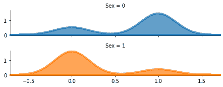

# 如何用海底巨蟒制作山脊线剧情？

> 原文:[https://www . geeksforgeeks . org/如何制作山脊线-用蟒蛇皮绘制的地块/](https://www.geeksforgeeks.org/how-to-make-ridgeline-plot-in-python-with-seaborn/)

**先决条件:** [海鸟](https://www.geeksforgeeks.org/introduction-to-seaborn-python/)

脊线图是一组重叠的密度图，有助于比较数据集之间的多种分布。山脊线图看起来像一个山脉，它们对于可视化分布随时间或空间的变化非常有用。有时也被称为“joyplot”，指的是 Joy Division 专辑《未知的快乐》的标志性封面艺术。在本文中，我们将看到如何为数据集生成脊线图。

### 装置

像任何其他 python 库一样，seaborn 可以使用 pip 轻松安装:

```
pip install seaborn

```

该库是 Anaconda 发行版的一部分，如果您的 IDE 受 Anaconda 支持，通常只需导入即可，但也可以通过以下命令安装:

```
conda install seaborn

```

#### 程序

*   用 Python 加载生成脊线图所需的包。
*   读取数据集。在本例中，我们使用 [**read_csv()**](https://www.geeksforgeeks.org/python-read-csv-using-pandas-read_csv/) 方法加载数据集。在给定的示例中，我们将使用 [**head()**](https://www.geeksforgeeks.org/python-pandas-dataframe-series-head-method/) 方法仅显示前 5 个条目。
*   生成 RidgePlot。脊线图使用刻面，这意味着它在一列中创建小倍数。要生成脊线图，Seaborn 使用 [**FacetGrid()**](https://www.geeksforgeeks.org/python-seaborn-facetgrid-method/) 方法，所有需要的信息都应该传递给它

> **语法:**海鸟。FacetGrid(数据、行、列、色调、调色板、纵横比、高度)
> 
> **参数:**
> 
> 1.  **数据:**整齐的(“长格式”)数据帧，其中每一列是一个变量，每一行是一个观察值。
> 2.  **行、列、色调**:定义数据子集的变量，这些数据将绘制在网格中的独立面上。
> 3.  **高度:**每个小平面的高度(英寸)。
> 4.  **纵横比:**每个小平面的纵横比，因此纵横比*高度给出了每个小平面的宽度，单位为英寸。
> 5.  **调色板:**用于色调变量不同级别的颜色。

*   使用[贴图()](https://seaborn.pydata.org/generated/seaborn.FacetGrid.map.html)方法在网格的每个元素中创建密度图。在这个例子中，我们需要一个密度图，所以使用在 Seaborn 中可用的 [kdeplot](https://datavizpyr.com/ridgeline-plot-in-python-with-seaborn/#:~:text=The%20way%20to%20make%20ridgeline,a%20empty%20grid%20for%20us.) ()方法。

**样本数据库:**以下示例中使用的数据集是从 kaggle.com 下载的。以下链接可用于相同目的。

数据库: [titanic_train.csv](https://www.kaggle.com/tedllh/titanic-train)

**示例:**

## 蟒蛇 3

```
import seaborn as sns
import matplotlib.pyplot as plt
import pandas as pd
from sklearn import preprocessing

df = pd.read_csv("titanic_train.csv")
df.dropna()

le = preprocessing.LabelEncoder()
df["Sex"] = le.fit_transform(df["Sex"])

rp = sns.FacetGrid(df, row="Sex", hue="Sex", aspect=5, height=1.25)

rp.map(sns.kdeplot, 'Survived', clip_on=False,
       shade=True, alpha=0.7, lw=4, bw=.2)

rp.map(plt.axhline, y=0, lw=4, clip_on=False)
```

**输出:**

