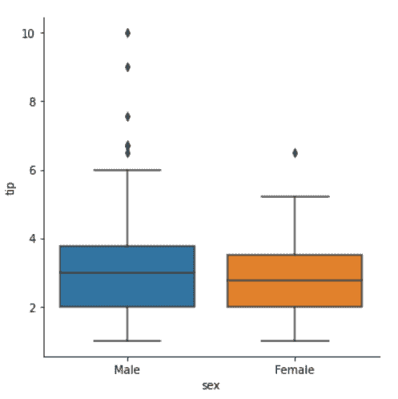

# 如何用蟒蛇皮制作简单的刻面图？

> 原文:[https://www . geeksforgeeks . org/如何用 python 中的 seaborn-catplot 绘制简单小平面图/](https://www.geeksforgeeks.org/how-to-make-simple-facet-plots-with-seaborn-catplot-in-python/)

[**【海鸟】**](https://www.geeksforgeeks.org/introduction-to-seaborn-python/) 是一个用 Python 绘制统计图形的惊人可视化库。它提供了漂亮的默认样式和调色板，使统计图更有吸引力。它建立在 [matplotlib](https://www.geeksforgeeks.org/python-introduction-matplotlib/) 库的基础上，还紧密集成了到来自 [熊猫](https://www.geeksforgeeks.org/introduction-to-pandas-in-python/) 的数据结构。
Seaborn 旨在将的可视化作为探索和理解数据的核心部分。它提供了面向数据集的 API，这样我们就可以为在不同的可视化表示之间切换，为提供相同的变量，更好地理解数据集。

**分面图**，其中一个基于分类变量对数据进行子集化，并制作一系列具有相同比例的相似图。

我们可以通过多种方式在 Python 中制作刻面图。在这篇文章中，我们将看到一个使用 *Seaborn* 的 *Catplot()* 方法制作简单小平面图的例子。当有一个数字变量和一个相应的分类变量时，它主要用于可视化。

### 所需步骤

1.  导入库。
2.  导入或创建数据。
3.  将*曲线()*方法与*小平面曲线*一起使用。
4.  使用其他参数以获得更好的可视化效果。

### 使用的数据集

下例中使用的数据集是[https://www.kaggle.com/ranjeetjain3/seaborn-tips-dataset](https://www.kaggle.com/ranjeetjain3/seaborn-tips-dataset)

### 以下是一些使用 Seaborn 模块描绘小平面图的示例:

**例 1:**

## 蟒蛇 3

```py
# importing packages
import seaborn

# load data
tip = seaborn.load_dataset('tips')

# create catplot facetplot object
seaborn_facetgrid_object = seaborn.catplot(
    x='sex',
    y='tip',
    data=tip
)
# show plot
seaborn_facetgrid_object
```

**输出:**


**例 2:**

## 蟒蛇 3

```py
# importing packages
import seaborn

# load data
tip = seaborn.load_dataset('tips')

# create catplot facetplot object
seaborn_facetgrid_object = seaborn.catplot(
    x='sex',
    y='tip',
    kind='box',
    data=tip
)
# show plot
seaborn_facetgrid_object
```

**输出:**



**例 3:**

## 蟒蛇 3

```py
# importing packages
import seaborn

# load data
tip = seaborn.load_dataset('tips')

# create catplot facetplot object
seaborn_facetgrid_object = seaborn.catplot(
    x='sex',
    y='tip',
    col='time',
    kind='box',
    data=tip
)
# show plot
seaborn_facetgrid_object
```

**输出:**


**例 4:**

## 蟒蛇 3

```py
# importing packages
import seaborn

# load data
tip = seaborn.load_dataset('tips')

# create catplot facetplot object
seaborn_facetgrid_object = seaborn.catplot(
    x='sex',
    y='tip',
    row='time',
    col='day',
    aspect=0.9,
    dodge=False,
    kind='box',
    data=tip
)
# show plot
seaborn_facetgrid_object
```

**输出:**

