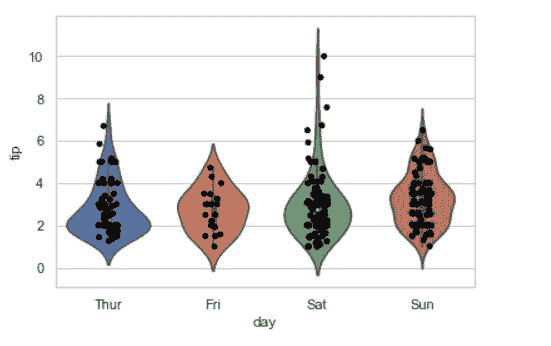
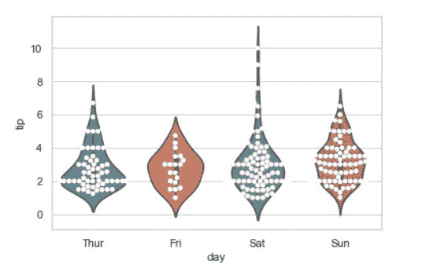
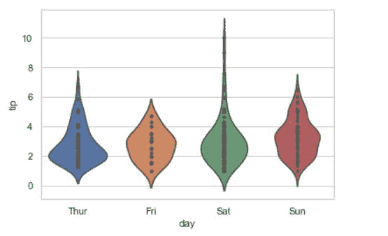

# 如何在 Seaborn 中用数据点制作小提琴？

> 原文:[https://www . geeksforgeeks . org/如何用数据点制作 violin pot-in-seaborn/](https://www.geeksforgeeks.org/how-to-make-violinpot-with-data-points-in-seaborn/)

A [小提琴剧情](https://www.geeksforgeeks.org/violinplot-using-seaborn-in-python/)播放类似的活动，通过触须或方块剧情 do 进行。因为它显示了一个或多个分类变量的若干定量数据。在几个单元显示多个数据可能是一种有效且有吸引力的方式。“宽格式”数据框有助于维护可以在图表上绘制的每个数字列。可以使用 NumPy 或 Python 对象，但熊猫对象更好，因为相关名称将用于注释轴。在这篇文章中，我们将看到如何用数据点制作小提琴曲。

> **语法:**seaborn . violinplot(x =无，y =无，色相=无，数据=无，**kwargs)
> 
> **参数:**
> **x，y，色相:**用于绘制长格式数据的输入。
> **数据:**用于绘图的数据集。
> **比例:**用来缩放每把小提琴宽度的方法。
> 
> **返回:**该方法返回绘制了绘图的坐标轴对象。

**我们先创建一个简单的小提琴手:**

## 蟒蛇 3

```py
# Python program to illustrate 
# violinplot using inbuilt data-set 
# given in seaborn 

# importing the required module 
import seaborn  

# use to set style of background of plot 
seaborn.set(style = 'whitegrid')  

# loading data-set 
tip = seaborn.load_dataset('tips') 

seaborn.violinplot(x='day', y='tip', data=tip)
```

**输出:**


**方法 1:** 采用带状图。

## 蟒蛇 3

```py
# Python program to illustrate 
# violinplot using inbuilt data-set 
# given in seaborn 

# importing the required module 
import seaborn  

# use to set style of background of plot 
seaborn.set(style = 'whitegrid')  

# loading data-set 
tip = seaborn.load_dataset('tips') 

seaborn.violinplot(x ='day', y ='tip',
                   data = tip) 

seaborn.stripplot(x = "day", y = "tip", 
                  color = 'black',
                  data = tip)
```

**输出:**



**方法二:**利用蜂群图。

## 蟒蛇 3

```py
# Python program to illustrate 
# violinplot using inbuilt data-set 
# given in seaborn 

# importing the required module 
import seaborn  

# use to set style of background of plot 
seaborn.set(style = 'whitegrid')  

# loading data-set 
tip = seaborn.load_dataset('tips') 

seaborn.violinplot(x ='day', y ='tip',
                data = tip) 

seaborn.swarmplot(x ='day', y ='tip',
                  data = tip,
                  color = "white")
```

**输出:**



**方法三:**使用内点自变量。

## 蟒蛇 3

```py
# Python program to illustrate 
# violinplot using inbuilt data-set 
# given in seaborn 

# importing the required module 
import seaborn  

# use to set style of background of plot 
seaborn.set(style = 'whitegrid')  

# loading data-set 
tip = seaborn.load_dataset('tips') 

seaborn.violinplot(x ='day', y ='tip',
                data = tip, inner = "points") 
```

**输出:**

