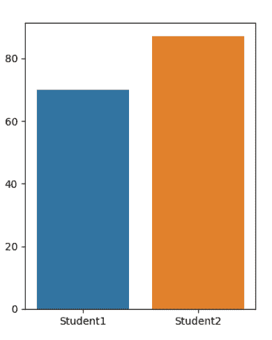
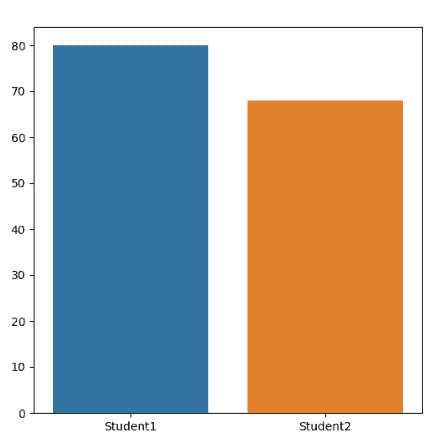

# 如何设置一个 Seaborn 的图表图大小？

> 原文:[https://www . geeksforgeeks . org/如何设置-a-seaborn-chart-fig-size/](https://www.geeksforgeeks.org/how-to-set-a-seaborn-chart-figure-size/)

Seaborn 是一个基于 matplotlib 的 Python 数据可视化库。它用于绘制吸引人且信息丰富的统计图形。为了调整海伯恩剧情的人物尺寸，我们将使用 matplotlib.pyplot 的支线剧情功能。

[**matplotlib.pyplot .支线剧情()**](https://www.geeksforgeeks.org/matplotlib-pyplot-subplots-in-python/) 创建一个人物和一组支线剧情。它有一个名为 figsize 的参数，该参数以元组为参数，包含图的高度和宽度。它返回图形和轴的数组。

在调用 seaborn 绘图时，我们将设置 ax 参数等于 matplotlib . py plot . sub plot 在设置所需绘图的尺寸后返回的轴数组。

**例 1:** 我们将考虑两个学生，将他们的分数绘制成条形图，我们将设置大小为(4，5)的图。

## 蟒蛇 3

```
# Importing libraries
import seaborn as sns
import matplotlib.pyplot as plt

# Setting the data
x = ["Student1", "Student2"]
y = [70, 87]

# setting the dimensions of the plot
fig, ax = plt.subplots(figsize=(4, 5))

# drawing the plot
sns.barplot(x, y, ax=ax)
plt.show()
```

**输出:**



图尺寸(6，4)

**例 2:** 我们画一个大小为(6，6)的图。

## 蟒蛇 3

```
# Importing libraries
import seaborn as sns
import matplotlib.pyplot as plt

# Setting the data
x = ["Student1", "Student2"]
y = [80, 68]

# setting the dimensions of the plot
fig, ax = plt.subplots(figsize=(6, 6))

# drawing the plot
sns.barplot(x, y, ax=ax)
plt.show()
```



图尺寸(6，6)

**示例 3:** 在本例中，我们将创建 boxplot，并用 figsize 设置图表的大小。

## 蟒蛇 3

```
# Importing libraries
import seaborn as sns
import matplotlib.pyplot as plt

# Setting the data
x = ["Student1", "Student2"]
y = [70, 87]

# setting the dimensions of the plot
fig, ax = plt.subplots(figsize=(40, 5))

# drawing the plot
sns.boxplot(x = y)
plt.show()
```

**输出:**

