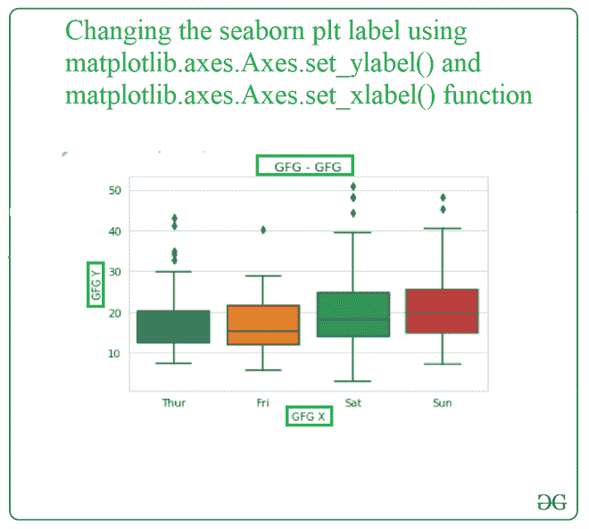
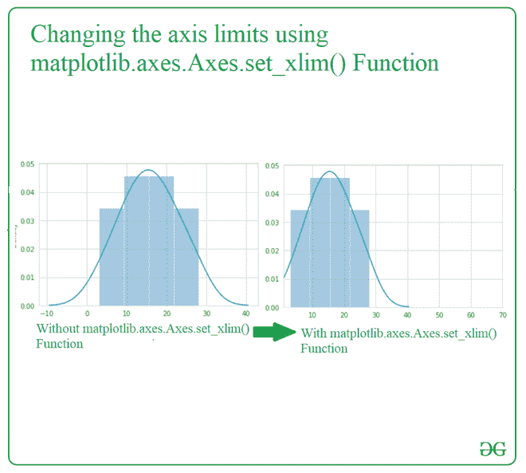
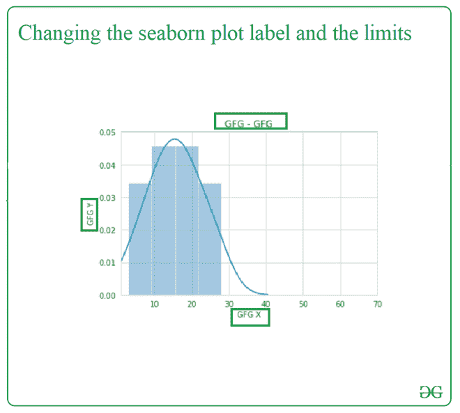

# 如何在海伯恩地块中设置轴标签&限制？

> 原文:[https://www . geeksforgeeks . org/如何设置轴-标签-海上极限-绘图/](https://www.geeksforgeeks.org/how-to-set-axes-labels-limits-in-a-seaborn-plot/)

在这篇文章中，我们将学习如何设置轴标签和限制在一个 Seaborn 地块。先讨论一些概念。

*   轴是图中包含数据空间的区域。轴包含两个或三个处理数据限制的轴(如果是三维)对象。
*   轴标签是根据含义、单位和方向描述轴值的标签。
*   轴限制是轴值的限制，用于筛选轴上的所需值。

在本文中，内容将从设置轴标签、轴限制以及同时设置两者开始。最后，你将能够学习如何在一个海底世界中设置轴标签和限制。

## **设置轴标签**

**方法 1:** 要在海底地块中设置轴标签，我们使用 python matplotlib 库中的[matplotlib . axes . axes . set()](https://www.geeksforgeeks.org/matplotlib-axes-axes-set-in-python/)函数。

> **语法:**定线(self，xlabel，ylabel，fontdict=None， *labelpad=None，* **kwargs)
> 
> **参数:**
> 
> *   xlabel:str-x 轴的标签文本。
> *   y 轴的标签文本。
> *   labelpad:标量，可选，默认:无
> *   **kwargs:文本属性
> 
> **返回:**将改变 x 轴和 y 轴标签。

**示例:**在本例中，我们将使用单个 matplotlib.axes.Axes.set()函数，并通过调用该函数来更改的标签，我们将一次性传递 xlabel 和 ylabel 参数，这将更改用户绘图。

## 蟒蛇 3

```py
# import seaborn
import seaborn as sns
sns.set_style("whitegrid")

# import data
tips = sns.load_dataset("tips")

# plot boxplot
gfg = sns.boxplot(x ="day", y ="total_bill", data = tips)

# add label to the axis and label to the plot
gfg.set(xlabel ="GFG X", ylabel = "GFG Y", title ='some title')
```

**输出:**


**方法 2:** 要在 seaborn 地块中设置轴标签，我们使用 python matplotlib 库中的[matplotlib . axes . axes . set _ ylabel()](https://www.geeksforgeeks.org/matplotlib-axes-axes-set_ylabel-in-python/)和[matplotlib . axes . set _ xlabel()](https://www.geeksforgeeks.org/matplotlib-axes-axes-set_xlabel-in-python/)函数。

> ***语法:***
> 
> *Axes.set_xlabel(self，xlabel，fontdict=None，labelpad=None，**kwargs)*
> 
> axis . set _ ylabel(self、xlabel、fontdict=None、labelpad=None、**kwargs)
> 
> ***参数:**该方法接受以下参数。*
> 
> *   ***xlabel :** 此参数为标签文本。*
> *   ***标签标签:**该参数是轴边界框(包括刻度和刻度标签)的点间距。*
> 
> ***返回:**该方法不返回值。*

**示例:**在本例中，我们将分别使用 matplotlib . axes . axes . set _ ylabel()和 matplotlib . axes . axes . set _ xlabel()函数，并将标签的名称作为参数传递，以更改绘图的标签。

**输入:**

## 蟒蛇 3

```py
# import seaborn
import seaborn as sns
sns.set_style("whitegrid")

# load data
tips = sns.load_dataset("tips")

# plot boxplot
gfg = sns.boxplot(x ="day", y ="total_bill", data = tips)
# This will add title to plot
gfg.set_title( "GFG - GFG")

# This will add label to X-axis
gfg.set_xlabel( "GFG X")
# This will add label to Y-axis
gfg.set_ylabel( "GFG Y")
```

**输出:**



## **设定轴限制**

更改限额的功能:-

1.  matplotlib.axes.Axes.set_xlim()功能:matplotlib 库的 axes 模块用于设置 x 轴视图限制。
2.  matplotlib.axes.Axes.set_ylim()功能:matplotlib 库的 axes 模块用于设置 y 轴视图限制。

> **语法:**
> 
> Axes.set_xlim(self，左=无，右=无，发射=真，自动=假，* xmin =无，xmax =无)
> 
> Axes.set_ylim(self，底部=无，顶部=无，发射=真，自动=假，* ymin =无，ymax =无)
> 
> **参数:**
> 
> *   底部:此参数是数据坐标中的底部 xlim/ylim
> *   top:此参数是数据坐标中的顶级 xlim/ylim
> *   发出:该参数用于通知观察者极限变化。
> *   自动:此参数用于打开 x 轴/y 轴的自动缩放。
> *   xmin、xmax、ymin、ymax:这些参数相当于底部和顶部，同时传递 xmin/ymin 和底部或者 xmax/ymax 和顶部都是错误的。
> 
> **返回:**底部，顶部:返回数据坐标中新的 x 轴/y 轴限制。

**示例:**

## 蟒蛇 3

```py
# import packages
import matplotlib.pyplot as plt
import seaborn as sns

# create data
data = [3, 7, 9, 11, 12, 14, 15, 16, 18, 19, 20, 23, 25, 28]

# plot distplot
fig, ax = plt.subplots()
sns.distplot(data, ax = ax)

# change the limits of X-axis
ax.set_xlim(1, 70)
plt.show()
```

**输出:**



## **设置轴标签和轴限制**

在这个特殊的例子中，我们将在 python 库的合适的必需函数的帮助下，在单个代码中更改标签和图的限制。

## 蟒蛇 3

```py
# import packages
import matplotlib.pyplot as plt
import seaborn as sns

# create data
data = [3, 7, 9, 11, 12, 14, 15, 16, 18, 19, 20, 23, 25, 28]

# plot distplot
fig, ax = plt.subplots()
sns.distplot(data, ax = ax)

# This will change the limits of the x-axis
ax.set_xlim(1, 70)

# This will add label to the X-axis
ax.set_xlabel( "GFG X")

# This will add label to the Y-axis
ax.set_ylabel( "GFG Y")

# This will add title to the plot
ax.set_title( "GFG - GFG") 
plt.show()
```

**输出:**

