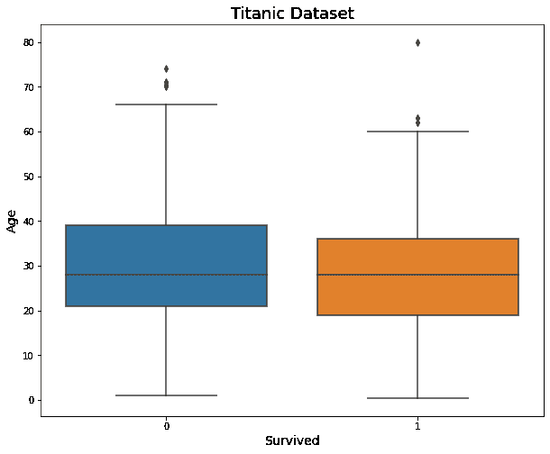

# 如何用 Python 中的 Seaborn 在 Boxplot 上显示均值？

> 原文:[https://www . geesforgeks . org/how-show-mean-on-box plot-use-seaborn-in-python/](https://www.geeksforgeeks.org/how-to-show-mean-on-boxplot-using-seaborn-in-python/)

一个[箱线图](https://www.geeksforgeeks.org/box-plot-visualization-with-pandas-and-seaborn/)是一个强大的[数据可视化](https://www.geeksforgeeks.org/top-8-python-libraries-for-data-visualization/)工具，用来了解数据的分布。它将数据分成[四分位数](https://www.geeksforgeeks.org/interquartile-range-iqr/)，并根据这些四分位数得出的五个数字进行汇总:

*   **中位数:**数据的中间值。标记为 Q2，描绘了第 50 个百分点。
*   **第一个四分位数:**介于“最小非异常值”和中位数之间的中间值。标记为 Q1，描绘了第 25 个百分点。
*   **第三个四分位数:**介于“最大非异常值”和中位数之间的中间值。标记为 Q3，描绘了第 75 个百分点。
*   **“最大非异常值”:**计算公式为(Q3 + 1.5*IQR)。高于此值的所有值都被视为异常值。
*   **“最小非异常值”:**由(Q1–1.5 * IQR)计算。低于此值的所有值都被视为异常值。

它还可以表示数据的对称、偏斜和扩散。


在 Python 3 中，我们可以使用三种方法绘制箱线图，使用 matplotlib，使用 pandas，或者使用 seaborn。在这里，我们将使用 seaborn，这是一个 matplotlib 包装器，它提供了与 pandas 数据结构的紧密集成以及比 matplotlib 更好的调色板选项。我们将使用 [seaborn.boxplot()](https://seaborn.pydata.org/generated/seaborn.boxplot.html) 方法，然后我们将学习如何在 boxplot 上显示均值。

**步骤 1:** 导入库并加载数据集

## 蟒蛇 3

```
# importing useful libraries
import seaborn as sns
import matplotlib.pyplot as plt

# using titanic dataset from
# seaborn library
df = sns.load_dataset("titanic")

# to see first 5 rows of dataset
print(df.head())
```


数据集的前 5 行

**步骤 2:** 使用 seaborn.boxplot()绘制一个基本的 boxplot

## 蟒蛇 3

```
# to plot a boxplot of
# age vs survived feature
plt.figure(figsize=(10, 8))
sns.boxplot(x='survived',
            y='age',
            data=df)
plt.ylabel("Age", size=14)
plt.xlabel("Survived", size=14)
plt.title("Titanic Dataset", size=18)
```

我们观察到中位数显示为四分位线，但平均值未显示。



简单箱线图

**步骤 3:** 为了显示均值，我们在 boxplot 函数中使用了一个额外的关键字参数。我们将显示方式设置为“真”。

## 蟒蛇 3

```
# boxplot with showmeans
plt.figure(figsize=(10, 8))
sns.boxplot(x='survived',
            y='age',
            data=df,
            showmeans=True)  # notice the change
plt.ylabel("Age", size=14)
plt.xlabel("Survived", size=14)
plt.title("Titanic Dataset", size=18)
```

现在，我们观察到平均值被标记为绿色三角形，这与我们的配色方案不太匹配。


使用 showmeans 关键字参数绘制平均值

**第 4 步:**要设置我们的自定义标记和 markercolor，我们将使用‘mean props’关键字参数，如下面的代码所示。

## 蟒蛇 3

```
# customizing using meanprops
plt.figure(figsize=(10, 8))
sns.boxplot(x='survived',
            y='age',
            data=df,
            showmeans=True,
            meanprops={"marker": "+",
                       "markeredgecolor": "black",
                       "markersize": "10"})
plt.ylabel("Age", size=14)
plt.xlabel("Survived", size=14)
plt.title("Titanic Dataset", size=18)
```

