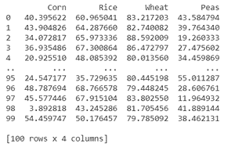
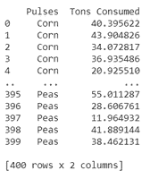
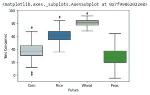
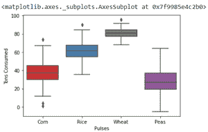

# 如何使用海博恩调色板进行彩盒绘图？

> 原文:[https://www . geeksforgeeks . org/如何使用-seaborn-color-palette-to-color-box plot/](https://www.geeksforgeeks.org/how-to-use-seaborn-color-palette-to-color-boxplot/)

**箱线图**是通过四分位数描绘数字数据组的视觉表示。Boxplot 也用于检测数据集中的异常值。它通过一个简单的方框和触须高效地捕获数据摘要，并允许我们轻松地跨组进行比较。

将正确的一组颜色添加到 Boxscript 中可以展示许多以前没有见过的不同图案。Seaborn 调色板使得在 Boxplot 中添加颜色变得非常容易。本文将解释如何使用 Seaborn 调色板给 Boxplots 上色。

有两种方法可以使用 Seaborn 调色板为 Boxplot 着色

### 1)使用预定义的海鸟调色板

这可以通过在 boxplot()函数中添加一个调色板参数，并给它任何预定义的 seaborn 调色板值来实现，如“Set1”、“Set2”、“Paired”、“Set3”等。

**步骤 1:创建数据框。**

## 蟒蛇 3

```
# import the required library
import seaborn as sns 
import matplotlib.pyplot as plt
import pandas as pd
import numpy as np

#Generate some random data
np.random.seed(45)
df = pd.DataFrame({
    'Corn': np.random.normal(40, 15, 100),
    'Rice': np.random.normal(60, 10,100),
    'Wheat': np.random.normal(80, 5, 100),
    'Peas': np.random.normal(30, 13, 100),
})
print(df)
```

**输出:**



**第二步:使用 pandas.melt()将宽转换为长**

## 蟒蛇 3

```
# Since the above data is in wide
# form we convert it into long
# form using melt function
data_df = df.melt(var_name='Pulses',
                  value_name='Tons Consumed')
print(data_df)
```

**输出:**



**步骤 3:** 创建一个使用调色板的箱线图。

## 蟒蛇 3

```
# Create boxplot and add palette
# with predefined values like Paired, Set1, etc
sns.boxplot(x="Pulses", y="Tons Consumed",
            data=data_df, palette="Paired")
```

**输出:**



使用不同的颜色:

## 蟒蛇 3

```
sns.boxplot(x="Pulses", y="Tons Consumed",
            data=data_df, palette="Set1")
```

**输出:**



> 可能的调色板值有:
> 
> -= ytet-伊甸园字幕组=-翻译:粒粒粒尘紫月猫姐 scenery 校对:
> 
> CMRmap，CMRmap_r，Dark2，Dark2_r，GnBu，GnBu_r，Greens，Greens_r，Greys，Greys_r，
> 
> OrRd、OrRd_r、orange、oranges _ r、PRGn、PRGn_r、pair、paired _ r、Pastel1、Pastel1_r、
> 
> 蛋糕 2，蛋糕 2_r，PiYG，PiYG_r，出版，宣传，宣传，出版 _r，恶臭，恶臭，
> 
> PuRd_r，purples _ r，RdBu，RdBu_r，RdGy，RdGy_r，RdPu，RdPu_r，RdYlBu，RdYlBu_r，
> 
> RdYlGn，RdYlGn_r，red，Reds _ r，Set1，Set1_r，Set2，Set2_r，Set3，Set3_r，Spectral，
> 
> -伊甸园字幕组=-翻译:
> 
> YlOrRd_r，afmhot，afmhot_r，秋季，秋季 _r，binary，binary_r，bone，bone_r，brg，brg_r，
> 
> bwr，bwr_r，civic dis，cividis _r，cool，cool_r，coolwarm，coolwarm_r，铜，铜 _ r，立方螺旋

### 2) **手动创建自己的调色板并使用它**

**进场:**

*   创建自己的颜色数组。
*   使用 seaborn 的 set_palette()函数，并添加数组名作为参数。
*   调用 boxplot()函数进行 boxplot

## 蟒蛇 3

```
#create your own color array
my_colors = ["#9b59b6", "#3498db", 
             "#2ecc71", "#006a4e"]

# add color array to set_palette
# function of seaborn
sns.set_palette( my_colors )

# make boxplot
sns.boxplot( x = "Pulses", y = "Tons Consumed",
            data = data_df)
```

