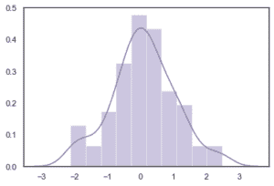
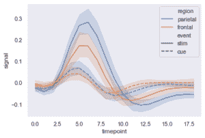
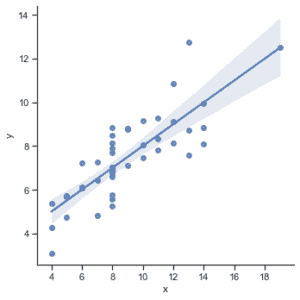

# 海伯恩–蟒蛇简介

> 原文:[https://www . geesforgeks . org/introduction-to-seaborn-python/](https://www.geeksforgeeks.org/introduction-to-seaborn-python/)

Seaborn 是一个用 Python 绘制统计图形的惊人可视化库。它提供了漂亮的默认样式和调色板，使统计图更有吸引力。它建立在 [matplotlib](https://www.geeksforgeeks.org/python-introduction-matplotlib/) 库的基础上，也与[熊猫](https://www.geeksforgeeks.org/introduction-to-pandas-in-python/)的数据结构紧密结合。
Seaborn 旨在让可视化成为探索和理解数据的核心部分。它提供了面向数据集的 API，因此我们可以在相同变量的不同可视化表示之间切换，以便更好地理解数据集。

## 《海底世界》中不同类型的情节

图基本上用于可视化变量之间的关系。这些变量可以是完全数字的，也可以是一个类别，如组、类或部门。Seaborn 将剧情分为以下几类:

*   **关系图:**该图用于理解两个变量之间的关系。
*   [**分类图:**](https://www.geeksforgeeks.org/seaborn-categorical-plots/) 这个图处理分类变量以及它们如何被可视化。
*   [**分布图:**](https://www.geeksforgeeks.org/seaborn-distribution-plots/) 该图用于检查单变量和双变量分布
*   [**【回归图:**](https://www.geeksforgeeks.org/seaborn-regression-plots/)seaborn 中的回归图主要是为了添加一个视觉指南，有助于在探索性数据分析期间强调数据集中的模式。
*   [**矩阵图:**](https://www.geeksforgeeks.org/ml-matrix-plots-in-seaborn/) A 矩阵图是散点图的阵列。
*   **多图格网:**一种有用的方法是在数据集的不同子集上绘制相同图的多个实例。

### 装置

对于 python 环境:

```
pip install seaborn

```

对于 conda 环境:

```
conda install seaborn

```

### **依赖关系**

*   Python 3.6+
*   numpy (>= 1.13.3)
*   scipy(>
*   熊猫(> = 0.22.0)
*   matplotlib （>= 2.1.2）
*   statsmodel (>= 0.8.0)

## 使用海伯恩的一些基本地块

**距离图:** Seaborn dist 图用于绘制直方图，还有一些其他变化，如 kdeplot 和 rugplot。

## 蟒蛇 3

```
# Importing libraries
import numpy as np
import seaborn as sns

# Selecting style as white,
# dark, whitegrid, darkgrid 
# or ticks
sns.set(style="white")

# Generate a random univariate 
# dataset
rs = np.random.RandomState(10)
d = rs.normal(size=100)

# Plot a simple histogram and kde 
# with binsize determined automatically
sns.distplot(d, kde=True, color="m")
```

**输出:**



**线路剧情:** 线路剧情是海伯恩图书馆最基础的剧情之一。该图主要用于以某种时间序列的形式可视化数据，即以连续的方式。

## 蟒蛇 3

```
import seaborn as sns

sns.set(style="dark")
fmri = sns.load_dataset("fmri")

# Plot the responses for different\
# events and regions
sns.lineplot(x="timepoint",
             y="signal",
             hue="region",
             style="event",
             data=fmri)
```

**输出:**



**LMP lot:**LMP lot 是另一个最基础的剧情。它显示了一条代表线性回归模型的线以及 2D 空间上的数据点，x 和 y 可以分别设置为水平和垂直标签。

## 蟒蛇 3

```
import seaborn as sns

sns.set(style="ticks")

# Loading the dataset
df = sns.load_dataset("anscombe")

# Show the results of a linear regression
sns.lmplot(x="x", y="y", data=df)
```

**输出:**

