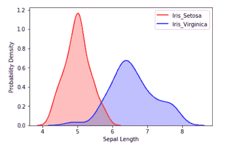
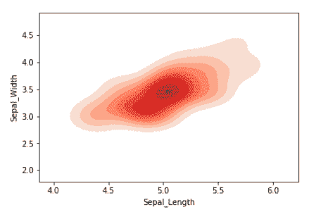

# 熊猫和海鸟 KDE 地块可视化

> 原文:[https://www . geesforgeks . org/kde-plot-visualization-with-pandas-and-seaborn/](https://www.geeksforgeeks.org/kde-plot-visualization-with-pandas-and-seaborn/)

描述为**核密度估计**的 KDE 图用于可视化连续变量的概率密度。它描述了连续变量中不同值的概率密度。我们还可以为多个样本绘制单个图表，这有助于更高效的数据可视化。

在本文中，我们将使用虹膜数据集和 KDE 图来可视化数据集的见解。

**关于虹膜数据集**–

1.  **属性**:花瓣长(厘米)、花瓣宽(厘米)、萼片长(厘米)、萼片宽(厘米)
2.  **目标**:iris _ Virginia，Iris_Setosa，iris _ vercicolor
3.  **实例数** : 150

**一维 KDE 图:**

我们可以将样本相对于单个连续属性的概率分布可视化。

```py
# importing the required libraries
from sklearn import datasets
import pandas as pd
import seaborn as sns
import matplotlib.pyplot as plt
%matplotlib inline

# Setting up the Data Frame
iris = datasets.load_iris()

iris_df = pd.DataFrame(iris.data, columns=['Sepal_Length',
                      'Sepal_Width', 'Patal_Length', 'Petal_Width'])

iris_df['Target'] = iris.target

iris_df['Target'].replace([0], 'Iris_Setosa', inplace=True)
iris_df['Target'].replace([1], 'Iris_Vercicolor', inplace=True)
iris_df['Target'].replace([2], 'Iris_Virginica', inplace=True)

# Plotting the KDE Plot
sns.kdeplot(iris_df.loc[(iris_df['Target']=='Iris_Virginica'),
            'Sepal_Length'], color='b', shade=True, Label='Iris_Virginica')

# Setting the X and Y Label
plt.xlabel('Sepal Length')
plt.ylabel('Probability Density')
```

**输出:**


我们还可以在单个图中可视化多个样本的概率分布。

```py
# Plotting the KDE Plot
sns.kdeplot(iris_df.loc[(iris_df['Target']=='Iris_Setosa'),
            'Sepal_Length'], color='r', shade=True, Label='Iris_Setosa')

sns.kdeplot(iris_df.loc[(iris_df['Target']=='Iris_Virginica'), 
            'Sepal_Length'], color='b', shade=True, Label='Iris_Virginica')

plt.xlabel('Sepal Length')
plt.ylabel('Probability Density')
```

**输出:**


**二维 KDE 图:**

我们可以将样本相对于多个连续属性的概率分布可视化。

```py
# Setting up the samples
iris_setosa = iris_df.query("Target=='Iris_Setosa'")
iris_virginica = iris_df.query("Target=='Iris_Virginica'")

# Plotting the KDE Plot
sns.kdeplot(iris_setosa['Sepal_Length'], 
            iris_setosa['Sepal_Width'],
            color='r', shade=True, Label='Iris_Setosa',
            cmap="Reds", shade_lowest=False)
```

**输出:**


我们还可以在单个图中可视化多个样本的概率分布。

```py
# Plotting the KDE Plot
sns.kdeplot(iris_setosa['Sepal_Length'],
            iris_setosa['Sepal_Width'],
            color='r', shade=True, Label='Iris_Setosa',
            cmap="Reds", shade_lowest=False)

sns.kdeplot(iris_virginica['Sepal_Length'], 
            iris_virginica['Sepal_Width'], color='b',
            shade=True, Label='Iris_Virginica',
            cmap="Blues", shade_lowest=False)
```

**输出:**
