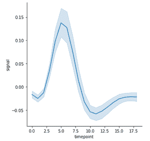

# 使用 Python 中的 Seaborn 绘制线图

> 原文:[https://www . geesforgeks . org/line plot-use-seaborn-in-python/](https://www.geeksforgeeks.org/lineplot-using-seaborn-in-python/)

**Seaborn** 是一个神奇的可视化库，用于在 Python 中绘制统计图形。它提供默认样式和调色板，使统计图更有吸引力。它建立在 matplotlib 库的顶部，也与熊猫的数据结构紧密结合。

## 线图

数据集的可视化表示必须根据数据集或我们希望从图中得到的答案类型来选择。散点图是可视化统计关系的首选。但是对于随时间变化的数据(或连续变量)，散点图不是一个好的选择。相反，在 Seaborn 中，必须优先选择 lineplot()或 relplot()，其类型为“line”。线图为每个点提供注释，并在自定义标记、线型和图例方面提供帮助。

> **语法:**seaborn . line plot(x =无，y =无，色相=无，大小=无，样式=无，数据=无，调色板=无，色相 _ 顺序=无，色相 _ 范数=无，大小=无，大小 _ 顺序=无，大小 _ 范数=无，破折号=真，标记=无，样式 _ 顺序=无，单位=无，估计器= '均值'，ci=95，n_boot=1000，种子=无，排序=真，err_style='band '，err_kws 必须是数字。
> **数据:**数据框，其中每一列是一个变量，每一行是一个观察值。
> **大小:**将产生不同宽度线条的分组变量。
> **样式:**分组变量，将产生具有不同破折号和/或标记的线条。

**示例 1:** 我们以 FMRI 数据集为例。这是时间序列数据的一个例子，其中变量是时间的函数。此数据集是内置可用的，可以使用 load_dataset()访问，无需单独下载。

## 蟒蛇 3

```py
# import libraries
import seaborn as sns

# load dataset
fmri = sns.load_dataset("fmri")
```

同一变量可以有多个度量。所以我们可以画出所有 x 值的平均值和平均值周围的 95%置信区间。这种聚集行为在 seaborn 中是默认的。

## 蟒蛇 3

```py
# plotting lineplot for signal with respect to timepoint
# using relplot, kind = "line"
# code added by devanshigupta1304
sns.lineplot( x = "timepoint",
             y = "signal",
             data = fmri);
```

**输出-**



**示例 2:** 使用色调参数创建多条线图。

## 蟒蛇 3

```py
sns.lineplot( x = "timepoint",
             y = "signal",
             hue = "region",
             data = fmri);
```