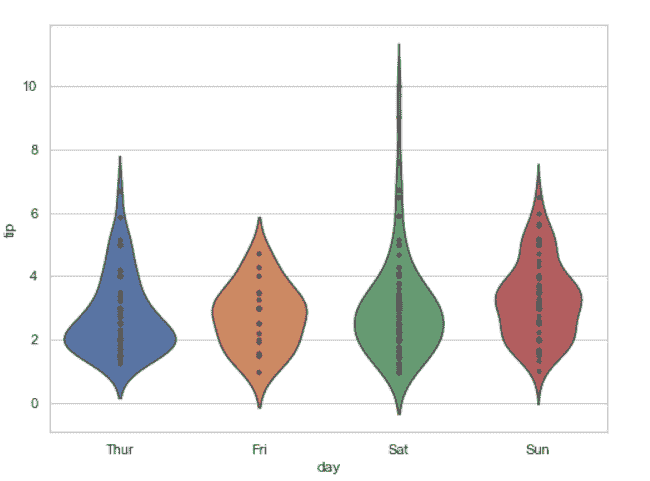

# 使用 Seaborn

制作带有数据点的小提琴曲

> 原文:[https://www . geesforgeks . org/make-violin plot-with-data-points-use-seaborn/](https://www.geeksforgeeks.org/make-violinplot-with-data-points-using-seaborn/)

A [小提琴剧情](https://www.geeksforgeeks.org/violinplot-using-seaborn-in-python/)播放类似的活动，通过触须或方块剧情 do 进行。因为它显示了一个或多个分类变量的若干定量数据。在几个单元显示多个数据可能是一种有效且有吸引力的方式。“宽格式”数据框有助于维护可以在图表上绘制的每个数字列。可以使用 NumPy 或 Python 对象，但熊猫对象更好，因为相关名称将用于注释轴。

在本文中，我们将看到如何制作 Violinplot 和绘制数据点。

**方法 1#:** 利用紫花地丁的内在属性

**示例 1:** 创建小提琴曲并使用内部属性。小提琴内部数据点的内部表示，如果是点或棒，显示每个基础数据点。

> **语法:** seaborn.violinplot( x，y，data，inner =“points”)

## 蟒蛇 3

```
# Python program to illustrate
# violinplot using inbuilt data-set
# given in seaborn

# importing the required module
import seaborn 

# use to set style of background of plot
seaborn.set(style = 'whitegrid') 

# loading data-set
tip = seaborn.load_dataset('tips')
plt.figure(figsize=(4,7))

seaborn.violinplot(x ='day', y ='tip',
                   data = tip,
                   inner="points")
```

**输出:**



**例 2:**

我们看到上面的实现，让我们对“棒”做同样的事情。此选项将数据显示为小提琴图上的线条。

## 蟒蛇 3

```
# Python program to illustrate
# violinplot using inbuilt data-set
# given in seaborn

# importing the required module
import seaborn 

# use to set style of background of plot
seaborn.set(style = 'whitegrid') 

# loading data-set
tip = seaborn.load_dataset('tips')
plt.figure(figsize=(4,7))

seaborn.violinplot(x ='day', y ='tip',
                   data = tip,
                   inner="stick")
```