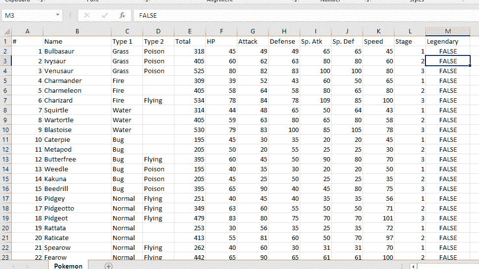
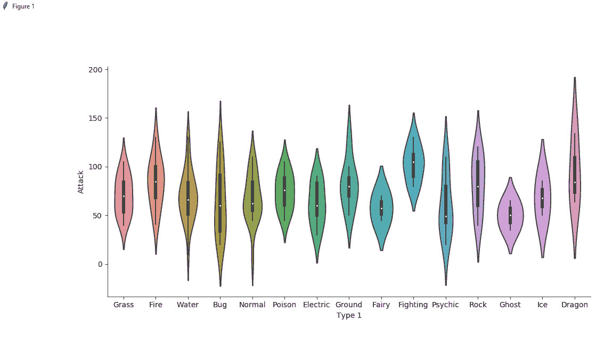
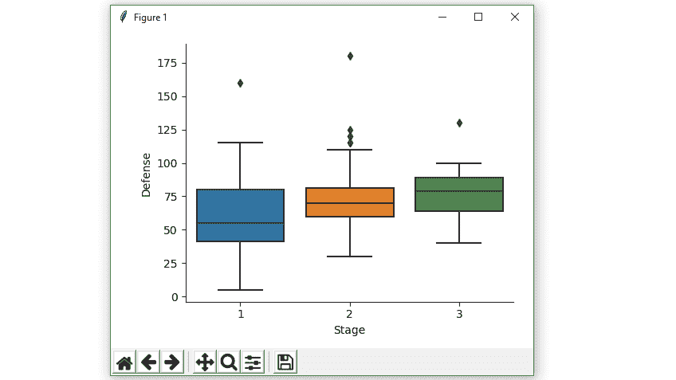
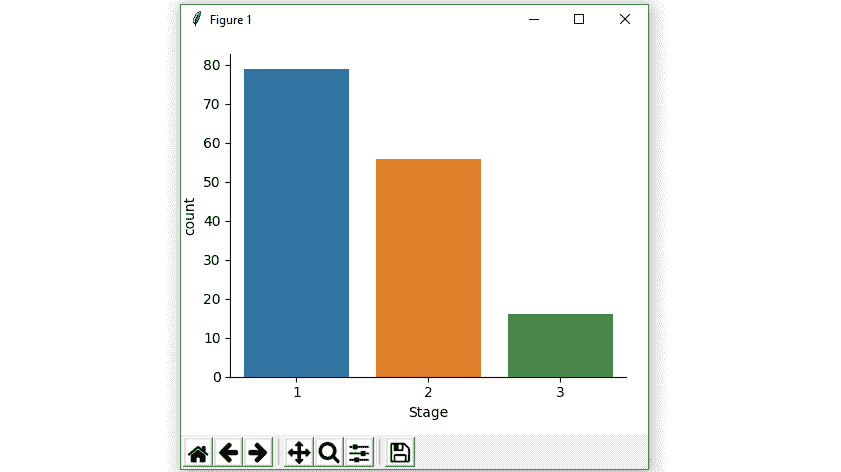

# 在海底使用因子图绘制不同类型的图

> 原文:[https://www . geeksforgeeks . org/标绘-不同类型的标绘-使用因子标绘-在海底进行标绘/](https://www.geeksforgeeks.org/plotting-different-types-of-plots-using-factor-plot-in-seaborn/)

**先决条件:** [海伯恩介绍](https://www.geeksforgeeks.org/introduction-to-seaborn-python/)

**Seaborn** 是一个神奇的可视化库，用于在 Python 中绘制统计图形。它提供了漂亮的默认样式和调色板，使统计图更有吸引力。它建立在 [matplotlib](https://www.geeksforgeeks.org/python-introduction-matplotlib/) 库的基础上，也与[熊猫](https://www.geeksforgeeks.org/introduction-to-pandas-in-python/)的数据结构紧密结合。

## 因子图

`Factor Plot`用于绘制不同类型的`[categorical plot](https://www.geeksforgeeks.org/seaborn-categorical-plots/)`。显示的默认图是点图，但是我们可以通过使用`kind`参数绘制其他 seaborn 分类图，如方框图、小提琴图、条形图或条形图。

注意:要查看神奇宝贝数据集文件，[点击此处](https://drive.google.com/file/d/1iZgKUwldueooAQy6W28J8aNVgs1T4qsS/view?usp=sharing)

**数据集片段:**


**代码 1 :** 使用 seaborn 的 factorplot()方法绘制点图。

```py
# importing required library
import pandas as pd
import seaborn as sns
import matplotlib.pyplot as plt

# read a csv file
df = pd.read_csv('Pokemon.csv')

# Stage v / s Attack point plot 
sns.factorplot(x ='Stage', y ='Attack', data = df)
sns.factorplot(x ='Stage', y ='Defense', data = df)

# Show the plots
plt.show()
```

**输出:**


**代码 2 :** 小提琴绘图使用了 seaborn 的 factorplot()方法。

```py
# importing required library
import pandas as pd
import seaborn as sns
import matplotlib.pyplot as plt

# read a csv file
df = pd.read_csv('Pokemon.csv')

# Type 1 v / s Attack violin plot 
sns.factorplot(x ='Type 1', y ='Attack',
               kind = 'violin', data = df)

# show the plots
plt.show()
```

**输出:**


**代码 3 :** 使用 seaborn 的 factorplot()方法绘制条形图。

```py
# importing required library
import pandas as pd
import seaborn as sns
import matplotlib.pyplot as plt

# read a csv file
df = pd.read_csv('Pokemon.csv')

# Type 1 v / s Defense bar plot 
# with Stage column is used for 
# colour encoding i.e 
# on the basis of Stages different
# colours is decided, here in this
# dataset, 3 Stage is mention so 
# 3 different colours is used.
sns.factorplot(x ='Type 1', y ='Defense', 
               kind = 'bar', hue = 'Stage', 
               data = df)

# show the plots
plt.show()
```

输出:


**代码 4 :** 使用海鸟因子图()方法的箱线图。

```py
# importing required library
import pandas as pd
import seaborn as sns
import matplotlib.pyplot as plt

# read a csv file
df = pd.read_csv('Pokemon.csv')

# Stage v / s Defense box plot 
sns.factorplot(x ='Stage', y ='Defense',
               kind = 'box', data = df)

# show the plots
plt.show()
```

**输出:**


**代码 5 :** 使用海鸟因子图()方法绘制带状图。

```py
# importing required library
import pandas as pd
import seaborn as sns
import matplotlib.pyplot as plt

# read a csv file
df = pd.read_csv('Pokemon.csv')

# Stage v / s Defense strip plot 
sns.factorplot(x ='Stage', y ='Defense', 
               kind = 'strip', data = df)

# show the plots
plt.show()
```

**输出:**


**代码 6 :** 使用海鸟因子图()方法计数图。

```py
# importing required library
import pandas as pd
import seaborn as sns
import matplotlib.pyplot as plt

# read a csv file
df = pd.read_csv('Pokemon.csv')

# Stage v / s count - count plot 
sns.factorplot(x ='Stage', kind = 'count', data = df)

# show the plots
plt.show()
```

**输出:**
