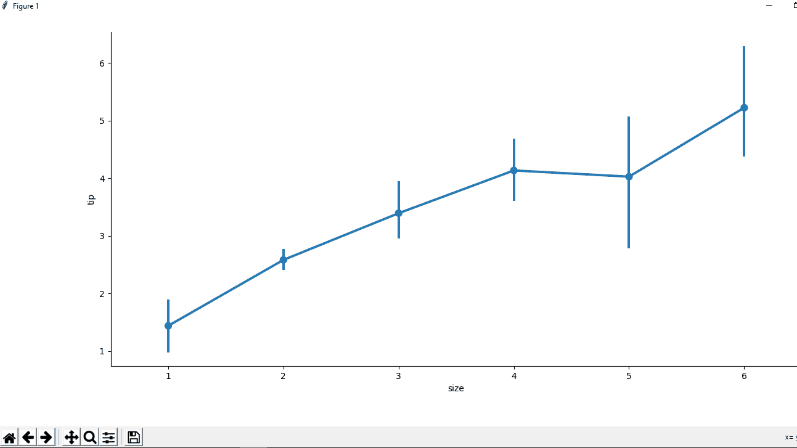

# Python–seaborn . factorplot()方法

> 原文:[https://www . geesforgeks . org/python-seaborn-factorplot-method/](https://www.geeksforgeeks.org/python-seaborn-factorplot-method/)

**`Seaborn`** 是一个用 Python 绘制统计图形的惊人可视化库。它提供了漂亮的默认样式和调色板，使统计图更有吸引力。它建立在 [matplotlib](https://www.geeksforgeeks.org/python-introduction-matplotlib/) 库之上，也与[熊猫](https://www.geeksforgeeks.org/introduction-to-pandas-in-python/)的数据结构紧密结合。

## seaborn.factorplot()方法

**`seaborn.factorplot()`** 方法用于在面网格上绘制分类图。

> **语法:**seaborn . factorplot(x =无，y =无，色相=无，数据=无，行=无，列=无，col _ wrap =无，估计器= <function mean="" at="">，ci=95，n_boot=1000，单位=无，种子=无，顺序=无，色相 _ 顺序=无，行 _ 顺序=无，列 _ 顺序=无，种类= '条状'，高度=5，纵横比=1，方向=无，颜色=无，调色板=无，图例=真，图例 _out</function>
> 
> **参数:**该方法接受以下描述的参数:
> 
> *   **x，y :** 该参数取数据中变量的名称，用于绘制长格式数据的输入。
> *   **色调:**(可选)该参数采用颜色编码的列名
> *   **数据:**该参数取数据帧，长格式(整齐)数据集进行标绘。每一列应该对应一个变量，每一行应该对应一个观察值。
> *   **行，列:**(可选)该参数采用数据中变量的名称，分类变量将决定网格的面。
> *   **col_wrap :** (可选)此参数取整数值，以此宽度“包装”列变量，使列刻面跨越多行。与行方面不兼容。
> *   **估计器:**(可选)该参数采用映射向量- >标量的可调用统计函数来估计每个分类仓内的值。
> *   **ci :** (可选)该参数取浮点或“sd”或“无”值，置信区间大小以得出估计值。如果是“sd”，跳过自举，画出观察值的标准差。如果为“无”，则不执行引导，也不绘制误差线。
> *   **n_boot :** (可选)该参数取整数 valiue，计算置信区间时使用的引导迭代次数。
> *   **单位:**(可选)该参数取数据或矢量数据中变量的名称，采样单位的标识符，用于执行多级自举，并考虑重复的测量设计。
> *   **seed :** (可选)此参数采用整数值、numpy.random.Generator 或 numpy.random.RandomState、seed 或随机数生成器进行可重复引导。
> *   **order，hue_order :** (可选)此参数采用字符串列表，order 来绘制分类级别，否则从数据对象中推断级别。
> *   **row_order，col_order:** (可选)此参数采用字符串列表、order 来组织网格中的行和/或列，否则从数据对象中推断出顺序。
> *   **种类:**(可选)此参数取字符串值，要绘制的绘图种类(对应于一个分类绘图函数的名称。选项有:“点”、“棒”、“带”、“群”、“盒”、“小提琴”或“博森”。
> *   **高度:**(可选)该参数取浮点值，即每个刻面的高度(英寸)。
> *   **纵横比:**(可选)该参数取浮点值，即每个小平面的纵横比，因此纵横比*高度给出了每个小平面的宽度，单位为英寸。
> *   **方向:**(可选)该参数取值应为“v”|“h”，图的方向(垂直或水平)。这通常是从输入变量的数据类型中推断出来的，但是可以用来指定“分类”变量是数字还是绘制宽格式数据。
> *   **颜色:**(可选)此参数采用 matplotlib 颜色、所有元素的颜色或渐变调色板的种子。
> *   **调色板:**(可选)该参数采用调色板名称、列表或字典颜色，用于色调变量的不同级别。应该是 color_palette()可以解释的东西，或者是将色调级别映射到 matplotlib 颜色的字典。
> *   **图例:**(可选)该参数取布尔值，如果为真且有色相变量，则在图上画一个图例。
> *   **legend_out :** (可选)此参数取布尔值，如果为 True，则图形尺寸将被扩展，图例将被绘制在中心右侧的图外。
> *   **共享{x，y} :** (可选)此参数取 bool、' col '或' row '，如果为真，则面将跨列共享 y 轴和/或跨行共享 x 轴。
> *   **margin_titles :** (可选)此参数取布尔值，如果为真，则行变量的标题绘制在最后一列的右侧。这个选项是实验性的，可能不是在所有情况下都有效。
> *   **facet_kws :** (可选)该参数取字典对象，字典的其他关键字参数传递给 FacetGrid。
> *   **kwargs :** 此参数接受键、值对、其他关键字参数，并传递给底层绘图函数。
> 
> **返回:**该方法返回带有地块的 FacetGrid 对象，以便进一步调整。

**注:**下载 Tips 数据集[点击此处](https://drive.google.com/file/d/1bsDSsI2MQSc77VBKVFETWYOs6fAlNwxF/view?usp=sharing)。

以下示例说明了 seaborn 库的 factorplot()方法。

**例 1 :**

```py
# importing the required library
import pandas as pd
import seaborn as sns
import matplotlib.pyplot as plt

# read a csv file
df = pd.read_csv('Tips.csv')

# point plot(by default)
sns.factorplot(x ='size', y ='tip', data = df)

# Show the plot
plt.show()
```

**输出:**


**例 2 :**

```py
# importing the required library
import pandas as pd
import seaborn as sns
import matplotlib.pyplot as plt

# read a csv file
df = pd.read_csv('Tips.csv')

# point plot using hue attribute
# for colouring out points
# according to the sex
sns.factorplot(x ='size', y ='tip', 
               hue = 'sex', data = df)

# Show the plot
plt.show()
```

**输出:**
