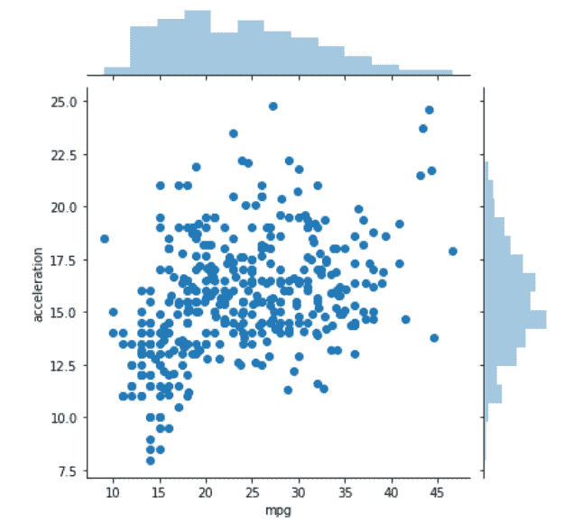
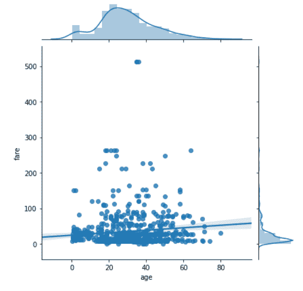

# Python–seaborn . joint plot()方法

> 原文:[https://www . geesforgeks . org/python-seaborn-joint plot-method/](https://www.geeksforgeeks.org/python-seaborn-jointplot-method/)

[**Seaborn**](https://www.geeksforgeeks.org/plotting-graph-using-seaborn-python/amp/) 是基于 [matplotlib](https://www.geeksforgeeks.org/python-introduction-matplotlib/amp/) 的 Python 数据可视化库。它提供了一个高级界面，用于绘制吸引人且信息丰富的统计图形。Seaborn 帮助解决了 Matplotlib 面临的两大问题；问题是。

*   默认 Matplotlib 参数
*   使用数据框

随着 Seaborn 对 Matplotlib 的补充和扩展，学习曲线是相当渐进的。如果你知道 Matplotlib，你已经走过了半个 Seaborn。

### seaborn.jointplot():

用二元和一元图画出两个变量的曲线图。这个函数为“联合网格”类提供了一个方便的接口，有几种固定的图。这是一个相当轻量级的包装器；如果需要更大的灵活性，应该直接使用:class:'JointGrid '。

> **语法:** seaborn.jointplot(x，y，data=None，kind= '散点'，stat_func=None，color=None，height=6，ratio=5，space=0.2，dropna=True，xlim=None，ylim=None，joint_kws=None，marginal_kws=None，annot_kws=None，**kwargs)
> 
> **参数:**部分主要参数描述如下:
> 
> **x，y:** 这些参数取“数据”或“数据”中变量的名称。
> 
> **数据:**(可选)当“x”和“y”为变量名时，此参数取 DataFrame。
> 
> **种类:**(可选)此参数取种类图进行绘制。
> 
> **颜色:**(可选)该参数采用用于绘图元素的颜色。
> 
> **dropna:** (可选)该参数取布尔值，如果为真，则删除“x”和“y”中缺失的观察值。
> 
> **返回:**带有地块的 jointgrid 对象。

下面是上述方法的实现:

**例 1:**

## 蟒蛇 3

```py
# importing required packages
import seaborn as sns
import matplotlib.pyplot as plt

# loading dataset
data = sns.load_dataset("attention")

# draw jointplot with
# hex kind
sns.jointplot(x = "solutions", y = "score",
              kind = "hex", data = data)
# show the plot
plt.show()

# This code is contributed 
# by Deepanshu Rustagi.
```

**输出:**


**例 2:**

## 蟒蛇 3

```py
# importing required packages
import seaborn as sns
import matplotlib.pyplot as plt

# loading dataset
data = sns.load_dataset("mpg")

# draw jointplot with
# scatter kind
sns.jointplot(x = "mpg", y = "acceleration",
              kind = "scatter", data = data)
# show the plot
plt.show()

# This code is contributed
# by Deepanshu Rustagi.
```

**输出:**



**例 3:**

## 蟒蛇 3

```py
# importing required packages
import seaborn as sns
import matplotlib.pyplot as plt

# loading dataset
data = sns.load_dataset("exercise")

# draw jointplot with
# kde kind
sns.jointplot(x = "id", y = "pulse",
              kind = "kde", data = data)
# Show the plot
plt.show()

# This code is contributed
# by Deepanshu Rustagi.
```

**输出:**


**例 4:**

## 蟒蛇 3

```py
# importing required packages
import seaborn as sns
import matplotlib.pyplot as plt

# loading dataset
data = sns.load_dataset("titanic")

# draw jointplot with
# reg kind
sns.jointplot(x = "age", y = "fare",
              kind = "reg", data = data,
              dropna = True)

# show the plot
plt.show()

# This code is contributed 
# by Deepanshu Rustagi.
```

**输出:**

