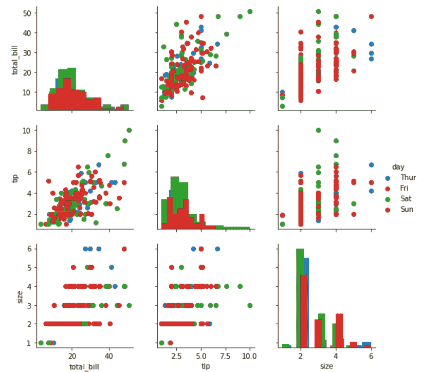
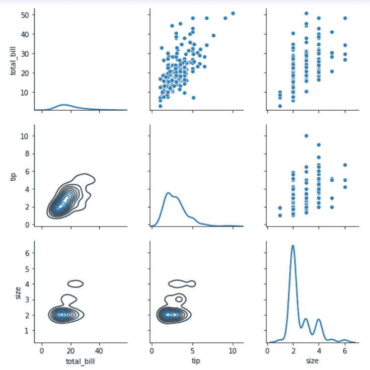

# 蟒蛇——海牛。PairGrid()方法

> 原文:[https://www . geesforgeks . org/python-seaborn-pair grid-method/](https://www.geeksforgeeks.org/python-seaborn-pairgrid-method/)

#### 先决条件: [<u>海鸟编程基础知识</u>](https://www.geeksforgeeks.org/plotting-graph-using-seaborn-python/)

Seaborn 是基于 [matplotlib](https://www.geeksforgeeks.org/python-introduction-matplotlib/) 的 Python 数据可视化库。它提供了一个高级界面，用于绘制吸引人且信息丰富的统计图形。Seaborn 帮助解决了 Matplotlib 面临的两大问题；问题是。

*   默认 Matplotlib 参数
*   使用数据框

随着 Seaborn 对 Matplotlib 的补充和扩展，学习曲线是相当渐进的。如果你知道 Matplotlib，你已经走过了半个 Seaborn。

### 希伯恩。pairgrid():

*   用于绘制数据集中成对关系的子图网格。
*   此类将数据集中的每个变量映射到多轴网格中的一列和一行。可以使用不同的轴级绘图函数在上三角形和下三角形中绘制二元图，并且每个变量的边际分布可以显示在对角线上。
*   它还可以用色调参数表示条件化的附加级别，该参数以不同的颜色绘制不同的数据子集。这使用颜色来解析第三维上的元素，但仅在彼此之上绘制子集，不会像接受色调的轴级函数那样为特定可视化定制色调参数。

```py
                    seaborn.PairGrid( data, \*\*kwargs)

```

西伯恩。PairGrid 使用许多参数作为输入，主要参数如下表所示:

<figure class="table">

| **论据** | **描述** | **值** |
| 数据 | 整齐的(长格式)数据框，其中每一列都是变量，每一行都是观察值。 | 数据帧 |
| 色彩 | “数据”中的变量，用于将绘图方面映射到不同的颜色。 | 字符串(变量名)，可选 |
| 调色板 | 用于映射“色调”变量的一组颜色。如果是字典，关键字应该是“色调”变量中的值。 | dict 或 seaborn 调色板 |
| vars | 要使用的“数据”中的变量，否则使用带有数字数据类型的每一列。 | 变量名列表，可选 |
| 快捷批处理 | 绘图前删除数据中缺失的值。 | 布尔值，可选 |

</figure>

下面是上述方法的实现:

**例 1:**

## 蟒蛇 3

```py
# importing packages
import seaborn
import matplotlib.pyplot as plt

# loading dataset
df = seaborn.load_dataset('tips')

# PairGrid object with hue
graph = seaborn.PairGrid(df, hue ='day')
# type of graph for diagonal
graph = graph.map_diag(plt.hist)
# type of graph for non-diagonal
graph = graph.map_offdiag(plt.scatter)
# to add legends
graph = graph.add_legend()
# to show
plt.show()
# This code is contributed by Deepanshu Rusatgi.
```

#### 输出:



#### 例 2:

## 蟒蛇 3

```py
# importing packages
import seaborn
import matplotlib.pyplot as plt

# loading dataset
df = seaborn.load_dataset('tips')

# PairGrid object with hue
graph = seaborn.PairGrid(df)
# type of graph for non-diagonal(upper part)
graph = graph.map_upper(sns.scatterplot)
# type of graph for non-diagonal(lower part)
graph = graph.map_lower(sns.kdeplot)
# type of graph for diagonal
graph = graph.map_diag(sns.kdeplot, lw = 2)
# to show
plt.show()
# This code is contributed by Deepanshu Rusatgi.
```

#### 输出:

