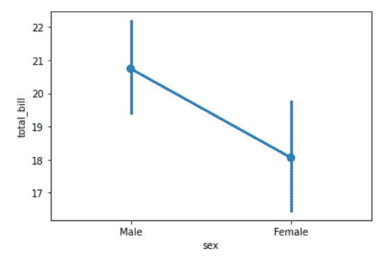
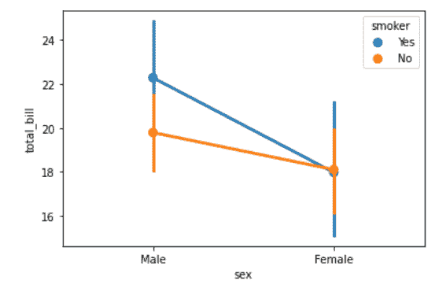
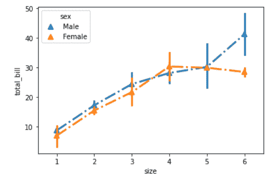

# Python–seaborn . pointplot()方法

> 原文:[https://www . geesforgeks . org/python-seaborn-point plot-method/](https://www.geeksforgeeks.org/python-seaborn-pointplot-method/)

[**Seaborn**](https://www.geeksforgeeks.org/plotting-graph-using-seaborn-python/amp/) 是一个用 Python 进行统计图形绘制的惊人可视化库。它提供了漂亮的默认样式和调色板，使统计图更有吸引力。它建立在 [matplotlib](https://www.geeksforgeeks.org/python-introduction-matplotlib/) 库的基础上，也与[熊猫](https://www.geeksforgeeks.org/introduction-to-pandas-in-python/)的数据结构紧密结合。

### seaborn.pointplot():

*   此方法用于使用散点图图示符显示点估计和置信区间。点图表示通过散点图点的位置对数值变量的中心趋势的估计，并使用误差线提供该估计周围的不确定性的一些指示。
*   此函数始终将其中一个变量视为分类变量，并在相关轴的序号位置(0，1，… n)绘制数据，即使数据是数字或日期类型。

> **语法:**seaborn . point plot(x =无，y =无，色调=无，数据=无，顺序=无，色调 _ 顺序=无，估计器= <函数平均值位于 0x00000193E305E828 >，ci=95，n_boot=1000，单位=无，标记='o '，线型='-'，减淡=假，连接=真，比例=1，方向=无，颜色=无，调色板=无，错误宽度=无，无
> 
> **参数:**部分主要参数描述如下:
> 
> *   **x，y:** 用于绘制长格式数据的输入。
> *   **色调:**(可选)颜色编码的列名。
> *   **数据:**作为用于绘图的数据集的数据帧。
> *   **标记:**(可选)用于每个“色调”级别的标记。
> *   **线条样式**:(可选)用于每个“色调”级别的线条样式。
> *   **减淡:**(可选)沿分类轴分隔“色调”变量各等级点的数量。
> *   **颜色:**(可选)所有元素的颜色，或渐变调色板的种子。
> *   **倾覆:**(可选)误差杆上“帽”的宽度。
> 
> **返回:**绘制了绘图的轴对象。

下面是上述方法的实现:

**例 1:**

## 蟒蛇 3

```py
# importing required packages
import seaborn as sns
import matplotlib.pyplot as plt

# loading dataset
data = sns.load_dataset("tips")

# draw pointplot
sns.pointplot(x = "sex",
              y = "total_bill",
              data = data)
# show the plot
plt.show()
# This code is contributed 
# by Deepanshu Rustagi.
```

**输出:**



**例 2:**

## 蟒蛇 3

```py
# importing required packages
import seaborn as sns
import matplotlib.pyplot as plt

# loading dataset
data = sns.load_dataset("tips")

# draw pointplot with
# hue = smoker
sns.pointplot(x = "sex",
              y = "total_bill",
              hue = "smoker",
              data = data)
# show the plot
plt.show()
# This code is contributed 
# by Deepanshu Rustagi.
```

**输出:**



**例 3:**

## 蟒蛇 3

```py
# importing required packages
import seaborn as sns
import matplotlib.pyplot as plt

# loading dataset
data = sns.load_dataset("tips")

# draw pointplot
sns.pointplot(x = "size",
              y = "total_bill",
              linestyles = '-.',
              markers = '^',
              hue = "sex",
              data = data)
# show the plot
plt.show()

# This code is contributed 
# by Deepanshu Rustagi.
```

**输出:**

