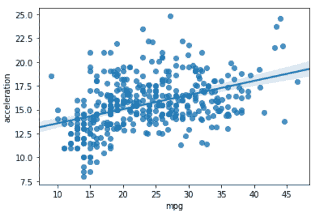
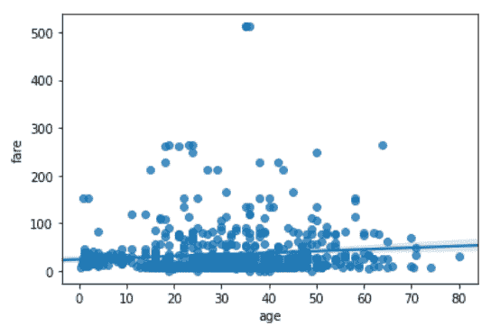
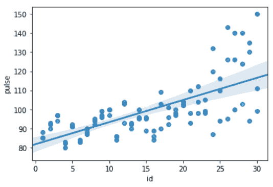

# Python–seaborn . regplot()方法

> 原文:[https://www . geesforgeks . org/python-seaborn-regplot-method/](https://www.geeksforgeeks.org/python-seaborn-regplot-method/)

[**Seaborn**](https://www.geeksforgeeks.org/plotting-graph-using-seaborn-python/amp/) 是基于 [matplotlib](https://www.geeksforgeeks.org/python-introduction-matplotlib/amp/) 的 Python 数据可视化库。它提供了一个高级界面，用于绘制吸引人且信息丰富的统计图形。Seaborn 帮助解决了 Matplotlib 面临的两大问题；问题是。

*   默认 Matplotlib 参数
*   使用数据框

随着 Seaborn 对 Matplotlib 的补充和扩展，学习曲线是相当渐进的。如果你知道 Matplotlib，你已经走过了半个 Seaborn。

### seaborn.regplot():

该方法用于绘制数据和线性回归模型拟合。有许多互斥的选项来估计回归模型。更多信息[点击此处。](https://www.geeksforgeeks.org/types-of-regression-techniques/)

> **语法:** seaborn.regplot( x，y，数据=无，x _ estimator =无，x _ bins =无，x_ci='ci '，散点图=真，fit _ reg =真，ci=95，n_boot=1000，单位=无，顺序=1，logistic =假，lowess =假，robust =假，logx =假，x _ partial =无，y _ partial =无，truncate =假，dropna =真，x _ jitter =无，y _ jitter =无，label =无
> 
> **参数:**部分主要参数描述如下:
> 
> *   **x，y:** 这些是输入变量。如果是字符串，这些应该与“数据”中的列名相对应。当熊猫对象被使用时，轴将被标上系列名称。
> *   **数据:**这是数据帧，其中每一列是一个变量，每一行是一个观察值。
> *   **下限:**(可选)该参数取布尔值。如果为“真”，则使用“统计模型”来估计非参数低限模型(局部加权线性回归)。
> *   **颜色:**(可选)应用于所有绘图元素的颜色。
> *   **标记:**(可选)用于散点图字形的标记。
> 
> **返回:**包含绘图的轴对象。

下面是上述方法的实现:

**例 1:**

## 蟒蛇 3

```
# importing required packages
import seaborn as sns
import matplotlib.pyplot as plt

# loading dataset
data = sns.load_dataset("mpg")

# draw regplot
sns.regplot(x = "mpg", 
            y = "acceleration", 
            data = data)

# show the plot
plt.show()

# This code is contributed 
# by Deepanshu Rustagi.
```

**输出:**



**例 2:**

## 蟒蛇 3

```
# importing required packages
import seaborn as sns
import matplotlib.pyplot as plt

# loading dataset
data = sns.load_dataset("titanic")

# draw regplot
sns.regplot(x = "age",
            y = "fare",
            data = data,
            dropna = True)
# show the plot
plt.show()

# This code is contributed 
# by Deepanshu Rustagi.
```

**输出:**



**例 3:**

## 蟒蛇 3

```
# importing required packages
import seaborn as sns
import matplotlib.pyplot as plt

# loading dataset
data = sns.load_dataset("exercise")

# draw regplot
sns.regplot(x = "id",
            y = "pulse", 
            data = data)

# show the plot
plt.show()

# This code is contributed 
# by Deepanshu Rustagi.
```

**输出**:



**例 4 :**

## 蟒蛇 3

```
# importing required packages
import seaborn as sns
import matplotlib.pyplot as plt

# loading dataset
data = sns.load_dataset("attention")

# draw regplot
sns.regplot(x = "solutions",
            y = "score",
            data = data)

# show ther plot
plt.show()

# This code is contributed 
# by Deepanshu Rustagi.
```

**输出:**

