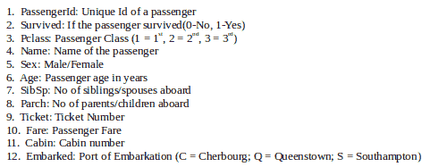
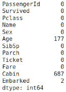
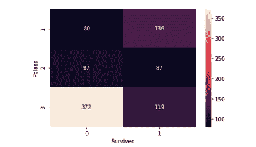
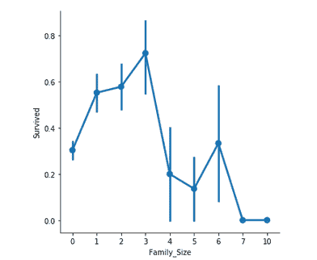
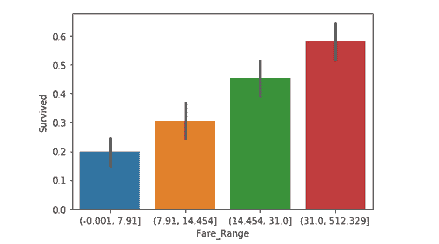

# Python |使用 Seaborn 的 Titanic 数据 EDA

> 原文:[https://www . geesforgeks . org/python-titanic-data-EDA-use-seaborn/](https://www.geeksforgeeks.org/python-titanic-data-eda-using-seaborn/)

**什么是 EDA？**
探索性数据分析(EDA)是一种用于分析和总结数据集的方法。大多数 EDA 技术都涉及到图形的使用。

**泰坦尼克号数据集–**
它是用于理解机器学习基础知识的最受欢迎的数据集之一。它包含了不幸遭遇海难的皇家邮轮泰坦尼克号上所有乘客的信息。该数据集可用于预测给定乘客是否幸存。

csv 文件可以从 [Kaggle](https://www.kaggle.com/c/titanic/data) 下载。



**代码:使用熊猫加载数据**

## 蟒蛇 3

```
#importing pandas library
import pandas as pd

#loading data
titanic = pd.read_csv('...\input\train.csv')
```

**Seaborn:**
这是一个用于统计可视化数据的 python 库。[基于 Matplotlib 构建的 Seaborn](https://seaborn.pydata.org/) ，提供了更好的界面和易用性。它可以使用以下命令安装，
pip3 安装 seaborn

**代码:打印数据头**

## 蟒蛇 3

```
# View first five rows of the dataset
titanic.head()
```

**输出:**


**代码:检查空值**

## 蟒蛇 3

```
titanic.isnull().sum()
```

**输出:**



具有空值的列有:年龄、船舱、船载。稍后需要用适当的值填充它们。

**特征:**泰坦尼克号数据集大致有以下几类特征:

*   **分类/名义**:可以分为多个类别但没有顺序或优先级的变量。
    登船；Q =皇后镇；S =南安普顿)
*   **二元**:分类特征的一个子类型，其中变量只有两个类别。
    例如:性别(男/女)
*   **序数**:与分类特征相似，但有顺序(即可以排序)。
    例如，玻璃(1，2，3)
*   **连续**:它们可以占用一列中最小值和最大值之间的任何值。
    例如年龄、票价
*   **计数**:它们代表一个变量的计数。
    例如 SibSp，炒
*   **无用**:它们对 ML 模型的最终结果没有贡献。在这里，*乘客、姓名、客舱*和*机票*可能属于这一类。

**代码:图形分析**

## 蟒蛇 3

```
import seaborn as sns
import matplotlib.pyplot as plt

# Countplot
sns.catplot(x ="Sex", hue ="Survived",
kind ="count", data = titanic)
```

**输出:**


单从图中观察，可以近似得出男性存活率在 *20%* 左右，女性存活率在 *75%* 左右。因此，乘客是男性还是女性在决定一个人是否会生存方面起着重要的作用。

**代码:Pclass(序数特征)vs 存活**

## 蟒蛇 3

```
# Group the dataset by Pclass and Survived and then unstack them
group = titanic.groupby(['Pclass', 'Survived'])
pclass_survived = group.size().unstack()

# Heatmap - Color encoded 2D representation of data.
sns.heatmap(pclass_survived, annot = True, fmt ="d")
```

**输出:**



这有助于确定高等级乘客的存活率是否高于低等级乘客，反之亦然。*1 级*乘客比*2 级和 3 级*乘客存活几率更高。这意味着*级*对乘客的存活率有很大的贡献。

**代码:年龄(连续特征)vs 存活**

## 蟒蛇 3

```
# Violinplot Displays distribution of data
# across all levels of a category.
sns.violinplot(x ="Sex", y ="Age", hue ="Survived",
data = titanic, split = True)
```

**输出:**


这张图表总结了被救的男女老少的年龄范围。存活率是–

*   对孩子有好处。
*   对 20-50 岁的女性来说很高。
*   随着年龄的增长，男性越来越少。

由于*年龄*栏很重要，需要填写缺失的值，或者使用*姓名*栏(根据称呼确定年龄-先生、女士等。)或通过使用回归器。
此步骤后，可创建另一列–*年龄 _ 范围*(基于年龄列)并可再次分析数据。

**代码:族 _ 尺寸(计数特征)和族尺寸的系数图。**

## 蟒蛇 3

```
# Adding a column Family_Size
titanic['Family_Size'] = 0
titanic['Family_Size'] = titanic['Parch']+titanic['SibSp']

# Adding a column Alone
titanic['Alone'] = 0
titanic.loc[titanic.Family_Size == 0, 'Alone'] = 1

# Factorplot for Family_Size
sns.factorplot(x ='Family_Size', y ='Survived', data = titanic)

# Factorplot for Alone
sns.factorplot(x ='Alone', y ='Survived', data = titanic)
```



**家庭规模**表示乘客家庭的人数。通过对相应乘客的 **SibSp** 和 **Parch** 列求和来计算。此外，还增加了另一栏【单独 T6】，以检查单独乘客与有家庭的乘客的生存机会。

重要观察–

*   如果一个乘客独自一人，存活率就更低了。
*   如果家庭规模大于 5，存活的机会会大大降低。

**代码:票价条形图(连续特征)**

## 蟒蛇 3

```
# Divide Fare into 4 bins
titanic['Fare_Range'] = pd.qcut(titanic['Fare'], 4)

# Barplot - Shows approximate values based
# on the height of bars.
sns.barplot(x ='Fare_Range', y ='Survived',
data = titanic)
```

**输出:**



**票价**表示乘客支付的票价。由于此栏中的值是连续的，因此需要将它们放在单独的容器中(如对**年龄**功能所做的那样)以获得清晰的概念。可以得出结论，如果乘客支付了更高的票价，存活率就更高。

**代码:装载特征的分类计数图**

## 蟒蛇 3

```
# Countplot
sns.catplot(x ='Embarked', hue ='Survived',
kind ='count', col ='Pclass', data = titanic)
```


一些值得注意的观察结果是:

*   大多数乘客从 *S* 登机。所以，缺失的值可以用 *S* 来填充。
*   大部分 3 类乘客从 *Q* 登机。
*   *S* 与 3 班相比，1、2 班乘客看起来比较幸运。

**结论:**

*   可以删除的列有:
    *   乘客身份、姓名、机票、客舱:它们是字符串，无法分类，对结果没有太大贡献。
    *   年龄、票价:取而代之的是，保留相应的范围列。
*   泰坦尼克号的数据可以用更多的图表技术和更多的列关联来分析，而不是像本文中描述的那样。
*   一旦 EDA 完成，生成的数据集就可以用于预测。