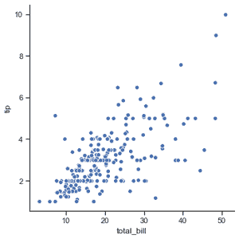
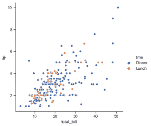
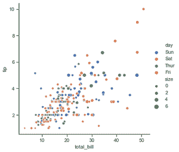

# 海伯恩的相关地块–第一部分

> 原文:[https://www . geeksforgeeks . org/relative-plot-in-seaborn-part-I/](https://www.geeksforgeeks.org/relational-plots-in-seaborn-part-i/)

**关系图**用于可视化数据点之间的统计关系。可视化是必要的，因为它允许人类看到数据中的趋势和模式。理解数据集中的变量如何相互关联以及它们之间的关系的过程称为统计分析。

与 matplotlib 不同，Seaborn 还提供了一些默认数据集。在本文中，我们将使用名为“tips”的默认数据集。这个数据集提供了关于在某个餐馆吃饭的人的信息，以及他们是否给服务员留了小费，他们的性别，他们是否吸烟，等等。

让我们看一下数据集。

## 蟒蛇 3

```
# importing the library
import seaborn as sns

# reading the dataset
data = sns.load_dataset('tips')

# printing first five entries
print(data.head())
```

**输出:**

```
   total_bill   tip     sex smoker  day    time  size
0       16.99  1.01  Female     No  Sun  Dinner     2
1       10.34  1.66    Male     No  Sun  Dinner     3
2       21.01  3.50    Male     No  Sun  Dinner     3
3       23.68  3.31    Male     No  Sun  Dinner     2
4       24.59  3.61  Female     No  Sun  Dinner     4
```

绘制关系图 seaborn 提供了三个功能。这些是:

*   relplot()
*   散点图()
*   线图()

## Seaborn.relplot()

这个函数为我们提供了访问其他不同轴级函数的途径，这些函数通过子集的语义映射显示了两个变量之间的关系。

**语法:**

```
seaborn.relplot(x=None, y=None, data=None, **kwargs) 
```

**参数:**

<figure class="table">

| 参数 | 价值 | 使用 |
| --- | --- | --- |
| x，y | 数字的 | 输入数据变量 |
| 数据 | 数据帧 | 正在使用的数据集。 |
| 色调、尺寸、风格 | 数据中的名称；可选择的 | 将产生不同颜色元素的分组变量。 |
| 种类 | 分散或成线；默认:分散 | 定义图的类型，散点图()或线图() |
| 行，列 | 数据中变量的名称；可选择的 | 将决定网格面的分类变量。 |
| 列换行 | int 可选择的 | 将列变量“环绕”到这个宽度，这样列刻面就可以跨越多行。 |
| 行顺序，列顺序 | 字符串列表；可选择的 | 组织网格行和列的顺序。 |
| 调色板 | 名字、名单或字典；可选择的 | 用于色调变量不同级别的颜色。 |
| 色调顺序 | 列表；可选择的 | 色调可变级别的指定外观顺序。 |
| 色调 _ 范数 | 元组或规范化对象；可选择的 | 当色调变量为数字时，应用于色调变量的颜色映射的数据单位标准化。 |
| 大小 | 列表、字典或元组；可选择的 | 确定绘图中每个点的大小。 |
| 大小 _ 顺序 | 列表；可选择的 | 大小可变级别的指定出现顺序 |
| 大小 _ 范数 | 元组或规范化对象；可选择的 | 当大小变量为数字时，用于缩放绘图对象的数据单位标准化。 |
| 神话；传奇 | “简短”、“完整”或“假”；可选择的 | 如果“简短”，数字色调和大小变量将使用均匀间隔的值的样本来表示。如果“满了”，每个组都会在图例中得到一个条目。如果为假，则不添加图例数据，也不绘制图例。 |
| 高度 | 标量；可选择的 | 每个刻面的高度(英寸)。 |
| 方面 | 标量；可选择的 | 每个刻面的纵横比，即宽度/高度 |
| facet_kws | dict 可选择的 | 要传递给 FacetGrid 的其他关键字参数的字典。 |
| 夸格斯 | 键值对 | 其他关键字参数传递给底层绘图函数。 |

</figure>

**示例 1:** 可视化最基本的图，以显示 tips 数据集中的所有数据点。

## 蟒蛇 3

```
# importing the library
import seaborn as sns

# selecting style
sns.set(style ="ticks")

# reading the dataset
tips = sns.load_dataset('tips')

# plotting a simple visualization of data points
sns.relplot(x ="total_bill", y ="tip", data = tips)
```

**输出:**



**例 2:** 根据类别对数据点进行分组，此处为时间。

## 蟒蛇 3

```
# importing the library
import seaborn as sns

# selecting style
sns.set(style ="ticks")

# reading the dataset
tips = sns.load_dataset('tips')

sns.relplot(x="total_bill",
            y="tip",
            hue="time",
            data=tips)
```

**输出:**



**示例 3:** 使用时间和性别来确定网格的面。

## 蟒蛇 3

```
# importing the library
import seaborn as sns

# selecting style
sns.set(style ="ticks")

# reading the dataset
tips = sns.load_dataset('tips')

sns.relplot(x="total_bill",
            y="tip",
            hue="day",
            col="time",
            row="sex",
            data=tips)
```

**输出**:


**例 4:** 使用大小属性，我们可以看到大小不同的数据点。

## 蟒蛇 3

```
# importing the library
import seaborn as sns

# selecting style
sns.set(style ="ticks")

# reading the dataset
tips = sns.load_dataset('tips')

sns.relplot(x="total_bill",
            y="tip",
            hue="day",
            size="size",
            data=tips)
```

**输出**:

