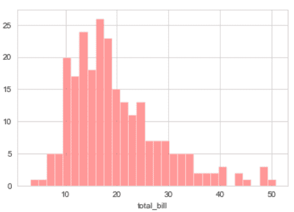
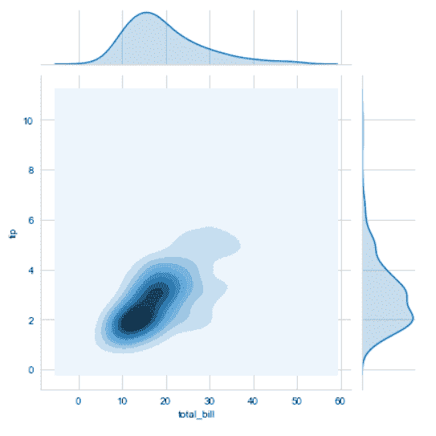
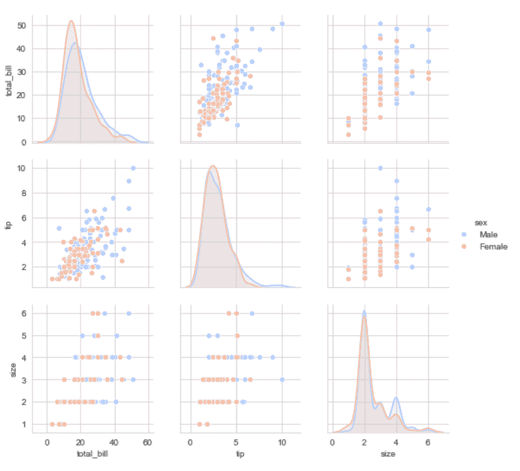

# 海底|分布图

> 原文:[https://www.geeksforgeeks.org/seaborn-distribution-plots/](https://www.geeksforgeeks.org/seaborn-distribution-plots/)

Seaborn 是一个基于 Matplotlib 的 Python 数据可视化库。它提供了一个高级界面，用于绘制吸引人且信息丰富的统计图形。本文讨论了用于检验单变量和双变量分布的海底分布图。在本文中，我们将讨论 4 种类型的分布图，即:

1.  接合图
2.  distplot
3.  配对图
4.  皱纹图

除了提供不同种类的可视化图，seaborn 还包含一些内置数据集。我们将在本文中使用 tips 数据集。“小费”数据集包含可能在餐馆吃过饭的人的信息，以及他们是否留下小费、他们的年龄、性别等等。让我们看看它。

**代码:**

```py
# import thr necessary libraries
import seaborn as sns
import matplotlib.pyplot as plt % matplotlib inline

# to ignore the warnings 
from warnings import filterwarnings

# load the dataset
df = sns.load_dataset('tips')

# the first five entries of the dataset
df.head()
```


现在，让我们进入剧情。

## **显示区**

它基本上用于单变量观察组，并通过直方图可视化，即只有一个观察，因此我们选择数据集的一个特定列。
**语法:**

```py
distplot(a[, bins, hist, kde, rug, fit, ...])
```

**示例:**

```py
# set the background style of the plot
sns.set_style('whitegrid')
sns.distplot(df['total_bill'], kde = False, color ='red', bins = 30)
```

**输出:**


**说明:**

*   KDE 代表**核密度估计**，这是海伯恩的另一种情节。
*   面元用于设置您想要在绘图中使用的面元数量，它实际上取决于您的数据集。
*   颜色用于指定绘图的颜色

现在看看这个，我们可以说大部分的账单总额在 10 到 20 英镑之间。

## **联图**

它用于用二元和一元图绘制两个变量的图。它基本上结合了两个不同的情节。
**语法:**

```py
jointplot(x, y[, data, kind, stat_func, ...])    
```

**示例:**

```py
sns.jointplot(x ='total_bill', y ='tip', data = df)
```

**输出:**


```py
sns.jointplot(x ='total_bill', y ='tip', data = df, kind ='kde')
# KDE shows the density where the points match up the most
```



**说明:**

*   kind 是一个变量，它帮助我们处理数据可视化的问题。这有助于了解连接图内部的情况。默认值为分散，可以是十六进制、reg(回归)或 kde。
*   x 和 y 是两个字符串，它们是列名，列包含的数据通过指定 data 参数来使用。
*   here we can see tips on the y axis and total bill on the x axis as well as a linear relationship between the two that suggests that the total bill increases with the tips.

    ## 配对图

    它表示整个数据帧中的成对关系，并支持一个称为**色调**的额外参数，用于分类分离。它基本上是在每一个可能的数字列之间创建一个 jointplot，如果数据框真的很大，需要一些时间。

    **语法:**

    ```py
    pairplot(data[, hue, hue_order, palette, …])    
    ```

    **示例:**

    ```py
    sns.pairplot(df, hue ="sex", palette ='coolwarm')
    ```

    **输出:**
    
    **解释:**

    *   如果数据集。
    *   调色板用于设计地块。

    ## **【rug plot】**

    它将数组中的数据点绘制成轴上的棒。就像距离图一样，它只需要一列。它不是绘制直方图，而是在整个图中创建虚线。如果你把它和连接图进行比较，你可以看到连接图的作用是计算破折号并显示为箱。

    **语法:**

    ```py
    rugplot(a[, height, axis, ax])  
    ```

    **示例:**

    ```py
    sns.rugplot(df['total_bill'])
    ```

    **输出:**
    