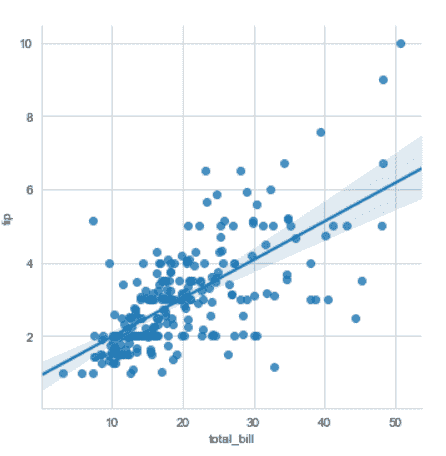
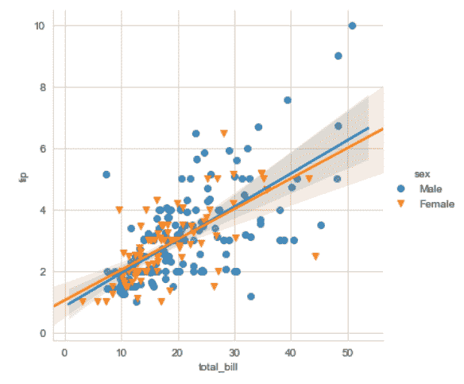

# 海伯恩|回归图

> 原文:[https://www.geeksforgeeks.org/seaborn-regression-plots/](https://www.geeksforgeeks.org/seaborn-regression-plots/)

seaborn 中的回归图主要是为了添加一个视觉指南，有助于在探索性数据分析期间强调数据集中的模式。顾名思义，回归图在两个参数之间创建了一条回归线，有助于可视化它们的线性关系。本文讨论了在海底的那些类型的地块，并展示了可以改变大小、长宽比等的方法。这样的情节。

**Seaborn** 不仅是一个可视化库，也是内置数据集的提供者。在这里，我们将在 seaborn 使用一个名为“tips”的数据集。tips 数据集包含可能在餐厅吃过饭的人的信息，以及他们是否留下了小费。它还提供了关于人们性别的信息，他们是否吸烟，日期，时间等等。

在开始回归图之前，让我们先看一下数据集。

**加载数据集**

## 蟒蛇 3

```
# import the library
import seaborn as sns

# load the dataset
dataset = sns.load_dataset('tips')

# the first five entries of the dataset
dataset.head()
```

**Output**Now let us begin with the regression plots in seaborn.Regression plots in seaborn can be easily implemented with the help of the lmplot() function. lmplot() can be understood as a function that basically creates a linear model plot. lmplot() makes a very simple linear regression plot.It creates a scatter plot with a linear fit on top of it.**Simple linear plot**

## 蟒蛇 3

```
sns.set_style('whitegrid')
sns.lmplot(x ='total_bill', y ='tip', data = dataset)
```

**Output****Explanation**x and y parameters are specified to provide values for the x and y axes. sns.set_style() is used to have a grid in the background instead of a default white background. The data parameter is used to specify the source of information for drawing the plots.**Linear plot with additional parameters**

## 蟒蛇 3

```
sns.set_style('whitegrid')
sns.lmplot(x ='total_bill', y ='tip', data = dataset, 
           hue ='sex', markers =['o', 'v'])
```

**Output****Explanation**In order to have a better analysis capability using these plots, we can specify hue to have a categorical separation in our plot as well as use markers that come from the matplotlib marker symbols. Since we have two separate categories we need to pass in a list of symbols while specifying the marker.**Setting the size and color of the plot**

## 蟒蛇 3

```
sns.set_style('whitegrid')
sns.lmplot(x ='total_bill', y ='tip', data = dataset, hue ='sex', 
           markers =['o', 'v'], scatter_kws ={'s':100}, 
           palette ='plasma')
```

**Output****Explanation**In this example what seaborn is doing is that its calling the matplotlib parameters indirectly to affect the scatter plots. We specify a parameter called scatter_kws. We must note that the scatter_kws parameter changes the size of only the scatter plots and not the regression lines. The regression lines remain untouched. We also use the palette parameter to change the color of the plot. Rest of the things remain the same as explained in the first example.**Displaying multiple plots**

## 蟒蛇 3

```
sns.lmplot(x ='total_bill', y ='tip', data = dataset, 
           col ='sex', row ='time', hue ='smoker')
```

**Output****Explanation**In the above code, we draw multiple plots by specifying a separation with the help of the rows and columns. Each row contains the plots of tips vs the total bill for the different times specified in the dataset. Each column contains the plots of tips vs the total bill for the different genders. A further separation is done by specifying the hue parameter on the basis of whether the person smokes.**Size and aspect ratio of the plots**

## 蟒蛇 3

```
sns.lmplot(x ='total_bill', y ='tip', data = dataset, col ='sex', 
           row ='time', hue ='smoker', aspect = 0.6, 
           size = 4, palette ='coolwarm')
```

**Output****Explanation**Suppose we have a large number of plots in the output, we need to set the size and aspect for it in order to better visualize it.aspect: scalar, optional specifies the aspect ratio of each facet, so that “aspect * height” gives the width of each facet in inches.