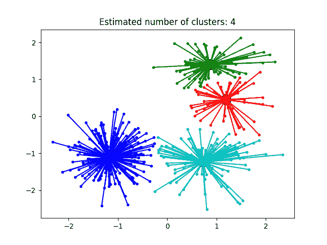

# ML 中的亲和传播|查找簇数

> 原文:[https://www . geesforgeks . org/affinity-propagation-in-ml-to-find-number-of-clusters/](https://www.geeksforgeeks.org/affinity-propagation-in-ml-to-find-the-number-of-clusters/)

相似性传播通过在数据点之间发送消息来创建集群，直到收敛。与 k-means 或 k-med oid 等聚类算法不同，亲和传播不需要在运行算法之前确定或估计聚类的数量，为此，两个重要的参数是*偏好*，它控制使用多少样本(或原型)，以及*阻尼因子*，它阻尼消息的责任和可用性，以避免更新这些消息时的数值振荡。

使用少量样本描述数据集，“样本”是代表聚类的输入集的成员。成对之间发送的消息表示一个样本是否适合作为另一个样本的样本，该样本会根据其他成对样本的值进行更新。这种更新反复进行，直到收敛，在这一点上，最终的样本被选择，因此我们获得最终的聚类。

**亲和传播算法:**

**输入:**给定数据集 D = {d1，d2，d3，…..dn }
T5】s 是 NxN 矩阵，使得`s(i, j)`代表 d <sub>i</sub> 和 d <sub>j</sub> 之间的相似性。两个数据点的负平方距离用作 s，即点 *xi* 和 *xj* 、`s(i, j)= -||x<sub>i</sub>-x<sub>j</sub>||<sup>2</sup>`。
s 即 *s(i，i)* 的对角线特别重要，因为它代表输入偏好，这意味着特定输入成为样本的可能性有多大。当它被设置为所有输入的相同值时，它控制算法产生多少类。接近最小可能相似度的值产生较少的类，而接近或大于最大可能相似度的值产生许多类。它通常被初始化为所有输入对的中间相似度。

该算法通过交替两个消息传递步骤来更新两个矩阵:

*   “责任”矩阵 R 的值 r(i，k)量化了 x <sub>k</sub> 相对于 x <sub>i</sub> 的其他候选样本，有多适合作为 x <sub>i</sub> 的样本。
*   “可用性”矩阵 A 包含值 a(i，k)，该值表示 x <sub>i</sub> 选择 x <sub>k</sub> 作为其样本是多么“合适”，同时考虑到其他点对 x <sub>k</sub> 作为样本的偏好。

两个矩阵都初始化为零。然后，该算法迭代执行以下更新:

*   首先，责任更新在
    前后发送
*   然后，可用性根据
    进行更新

执行迭代，直到集群边界在多次迭代中保持不变，或者在某个预定次数的迭代之后。样本是从最终矩阵中提取出来的，其自身的“责任+可用性”为正(即`(r(i, i) + a(i, i)) > 0`)。


下面是使用 scikit-learn 库的亲和传播聚类的 Python 实现:

```
from sklearn.cluster import AffinityPropagation
from sklearn import metrics
from sklearn.datasets.samples_generator import make_blobs

# Generate sample data
centers = [[1, 1], [-1, -1], [1, -1], [-1, -1]]
X, labels_true = make_blobs(n_samples = 400, centers = centers,
                           cluster_std = 0.5, random_state = 0)

# Compute Affinity Propagation
af = AffinityPropagation(preference =-50).fit(X)
cluster_centers_indices = af.cluster_centers_indices_
labels = af.labels_

n_clusters_ = len(cluster_centers_indices)
```

```
# Plot result
import matplotlib.pyplot as plt
from itertools import cycle

plt.close('all')
plt.figure(1)
plt.clf()

colors = cycle('bgrcmykbgrcmykbgrcmykbgrcmyk')

for k, col in zip(range(n_clusters_), colors):
    class_members = labels == k
    cluster_center = X[cluster_centers_indices[k]]
    plt.plot(X[class_members, 0], X[class_members, 1], col + '.')
    plt.plot(cluster_center[0], cluster_center[1], 'o',
             markerfacecolor = col, markeredgecolor ='k',
             markersize = 14)

    for x in X[class_members]:
        plt.plot([cluster_center[0], x[0]], 
                 [cluster_center[1], x[1]], col)

plt.title('Estimated number of clusters: % d' % n_clusters_)
plt.show()
```

**输出:**
